# Accelerometer BMA400 driver #


[](https://www.mikroe.com/accel-5-click)


## Description ##

This project shows the implementation of a accelerometer sensor that is integrated on the Accel 5 Click board.

Accel 5 click is based around the BMA400, an ultra-low power triaxial accelerometer sensor, from Bosch Sensortech. This sensor has many features perfectly suited for IoT applications and wearables, offering a good balance between the performance and the power consumption. One of its key features is its ultra-low power consumption, allowing it to be used in various always-on low power applications. To improve the battery life even more, this sensor also features a Sleep mode when the sensor current consumption is in magnitude of few hundred nanoamperes.

Besides the acceleration measurement, Accel 5 click is able to output an interrupt for many different events, including tap, double tap, step counting, activity recognition (walk, run, stand still), activity change (any type of acceleration pattern change), orientation, and more.

Accel 5 click communicates with the target microcontroller over I2C or SPI interface that corresponds to the pinout on the mikroBUS™ socket as shown below.

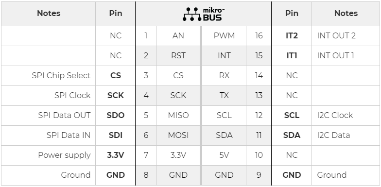

For more information about the BMA400, see the [specification page](https://www.bosch-sensortec.com/media/boschsensortec/downloads/datasheets/bst-bma400-ds000.pdf).

## Gecko SDK version ##

GSDK v3.1.2

## Hardware Required ##

- [A BGM220P Explorer Kit board.](https://www.silabs.com/development-tools/wireless/bluetooth/bgm220-explorer-kit)

- [A MikroE Accel 5 Click board.](https://www.mikroe.com/accel-5-click)

## Connections Required ##

The Accel 5 Click board can just be "clicked" into its place. Be sure that the board's 45-degree corner matches the Explorer Kit's 45-degree white line. Just be sure that the click board is configured into SPI-mode by the resistors and not into I2C-mode.

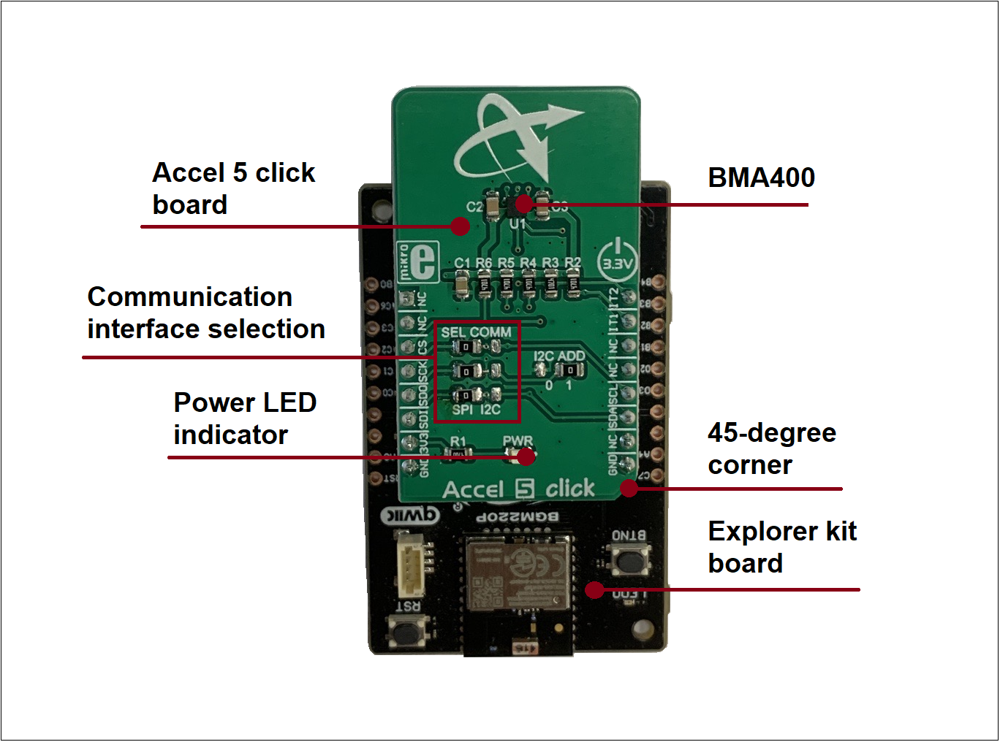

## Setup ##

To test this application, you should connect the BMG220 Explorer Kit Board to the PC using a microUSB cable.

You can either import the provided **bma400_spi_simple.sls** project file or start with an empty example project as basis:

1. Create a "Platform - Empty C Project" project for the "BGM220 Explorer Kit Board" using Simplicity Studio v5. Use the default project settings. Be sure to connect and select the BGM220 Explorer Kit Board from the "Debug Adapters" on the left before creating a project.

2. Copy the files *app.c*, *bma400_spi.h*, *bma400_spi.c*, *bma400.h*, *bma400.c* into the project root folder (overwriting existing app.c).

3. Set the test mode in the *app.c* file.

```c
#define TEST_ACCELEROMETER      0
#define TEST_TAP_DETECTION      1
#define TEST_ACTIVITY_CHANGE    2
#define TEST_READ_FIFO_FULL     3

#define TEST_MODE TEST_ACCELEROMETER
```

4. Install the software components:

- Open the .slcp file in the project.

- Select the SOFTWARE COMPONENTS tab.

- Install **[Platform] > [Driver] > [SPIDRV]** component with the instance name: **mikroe**.

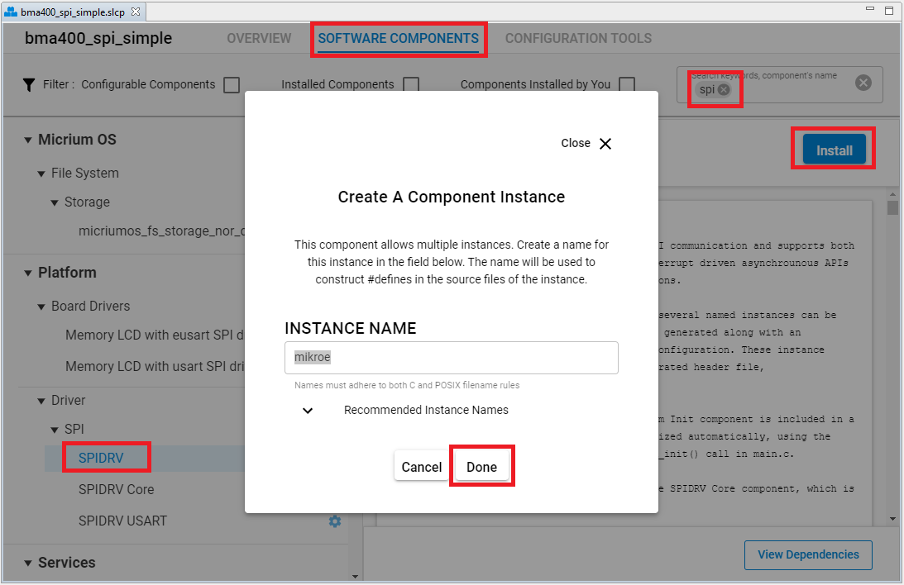

- Install **[Platform] > [Driver] > [Simple Button]** component with the instance name: **btn0**.

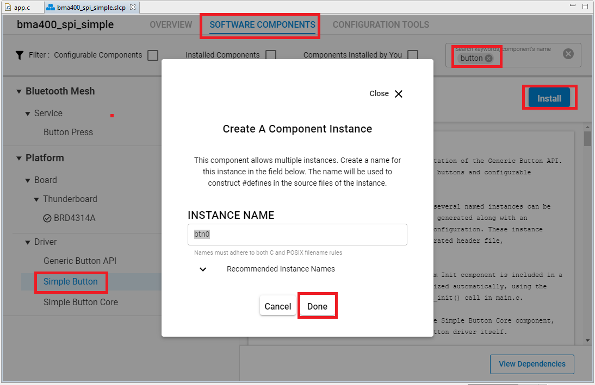

- Install **[Services] > [IO Stream] > [IO Stream: USART]** component with the default instance name: **vcom**.

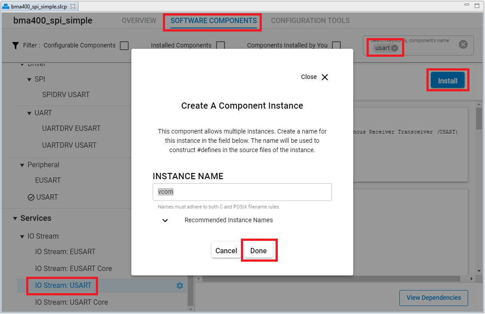

- Install the **[Services] > [IO Stream] > [IO Stream: Retarget STDIO]** component.

- Install the **[Thirty Party] > [Tiny printf]** component.

5. Build and flash the project to your device.

## How It Works ##

After the POR (Power ON Reset) event, the sensor stays in the Sleep mode. In Sleep mode, the sensor practically does not consume any power (about 300nA), but the sensor functionality is completely suspended. To use the sensor, it has to be either in Low Power mode, where it uses a fixed Output Data Refresh (ODR) of 25Hz, or in the Normal mode. Some options are exclusive only to Normal mode, such as the step counting detection, output filtering and so on. Normal mode still uses power conservative, allowing the device to be used in the Always-ON low power applications.

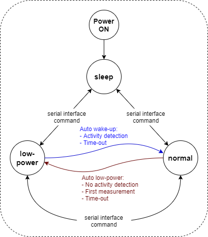

While operating in Normal mode, two filters are available for the data filtering. The filters can be applied either to the output registers, the FIFO engine, or can be used to process the interrupt data. The first filter can be used to obtain data rates from 12.5Hz up to 800Hz, which is defined by the filter registers, while the second filter offers fixed frequency of 100Hz, superimposed by a frequency of 1Hz. The output noise is affected by the ODR frequency.

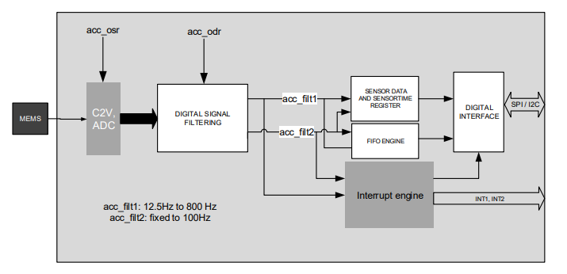

Acceleration data is available in 12-bit format from both the data registers and the internal FIFO buffer of 1kb. The FIFO buffer can be used for more complex calculations or timed readings. Writing to FIFO buffer is only allowed in the Normal mode, while it can be read in the Low power mode, too. The interrupt engine facilitates the complete FIFO buffer, triggering an interrupt for several FIFO events: overflow event, watermark event, almost full event, and so on.

The BMA400 sensor contains an integrated timer, which can be used along with the interrupts to be used for the auto Wakeup or auto Power down functions. The automatic functions are a part of the sensor power management. The automatic mode changes can be set either to an acceleration interrupt after a specified threshold is reached, or it can be set to a timer interrupt: when the timer expires, the interrupt is generated, and the power mode is switched.

An extensive interrupt engine offers two layers of interrupts. It offers basic interrupts, including some basic functions, such as the Data Ready interrupt, FIFO buffer related interrupts and the Wakeup event interrupt. Basic interrupts also report Interrupt overrun event, where too many interrupts are competing, so that the sensor is not able to process them all.

Besides the basic interrupts, the interrupt engine offers some more sophisticated, advanced interrupts, that include detection all of the activities: tap/double tap, step counting, activity changed, orientation changed, and two generic interrupts. The advanced interrupts require a certain ODR rate and can be used in the Normal mode exclusively, while basic interrupts offer more rudimental control over events.

The advanced interrupt engine can use two programmable interrupt pins. Both of these pins can be assigned with any interrupt source and can be either LOW or HIGH on interrupt, depending on settings in appropriate registers. These two pins are routed to INT and PWM pins of the mikroBUS™, and are labeled as IT1 and IT2, respectively. Besides the acceleration MEMS and complementary analog front-end circuitry, the BMA400 sensor also has an integrated temperature sensor. It is updated every 160ms and sampled with the 8-bit resolution. Thermal data is always available, except when the device is in the Sleep mode.

### API Overview ###

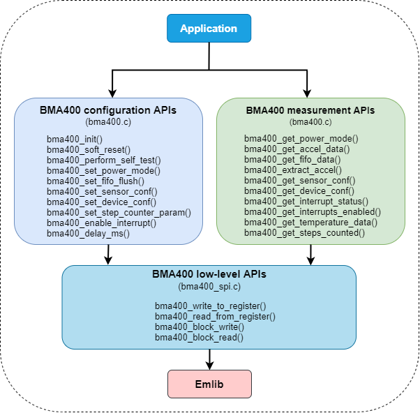

[bma400.c](src/bma400.c): implements the top level APIs for application.
- Memory block R/W APIs: read/write a memory block, given memory address.
- Specific register read/write APIs: specific register read/write to get and set settings for BMA400.

[bma400_spi.c](src/bma400_spi.c): implements BMA400 specific SPI APIs, called by [bma400.c](src/bma400.c).
- Initialization API: initialize SPI communication.
- SPI read/write APIs: read/write a memory block via SPI, given memory address.
- SPI read/write register APIs: read/write a register via SPI, given register address.

### Testing ###

This example demonstrates some of the available features of the Accelerometer BMA400. Follow the below steps to test the example:

1. Open a terminal program on your PC, such as the Console that is integrated in Simplicity Studio or a third-party tool terminal like TeraTerm to receive the logs from the virtual COM port.

2. Depends on the test mode declared in the app.c file, the code application can operate in the different modes.

- If use **TEST_ACCELEROMETER** for testing, try to use the BTN0 button to start/stop the measurement at any time and observe the log messages.

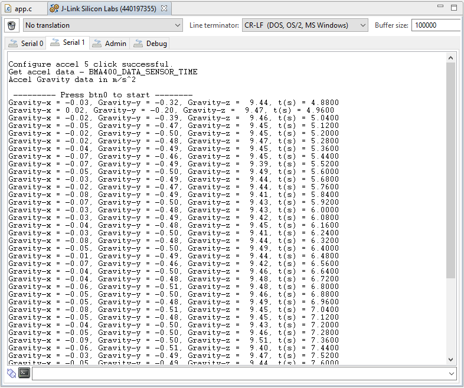

- If use **TEST_TAP_DETECTION** for testing, perform single or double tap on the board and observe the log messages.

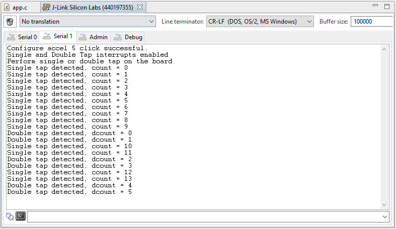

- If use **TEST_ACTIVITY_CHANGE** for testing, try move the board in some direction and observe the log messages.

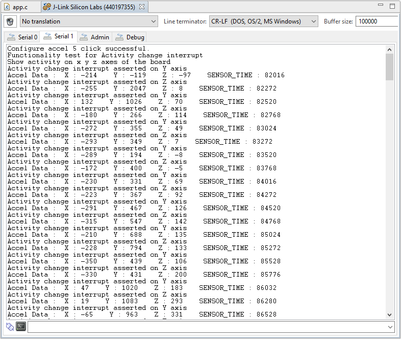

- If use **TEST_READ_FIFO_FULL** for testing, reset the device and observe the log messages.

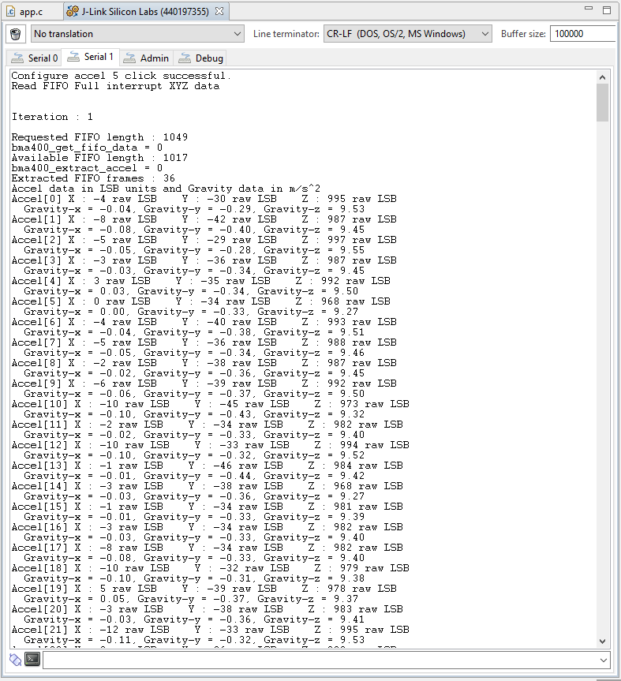

## .sls Projects Used ##

*bma400_spi_simple.sls* - Import this project to have a ready-to-compile project.

Also precompiled binaries in S-Record format (.s37) are included for the projects above test the applications instantly. The files can be programmed using for example _Simplicity Studio Flash Programmer_ tool or _Simplicity Commander_ application.
