# Accelerometer MMA8452Q driver #


[](https://www.sparkfun.com/products/retired/14587)


## Description ##

The MMA8452Q is a smart, low-power, three-axis, capacitive, micromachined accelerometer with 12 bits of resolution. This accelerometer is packed with embedded functions with flexible user programmable options, configurable to two interrupt pins. Embedded interrupt functions allow for overall power savings relieving the host processor from continuously polling data. 

The MMA8452Q has user-selectable full scales of ±2g/±4g/±8g with high-pass filter filtered data as well as non-filtered data available in real-time. The device can be configured to generate inertial wakeup interrupt signals from any combination of the configurable embedded functions allowing the MMA8452Q to monitor events and remain in a low power mode during periods of inactivity.

The goal is to provide a hardware driver that supports the basic accelerometer measurement readout, along with configuration for the various embedded functionality and interrupt generation. Interfaces should be intuitive and easy to integrate with our wireless stacks, focusing on BLE.

## Gecko SDK version ##

GSDK v4.1.0

## Hardware Required ##

- [A BGM220P Explorer Kit board.](https://www.silabs.com/development-tools/wireless/bluetooth/bgm220-explorer-kit)

- [SparkFun Triple Axis Accelerometer Breakout - MMA8452Q (Qwiic)](https://www.sparkfun.com/products/14587)

## Connections Required ##

An MMA8452Q sensor board can be easily connected up with two I2C wires (SDA and SCL) along with 3v3 and GND. For the designated boards, SparkFun Qwiic compatible STEMMA QT connectors can be used.

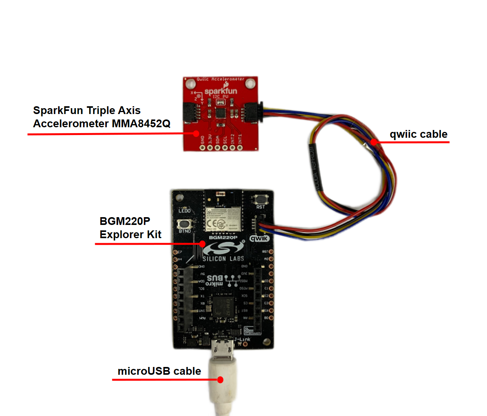

**Note:** There are several jumpers on SparkFun Triple Axis Accelerometer Breakout - MMA8452Q that can be changed to facilitate several different functions. The first of which is the Address jumper. The Address jumper can be used to change the I2C address of the board. The default jumper is open by default, pulling the address pin high and giving us an I2C address of 0X1D. Closing this jumper will ground the address pin, giving us an I2C address of 0X1C.

The second of which is the I2C pull-up jumper. If multiple boards are connected to the I2C bus, the equivalent resistance goes down, increasing your pull-up strength. If multiple boards are connected on the same bus, make sure only one board has the pull-up resistors connected.

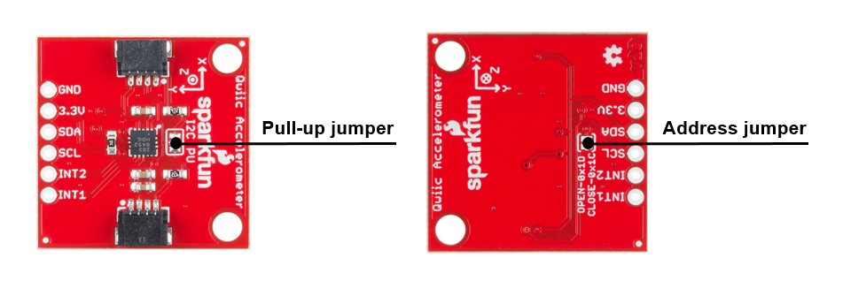

## Setup ##

To test this application, you should connect the BMG220 Explorer Kit Board to the PC using a micro-USB cable.

You can either import the provided **mma8452q_sensor_i2c.sls** project file or start with an empty example project as the basis:

1. Create a "Platform - Empty C Project" project for the "BGM220 Explorer Kit Board" using Simplicity Studio v5. Use the default project settings. Be sure to connect and select the BGM220 Explorer Kit Board from the "Debug Adapters" on the left before creating a project.

2. Copy the files */test/mma8452q_simple_test/app.c*, */inc/mma8452q.h*, */src/mma8452q.c*, */inc/mma8452q_i2c.h*, */inc/mma8452q_config.h* into the project root folder (overwriting existing app.c).

3. Set the test mode in the *app.c* file.

4. Install the software components:

    - Open the .slcp file in the project.

    - Select the SOFTWARE COMPONENTS tab.

    - Install **[Platform] > [Driver] > [I2CSPM] > [Qwiic]** component with the default instance name: Qwiic.

    - Install the **[Services] > [IO Stream] > [IO Stream: USART]** component with the default instance name: vcom.

    - Install the **[Services] > [IO Stream] > [IO Stream: USART] > [IO Stream: Retarget STDIO]** component.

    - Install the **[Application] > [Utility] > [Log]** component.

    - Install the **[Platform] > [Driver] > [GPIOINT]** component.

5. Build and flash the project to your device.

## How It Works ##

The device can be in either Standby Mode or Active Mode. Most of the settings are changed in Standby Mode but the data does not update and is not enabled until the device is in Active Mode. The device changes from Standby to Active Mode via bit 0 in the CTRL_REG1 register. The sleep and wake modes are active modes. In wake mode, the system uses a higher sample rate (higher current consumption) than in Sleep mode(lower current consumption). The interrupts that can wake the device from sleep are the following: pulse detection, orientation detection, motion freefall, and transient detection.

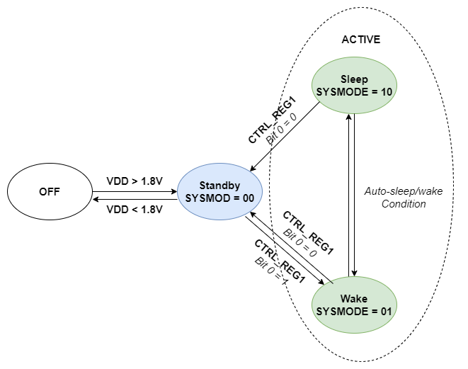

Some functionality of MMA8452Q includes the following:

- Device calibration: The device interface is factory calibrated for sensitivity and zero-g offset for each axis. The trim values are stored in non-volatile memory (NVM). On power-up, the trim parameters are read from NVM and applied to the circuitry. However, the MMA8452Q allows the user to adjust the zero-g offset for each axis after power-up, changing the default offset values. The user offset adjustments are stored in six volatile registers. A calibration routine is provided as a function of the driver. You can call

  ```c
  sl_status_t mma8452q_auto_calibrate(void);
  ```

  This function performs calibration steps and stores new offset information
  internally on the MMA8452Q device. Caution should be used when performing
  this function as this should be done with a device in specific (FRONT)
  orientation.

- 8-bit or 12-bit data: The measured acceleration data is stored in the OUT_X_MSB, OUT_X_LSB, OUT_Y_MSB, OUT_Y_LSB, OUT_Z_MSB, and OUT_Z_LSB registers as 2’s complement 12-bit numbers. The most significant 8-bits of each axis are stored in OUT_X (Y, Z)_MSB, so applications needing only 8-bit results can use these three registers and ignore OUT_X, Y, Z_LSB. To do this, the
F_READ bit in CTRL_REG1 must be set. When the F_READ bit is cleared, the fast-read mode is disabled.

  ```c
  sl_status_t sl_mma8452q_get_acceleration(uint16_t avec[3]);
  ```

  This function verifies whether the driver configuration is 8-bit or 12-bit data. If this configuration is 8-bit data, this function read data registers via block read, skipping LSBs when appropriate.

- Low-power modes vs high-resolution modes: Low-power modes vs high-resolution modes
The MMA8452Q can be optimized for lower power modes or higher resolution of the output data. High resolution is achieved by setting the LNOISE bit in register 0x2A. This improves the resolution but is aware that the dynamic range is limited to 4 g when this bit is set. This will affect all internal functions and reduce noise. Another method for improving the resolution of the data is by oversampling. There is a trade-off between low power and high resolution. Low power can be achieved when the oversampling rate is reduced.

  ```c
  sl_status_t mma8452q_set_mods(mma8452q_mods_t mods);
  ```

  This function sets the active power mode of the MMA8452Q. This mode can be normal, low noise low power, high-resolution, or low power.

- Auto-wake/sleep mode: Auto-wake/sleep mode allows the system can automatically transition to a higher sample rate (higher current consumption) when needed but spends the majority of the time in the sleep mode (lower current) when the device does not require higher sampling rates. Auto-wake refers to the device being triggered by one of the interrupt functions to transition to a higher sample rate. This may also interrupt the processor to transition from a sleep mode to a higher power mode. Sleep mode occurs after the accelerometer has not detected an interrupt for longer than the user-definable time-out period. The device will transition to the specified lower sample rate. It may also alert the processor to go into a lower power mode to save on current during this period of inactivity. You can choose interrupts that can wake the device from sleep by the function below:

  ```c
  sl_status_t mma8452q_config_interrupt(
  mma8452q_interrupt_config_t interrupt_cfg);
  ```

  And you can configure the minimum period to transition to sleep, sleep output data rate, and sleep power mode scheme by the function below:

  ```c
  sl_status_t mma8452q_config_aslp(mma8452q_aslp_odr_t alsp_rate,
                                   mma8452q_mods_t slp_mode_pwr,
                                   mma8452q_aslp_config_t aslp_cfg);
  ```

- Freefall and motion detection: MMA8452Q has flexible interrupt architecture for detecting either a freefall or a motion. Freefall can be enabled where the set threshold must be less than the configured threshold, or motion can be enabled where the set threshold must be greater than the threshold. You can configure the freefall/motion function settings of the MMA8452Q through the function.

  ```c
  sl_status_t mma8452q_config_ff_mt(mma8452q_ff_mt_config_t ff_mt_cfg);
  ```

- Transient detection: Similar to motion detection in that the detection function triggers an interrupt when acceleration magnitude is above a user-specified threshold, however, uses high-pass filtered data by default (can be configured to bypass); added flexibility. The interrupt can be routed to either interrupt pin via configuration. You can configure the transient function settings of the MMA8452Q through the funtion.

  ```c
  sl_status_t mma8452q_config_trans(mma8452q_trans_config_t trans_cfg);
  ```

- Orientation detection: The MMA8452Q has an orientation detection algorithm with the ability to detect all six orientations. The transition from portrait to landscape is fixed with a 45° threshold angle and a ±14° hysteresis angle. This allows for a smooth transition from portrait to landscape at approximately 30° and then from landscape to portrait at approximately 60°. You can configure the orientation function settings of the MMA8452Q through the function.

  ```c
  sl_status_t mma8452q_config_orientation(
  mma8452q_orientation_config_t orient_cfg);
  ```

- Pulse detection(single/double tap): The MMA8452Q has embedded single/double and directional pulse detection. This function has various customizing timers for setting the pulse time width and the latency time between pulses. There are programmable thresholds for all three axes. The pulse detection can be configured to run through the high-pass filter and also through a low-pass filter, which provides more customizing and tunable pulse-detection schemes. You can configure the pulse function settings of the MMA8452Q through the function.

  ```c
  sl_status_t mma8452q_config_pulse(mma8452q_pulse_config_t pulse_cfg);
  ```

### API Overview ###

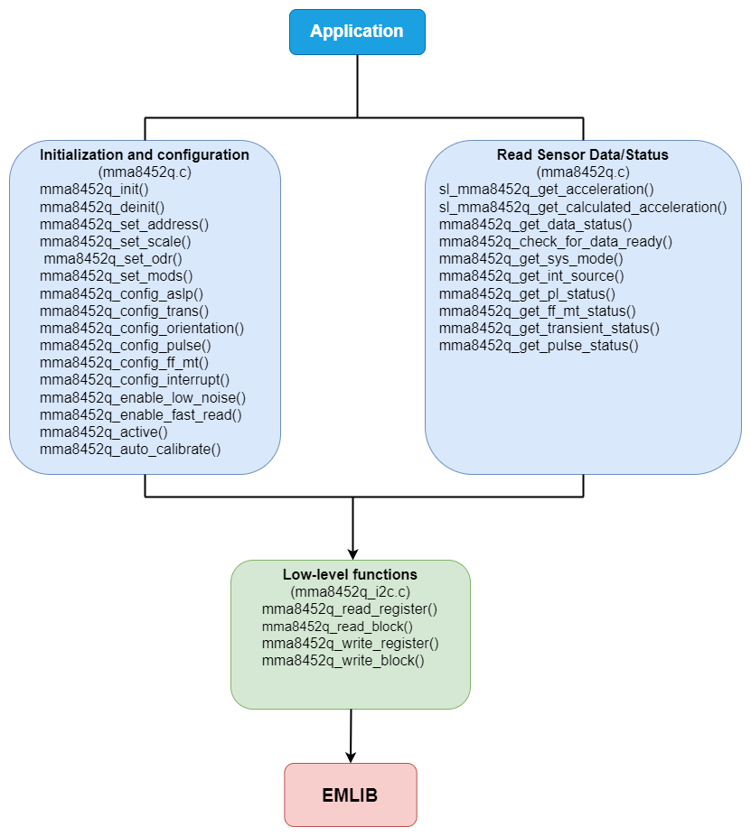

[mma8452q.c](src/bma400.c): implements APIs for application.

- Initialization and configuration API: specific register read/write to get and set settings for MMA8452Q.

- Read Sensor Data/Status: specific register read to get acceleration data and status.

- Low-level functions: initialize I2C communication, read/write a memory block via I2C, given memory address, and read/write a register via I2C, given register address.

### Testing ###

This simple test application demonstrates some of the available features of the accelerometer MMA8452Q, after initialization, the accelerometer MMA8452Q measures the value and return on the serial communication interface.

You can choose which type of test you want by uncommenting the #define.

```c
#define TEST_BASIC_READING
// #define TEST_RAW_DATA_READING
// #define TEST_ORIENTATION
// #define TEST_READ_TAPS
// #define TEST_FF_MT
```

Please follow the below steps to test the example:

1. Open a terminal program on your PC, such as the Console that is integrated into Simplicity Studio or a third-party tool terminal like TeraTerm to receive the logs from the virtual COM port.

2. Depending on the test mode defined in the app.c file, the code application can operate in the different modes.

- If use **TEST_BASIC_READING** for testing, this example initializes the accelerometer and stream calculated x, y, z, and acceleration values from it (in g units).

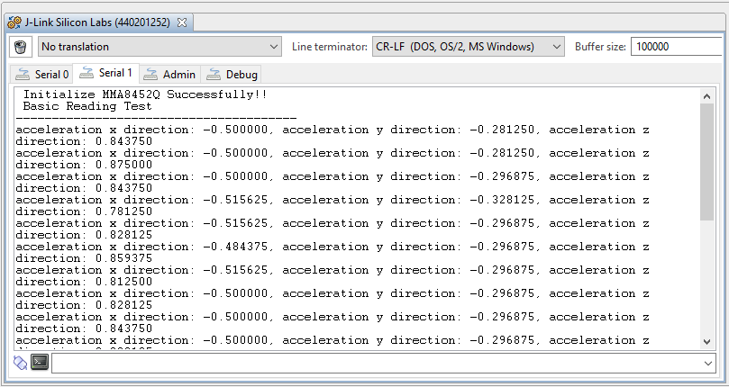

- If use **TEST_RAW_DATA_READING** for testing, this example initializes the accelerometer and streams raw x, y, and z, acceleration values from it.

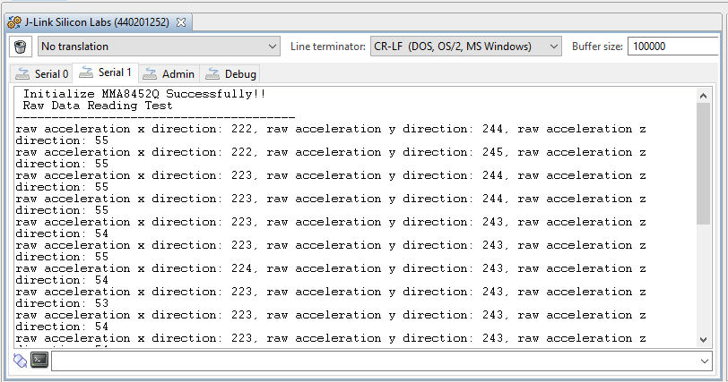

- If use **TEST_ORIENTATION** for testing, this example initializes the accelerometer and streams its orientation.

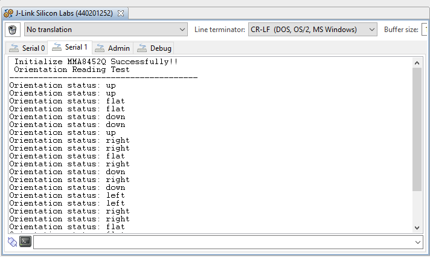

- If use **TEST_READ_TAPS** for testing, this example initializes the accelerometer and print a message each time it is tape.

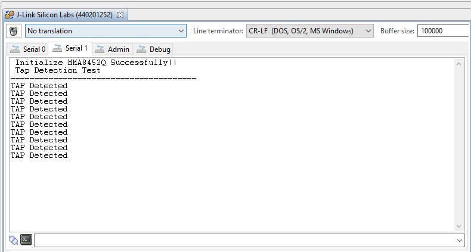

- If use **TEST_FF_MT** for testing, this example initializes the accelerometer and prints a message each time it moves or freefall. The message shows which axis the sensor moves and in the positive or negative direction.

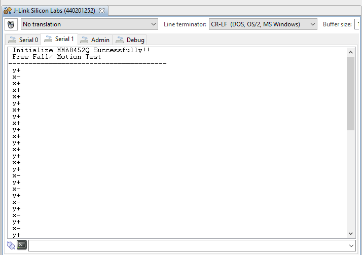

Our unit test for the application run with the flow chart below.

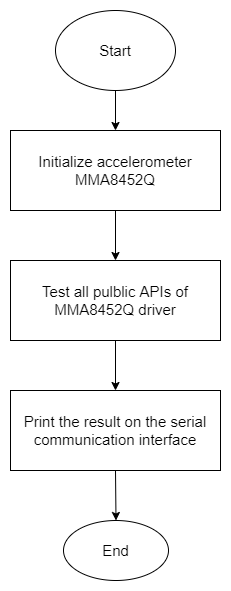

The unit test for all the APIs also was provided with the result below.

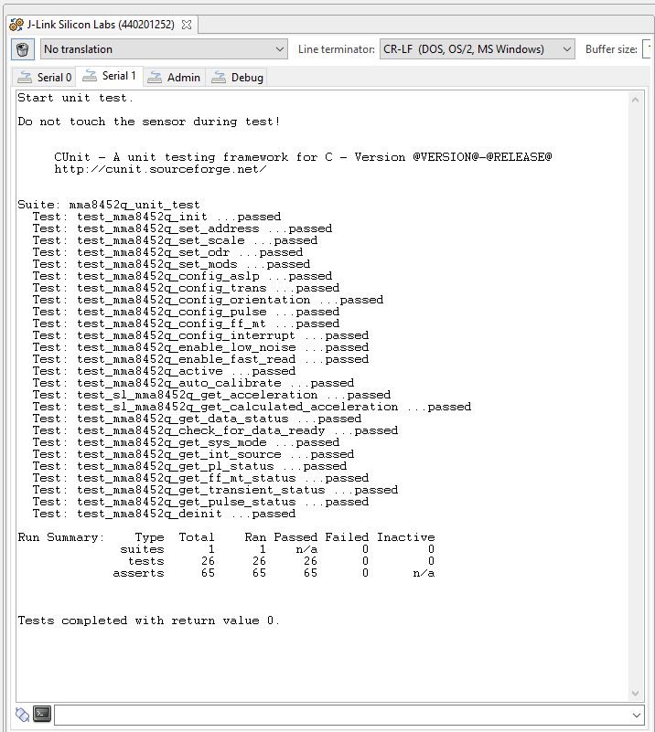

## .sls Projects Used ##

- [**accelerometer_mma8452q.sls**](SimplicityStudio/specstroscopy_as7265x.sls)
- [**accelerometer_mma8452q_unit_test.sls**](SimplicityStudio/specstroscopy_as7265x_unit_test.sls)