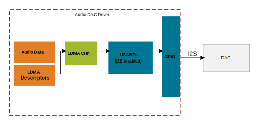

# Audio DAC Driver #

## Overview ##

This project shows the implementation of an I2S audio dac driver using a UDA1334 stereo DAC with the EFM32GG11 starter kit.

## Gecko SDK version ##

v3.0 or later

## Hardware Required ##

- EFM32GG11 Giant Gecko Series 1 Starter Kit (SLSTK3701A)
- [Adafruit I2S Stereo Decoder Board](https://www.adafruit.com/product/3678)
- Headphones or speakers with a 3.5mm connector

## Setup ##

The audio_dac driver provides the audio_dac_simple.sls Simplicity Studio project to test basic functionality of the driver and hardware. To use this test project, connect the I2S stereo decoder board to the GG11 starter kit as shown in the diagram below.

Next, Import the included .sls file into Studio, then build and flash the project to the starter kit.
In Simplicity Studio select "File->Import" and navigate to the directory with the .sls project file.
The project is built with relative paths to the GSDK using the STUDIO_SDK_LOC variable, which is defined as:

C:\SiliconLabs\SimplicityStudio\v5\developer\sdks\gecko_sdk_suite\v3.0

## API Documentation ##

### Overview
 The audio DAC driver plays signed 8 bit or 16 bit PCM audio trough an I2S
 DAC. The driver is designed for compatability with the UDA1334A I2S DAC,
 but can be ported to other compatible hardware. The driver can play arrays
 of PCM samples (such as wav files) for both stereo and mono formats, and
 can optionally loop continuously to play sine wave tables. The audio DAC
 driver uses DMA transfers to transmit audio samples without any processor
 intervention or overhead.
 
 The audio DAC driver is designed to run on Silicon Labs series 1 & 2
 devices. This driver requires a single I2S enabled USART, and an LDMA
 channel; both of these are defined in audio_dac_config.h.

### Initialization
 First, an audio_dac_data_t struct contains the data and metadata required
 for playback. This struct must be initialized and statically allocated via
 the AUDIO_DAC_DATA() macro. Ensure that the pointer to the PCM samples is 
 signed and the width matches the declared resolution
 (e.g. int16_t for resolution16) 
 
 Next, the audio DAC should be initialized by calling audio_dac_init() with
 an audio_dac_init_t struct. This struct can be initialized with default 
 parameters via the AUDIO_DAC_INIT_DEFAULT macro.

### Audio Playback
 To play audio, call audio_dac_start() with the desired audio data struct.
 One started, use the audio_dac_mute() and audio_dac_volume() to control
 playback.
 
 audio_dac_stop() will stop playback and reset the driver, it is required to
 stop playback prior to restarting.
 
 audio_dac_status() will return whether audio playback is in progress.
 
### Hardware Configuration
 The hardware specific configuration, including GPIO pins and peripheral
 usage are defined in the audio_dac_config.h file. This file is intended to
 be modified by the user in order to port to different hardware.
 
 The initialization struct also allows the user to supply three callback
 pointers. These callbacks allow for easy integration with external
 control interfaces, like i2c, which are commonly used by audio devices.
 
 init_cb is run after initialization and can be used to additionally
 configure the DAC as needed. For example, many audio codecs with i2c control
 interfaces require a sequence of i2c writes to initialize the codec.
 
 volume_cb is run during playback through the audio_dac_volume function. It
 should be used to send control signals to the DAC that change the output
 volume.
 
 mute_cb is run during playback through the audio_dac_mute_function. It
 should be used to send control signals to the DAC that mutes or unmutes
 audio output.
 
 Stub implementations for all of these callbacks are located in the
 audio_dac_config.h file for the UDA1334A. The UDA1334A only has available
 control signals to implement mute functionality via a GPIO pin.
 
### Energy Modes
 Audio playback is supported down to EM1. Audio playback should be stopped
 prior to EM2/EM3 entry.

## Porting

The driver should work with minimal porting on other EFM/EFR devices. Care should be taken that an I2S enabled USART is selected in the config header, see the device reference manual for details. Porting to other I2S audio dacs and codecs will likely require changes to the configuration header as well as custom callbacks to handle codecs with control interfaces such as SPI or I2C.
