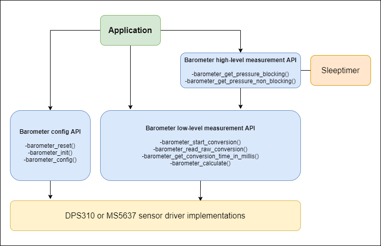
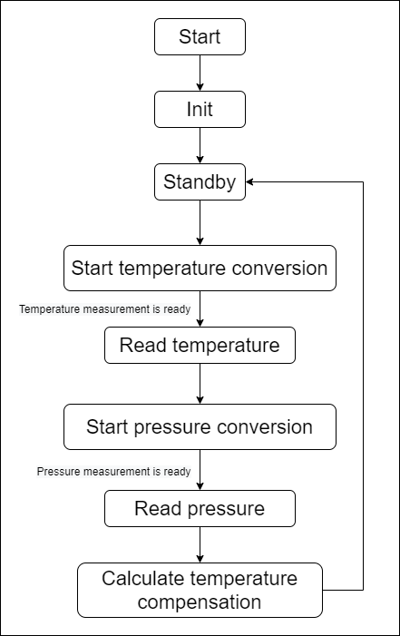

# Barometer driver #

## Overview ##

This project shows the implementation of an I2C pressure sensor driver. A target application of a barometer sensor could be a weather station or an altitude sensor.

This driver contains two different sensor IC drivers: the Infineon **DPS310** and the **MS5637** from TE Connectivity. They have the same public facing header and separate implementations so the user need to decide which one is used in compile time.

## Gecko SDK version ##

GSDK v3.1.2

## Hardware Required ##

- [BGM220P Explorer kit](https://www.silabs.com/development-tools/wireless/bluetooth/bgm220-explorer-kit)

Supported barometer boards:
- [Adafruit DPS310 board](https://www.adafruit.com/product/3678](https://www.adafruit.com/product/4494))
- [Sparkfun MS5637 board](https://www.sparkfun.com/products/14688)
- [MikroE Pressure 3 click board](https://www.mikroe.com/pressure-3-click)

## Connections Required ##

A barometer sensor board can be easily connected up with two I2C wires (SDA and SCL) along with 3v3 and GND. For the designated boards, SparkFun qwiic compatible STEMMA QT connectors can be used. 

## How It Works ##

These sensors are factory calibrated and contain calibration coefficients that are used in the application to compensate the measurement results for sensor non-linearities. They also have a temperature sensor built in, therefore temperature drift compensation is included in the masurements. 

For the lowest noise readings, it is recommended to take multiple measurements and combine the readings into one result. This increases the current consumption and also the measurement time,
reducing the maximum possible measurement rate. It is done internally in the sensor and the user can specify the oversampling rate (OSR) by configuring the sensor. It is necessary to balance the accuracy and data rate
required for each application with the allowable current consumption. 

The init function resets and configures the sensor, in this way the user only needs to call one init function during startup. The factory-programmed calibration values are also read from the sensor in the init function. After initialization the sensor is in Standby mode. A typical temperature compensated pressure measurement is shown in the following figure.

In case of using the high-level measurement API functions (blocking or non-blocking) this whole measurement and compensation process is done internally by the driver. Using the non-blocking function, the user can register a callback function which is called after the measurement and the compensated sensor value calculation is ready. In this case sleeptimer is used for correct timings. 

## Usage ##

The sensor board can be easily connected to the Explorer kit by using a Qwiic cable. If you are using a WSTK, you need to connect the sensor board's I2C wires to the WSTK's EXP header I2C_SDA and I2C_SCL pins. 

Add the driver's src and inc folders to your project. Choose which barometer sensor IC you want to use and delete the other one's source file from the src directory.

The driver uses the sleeptimer for timings. Also a higher level kit driver I2CSPM (I2C simple poll-based master mode driver) is used for initializing the I2C peripheral as master mode and performing the I2C transfer. These software components are need to be installed.

1. Create an "Empty C Project" project for the "BGM220 Explorer Kit Board" using Simplicity Studio v5. Use the default project settings. Be sure to connect and select the BGM220 Explorer Kit Board from the "Debug Adapters" on the left before creating a project.
2. Copy the inc and src folders to your project. Add the inc folder's path to the project's include paths (GNU C, workspace path).
3. Open the project's .slcp file and install the following software components:
   1. **Software Components tab -> Services/Sleeptimer**
   2. **Software Components tab -> Platform/Driver/I2CSPM** (in case of using the BRD4314A Explorer kit board, the instance name should be qwiic)
   3. **Software Components tab -> Services/IO Stream/IO** Stream: USART with the default instance name: vcom.
   4. **Software Components tab -> Application/Utility/Log**
4. Choose the actual sensor IC and delete other's source file from your project
5. Copy the app.c into the project root folder (replacing the old app.c)
6. If you want to print float sensor values like in this example, follow the instructions of the [Floating point print() with GCC](https://www.silabs.com/community/mcu/32-bit/knowledge-base.entry.html/2014/11/19/floating_point_print-7R9j) article 

## Test ##

To test the barometer application, you need to connect the sensor board and the Explorer kit with a Qwiic cable or the I2C wires to the WSTK's EXP header I2C_SDA and I2C_SCL pins. Build and run the barometer_simple_BRD4314A project on the BRD4314A board. By default, the DPS310 barometer board is used but you can modify it. 

## .sls Projects Used ##

barometer_simple_BRD4314A

