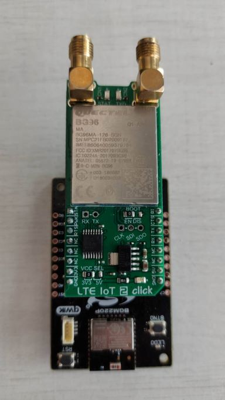
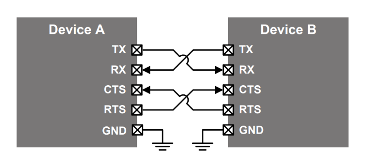
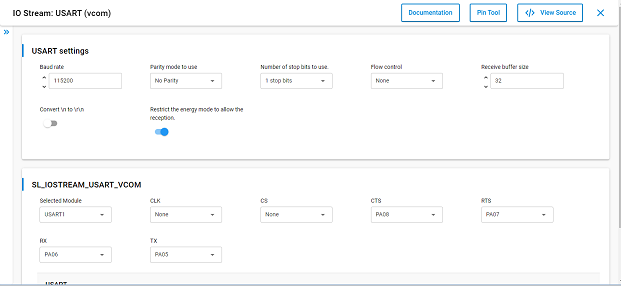
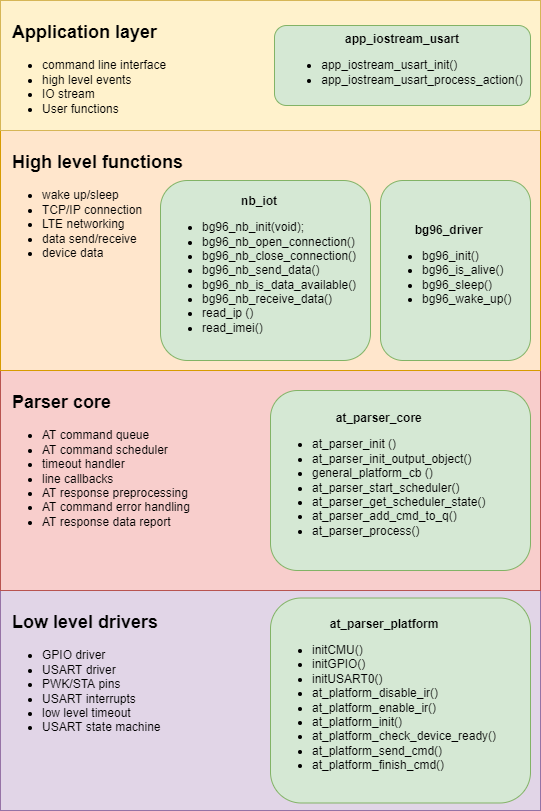
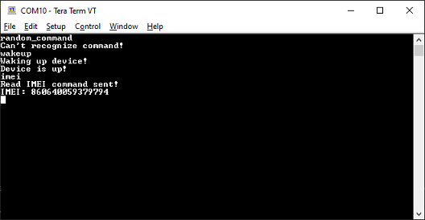

# BG96 cellular module driver #


[](https://www.mikroe.com/lte-iot-2-click)

## Description ##

This project shows the implementation of an AT command parser for the module LTE IOT 2 CLICK.

LTE IoT 2 click is a Click board™ that allows connection to the LTE networks, featuring Quectel BG96 LTE module, which offers two LTE technologies aimed at Machine to Machine communication (M2M) and Internet of Things (IoT). This module is an embedded IoT communication solution which supports the LTE Cat M1 and NB1 technologies, offering an alternative to similar Low Power Wide Area Network (LPWAN) solutions, such as the ones provided by Sigfox and LoRa. The LTE CAT1 and NB1 technologies are designed with specific requirements of the IoT network in mind. LTE IoT 2 click also offers various other features, allowing simple and reliable connection to these new 3GPP IoT technologies. 

For more information about LTE IOT 2 CLICK, see the [specification page](https://www.mikroe.com/lte-iot-2-click).

## Gecko SDK version ##

GSDK v3.3.2

## Hardware Required ##

- [A BGM220P Explorer Kit board.](https://www.silabs.com/development-tools/wireless/bluetooth/bgm220-explorer-kit)

- [An LTE IOT 2 CLICK.](https://www.mikroe.com/lte-iot-2-click)

## Connections Required ##

The LTE IOT 2 CLICK module can be easily connected to the BGM220P Explorer Kit via MikroE connector.



To ensure the proper UART handshake use CTS/RTS pins also!



## Setup ##

To test this application, you should connect the BMG220 Explorer Kit Board to the PC using a microUSB cable.

You can either import the provided **bg96_cellular_module_driver.sls** project file or start with an empty example project as basis:

1. Create a "Platform - Empty C Project" project for the "BGM220 Explorer Kit Board" using Simplicity Studio v5. Use the default project settings. Be sure to connect and select the BGM220 Explorer Kit Board from the "Debug Adapters" on the left before creating a project.

2. Copy the files *app.c* from test/ folder and all the files from src/ and inc/ folders into the project root folder (overwriting existing app.c).

3. Install the software components:

- Open the .slcp file in the project.

- Select the SOFTWARE COMPONENTS tab.

- Install **[Services] > [IO Stream] > [IO Stream: USART]** component with the default instance name: **vcom**.



- Install the **[Services] > [Sleep Timer]** component.

4. Build and flash the project to your device.

## How It Works ##
The BG96 cellular module driver consists of three driver layers and an application layer on the top. The hardware peripheral configuration and low level interrupt handling can be found on the lowest level.

The core driver schedules the sending of AT commands, maintains a command queue and handles the received responses. It also achieves an error handling which works similar to the exception handling in high level programming languages. If any error occoures during the communication it is able to interrupt the command scheduler and report the appropriate error message to the high level programming interface.

The high level functions prepare the AT commands, extend them with parameters if necessary, put them into the command queue and start the scheduler. The basic functions like LTE network configuration, data send/receive on a TCP/IP socket and GPS positioning are already implemented but it is possible to write custom high level functions too. You will find the detailed documentation in the code and a brief example of usage below.

### BG96 driver high level functions ###

 - *bg96_is_alive()*
 - *bg96_sleep()*
 - *bg96_wake_up()*

### NB IoT high level functions ###
 - *bg96_nb_init(void)*
 - *bg96_nb_open_connection()*
 - *bg96_network_registration()*
 - *bg96_nb_close_connection()*
 - *bg96_nb_send_data()*
 - *bg96_nb_receive_data()*
 - *read_ip()*
 - *read_imei()*
 - *bg96_get_operator()*

### GNSS high level functions ###
 - *gnss_start()*
 - *gnss_get_position()*
 - *gnss_stop()*

### Peripherals Usage ###

- GPIO ports are used for wake-up and standby the module and detect its status.
- A USART0 peripheral is used to communicate with LTE IoT 2 board.
- A USART1 peripheral used to print out the logs.

## Driver layer Overview ##


## Driver extension guide ##
### Adding new AT command ###
In order to add new AT command to the parser you need to define an AT command line callback which depends on the required response of the command.
The possible AT command responses are defined in the [User manual](https://docs.particle.io/assets/pdfs/Quectel_BG96_AT_Commands_Manual_V2.1.pdf) of BG96 module. In some cases one of the predefined line callback can be used. e.g.: *at_ok_error_cb()* if the command response is OK or ERROR.

1. define the appropriate line callback function in *at_parser_core.c*. You can find an example below.
```c
void at_custom_cb(uint8_t *new_line, uint8_t call_number)
  //call_number refers the number of new lines received as response
  //new_line points to a string with the new line data
  switch (call_number) {
  case 1:
    //the value of the new line can be parsed
    if (has_substring(new_line, "OK")) {
        //in case of the last response arrived scheduler can be stepped forward
        at_parser_scheduler_next_cmd();
    }
    if (has_substring(new_line, "ERROR")) {
        //data can be reported to the caller
        at_parser_report_data(new_line);
        //in case of error scheduler can be stopped and error code can be reported
        at_parser_scheduler_error(SL_STATUS_FAIL);
    }
    break;
  default:
    //default case always SHALL be defined
    at_parser_scheduler_error(SL_STATUS_FAIL);
    break;
  }
```
2. Add the core process function to the main loop.
```c
void app_process_action (void)
{
  at_parser_process ();
  ...
}
```
3. The definition of AT command SHALL be implemented in a high level function. See the section __Creating new high level function__.

### Creating new high level function ###
Creating a high level function means a single AT command or a list of AT commands which should be sent after each other to the BG96 IoT module and process their response, indicate errors and define the user data. The predefine high level function can be found in *nb_iot.c* and *nb_gnss.c* files.
```c
sl_status_t custom_high_level_function( user_data_t *custom_user_data,          //you can use user data
                                        at_scheduler_status_t *output_object)   //you MUST define an output_object to receive the response
{
    //define command status variable as SL_STATUS_OK, this will collect the errors of low level functions
  sl_status_t cmd_status = SL_STATUS_OK;
  //define the base and additional parts of the AT command, additional parts can be prameters inherited from user data 
  uint8_t extend_str[]= "0,0",
  uint8_t base_cmd[] = "AT+QICLOSE=";

  //create a STATIC command descriptor, this descriptor MUST be allocated during the AT command parsing process!
  static at_cmd_desc_t at_custom = { .cms_string="",                     //use an empty cmd_string if there are additional parameters
                                    .ln_cb=at_custom_cb,                //add the appropriate line callback function 
                                    .timeout_ms = AT_DEFAULT_TIMEOUT    //define a timeout for the command (check the BG96 datasheet for the decent timeout)
                                    };
    //prepare the command descriptor (clears the command string)
    at_parser_clear_cmd(&at_custom);

    //for the following functions use validate() function to indicate the errors!
    //extend command descriptor command string with the base command
    validate(cmd_status, at_parser_extend_cmd(&at_custom, base_cmd));
    //extend command descriptor command string with the additional parts
    validate(cmd_status, at_parser_extend_cmd(&at_custom, conn_string));
    //add the command descriptor to the command queue, queue is available only if previous high level function finished
    validate(cmd_status, at_parser_add_cmd_to_q(&at_custom));
    //start command scheduler, scheduler runs until the command queue is empty or error is occourred.
    validate(cmd_status, at_parser_start_scheduler(output_object));
  return cmd_status;
}
```

### Creating new CLI command ###
1. add a new element to the *cli_cmds[]* array in *app_iostream_usart.c*. The new element SHALL contain a CLI command string and a perform function. Use a short command and DO NOT use spaces and special characters! The maximum length of a CLI command is defined in *CLI_CMD_LENGTH* macro in *app_iostream_usart.h* and is 10 by default.
```c
static cli_cmd_t cli_cmds[] = {
                                { "imei", imei },
                                { "ip", ip },
                                //you can define new CLI commands here
                                {"custom_cmd", custom_cmd}
                                };
```
2. define the CLI command perform function. This is the function defined in the new element of *cli_cmd[]* array. Use static keyword!
```c
static void custom_cmd()
{
    //prepare an output object for receiving data from a high level function
    at_parser_init_output_object(&output_object);
    //call a high level function
    custom_high_level_function(&output_object);
    //create an event listener for the output object and define the event handler function
    at_listen_event(&output_object.status,      //pointer to a variable to check
                    SL_STATUS_OK,               //the state the status variable should be equal to
                    custom_cmd_handler,         //event handler function
                    (void*) &output_object);    //parameter of event handler function

    //you can write a short log if command perform function has run. Do not forget the \r\n at the end of the message!
    printf("Custom command has been performed!\r\n");
}
```
3. define the event handler function you gave in event listener parameter list.
```c
static void custom_cmd_handler(void *handler_data)
{
    //handler data is a pointer to the user data passed by the event listener
    //at_scheduler_state is a good option to propagate because it contains the AT command response
    at_scheduler_status_t *l_output = (at_scheduler_status_t*) handler_data;

    //check the error code and handle it
    if (l_output->error_code) {
        printf("Error while running custom command %d\r\n", l_output->error_code);
    } else {
        //print the response data if it was reported by the AT command line callback
        printf("Custom command response: %s\r\n", l_output->response_data);
    }
}
```
4. Add the event listener and IOstream process functions to the main loop.
```c
void app_process_action (void)
{
    app_iostream_usart_process_action ();
    at_event_process ();
    ...
}
```

### Testing ###

This example demonstrates some of the available features of the BG96 IoT module driver. Follow the below steps to test the example:

1. On your PC open a terminal program, such as the Console that is integrated in Simplicity Studio or a third-party tool terminal like TeraTerm to use the virtual COM port CLI. Set 115200 baud/s speed!.

2. Write a predefined CLI command and press Enter!

3. If you called a high level function in CLI command perform function you should see the result.



If command in not found in the command list you get *Can't recognize command!* error message.
Wake up command has successfully performed.
IMEI number has been requested from the BG96 module.

## .sls Projects Used ##

[**bg96_cellular_module_driver.sls**](SimplicityStudio/bg96_cellular_module_driver.sls)