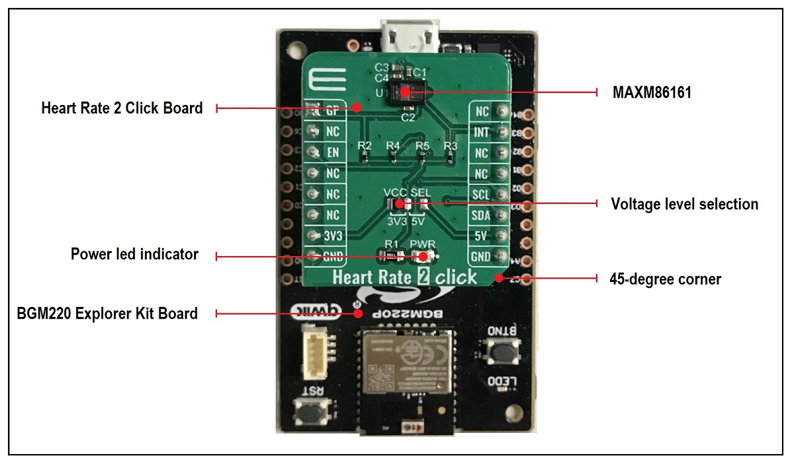
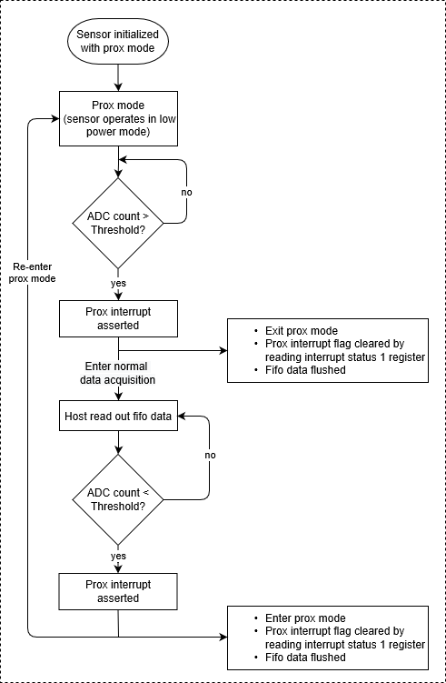
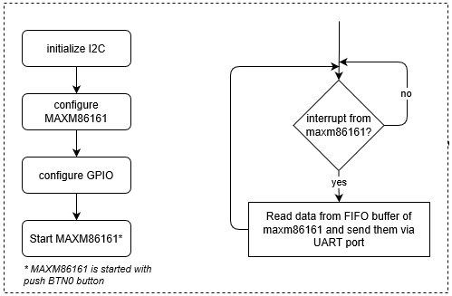
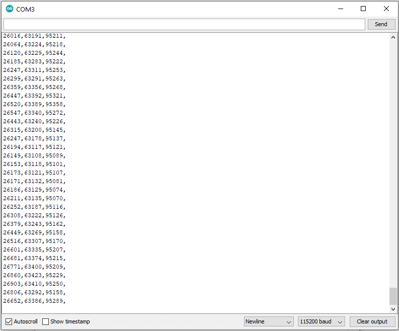
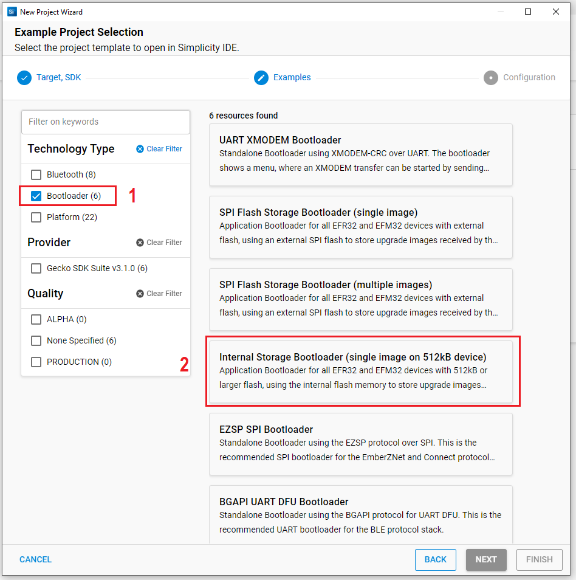
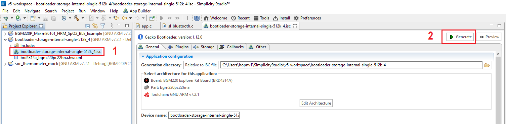

# Biometric Driver #


[](https://www.mikroe.com/heart-rate-2-click)

## Summary ##

This project shows the implementation of Bio-sensor driver using Maxm86161 from Maxim Integrated with BGM220 Explorer Kit based on I2C communication.

## Gecko SDK version ##

v3.1.0

## Hardware Required ##

- [**BGM220-EK4314A** BGM220 Bluetooth Module Explorer Kit (BRD4314A BGM220 Explorer Kit Board)](https://www.silabs.com/development-tools/wireless/bluetooth/bgm220-explorer-kit)

- [**Heart Rate 2 Click** board based on MAXM86161 from Maxim Integrated](https://www.mikroe.com/heart-rate-2-click).

## Connections Required ##

The Heart Rate 2 Click board can just be "clicked" into its place. Be sure that the board's 45-degree corner matches the Explorer Kit's 45-degree white line. The board also has the I2C-bus pull-ups. Just be sure that the click board is configured into I2C-mode (the default) by the resistors and not into SPI-mode.



## Setup ##

To test this application, you should connect the BMG220 Explorer Kit Board to the PC using a miniUSB cable. 

Simplicity Studio 5 was used to create the example code.

You can either use the already made maxm86161_simple.sls-project or create an example application code as basis and modify it according to the instructions below:

1. Create a "Platform - Empty C Example" project for the "BGM220 Explorer Kit Board" using Simplicity Studio 5 Launcher-perspective EXAMPLE PROJECTS-tab. Use the default project settings. Be sure to connect and select the BGM220 Explorer Kit Board from the "Debug Adapters" on the left before creating a project.

2. Copy the files *app.c*, *maxm86161_i2c.h*, *maxm86161_i2c.c*, *maxm86161.h*, *maxm86161.c*, *maxm86161_config.h* into the project root folder (app.c replaces the old one).

3. Add the *I2CSPM Core*, *IO Stream: USART* and *IO Stream: Retarget STDIO* from the Component Library.

4. To enable/disable proximity mode you can find and edit them in *maxm86161_config.h* file. To change sampling rate of ppg, how many new samples can be written to the FIFO before the interrupt is asserted, you can modify *default_maxim_config* variable in *app.c* file.

5. Save the files, build and ready to flash or debug! To build select the project from the "Simplicity IDE"-perspectives "Project Explorer" and then press the hammer sign from the above toolbar. If there were 0 warnings, then there should be a Binaries-folder in the project. Expand the folder and use right menu button for the .s37 file and select "Flash to Device". Flash Programmer dialog should be opened. The correct file is selected so just select Program.

*Note*: You need to create the bootloader project and flash it to the device before flashing the application. When flash the application image to the device, use the .hex or .s37 output file. Flashing the .bin files may overwrite (erase) the bootloader.

## API Overview ##

```
 ---------------------------------------------
|                 Application                 | 
|---------------------------------------------|
|                 maxm86161.c                 |
|---------------------------------------------|
|               maxm86161_i2c.c               |
|---------------------------------------------|
|                    emlib                    |
 ---------------------------------------------
```
[maxm86161.c](maxm86161/maxm86161.c): implements the top level APIs for application.
- Memory block R/W APIs: read/write a memory block, given memory address.
- Specific register read/write APIs: specific register read/write to get and set settings for MAXM86161.

[maxm86161_i2c.c](maxm86161/maxm86161_i2c.c): implements MAXM86161 specific I2C APIs, called by [maxm86161.c](maxm86161/maxm86161.c).
- Initialization API: initialize I2C communication.
- I2C read/write APIs: read/write a memory block via I2C, given memory address.
- I2C read/write register APIs: read/write a register via I2C, given block memory address and register address.

## Peripherals Usage ##

- 1 I2C port for communication with MAXM86161.
- 1 UART port for sending data to a host PC.
- 1 GPIO pin for detecting the interrupt from MAXM86161.
- 1 GPIO pin for enabling internal LDO of MAXM86161.
- 1 GPIO pin used as button to start/stop MAXM86161.

## How It Works ##

### Heart Rate 2 Click ###

Heart Rate 2 Click is an add-on board based on MAXM86161 from Maxim Integrated. MAXM86161 is a complete optical data acquisition system with the internal ADC that has 19-bit resolution. It also includes an optical proximity function which could significantly reduce energy consumption and extend battery life when the sensor is not in contact with the skin. Proximity function flow diagram as figure below.



### Workflow ###



The diagram on the left shows a basic initialization flow chart. The sensor driver has to be initialized and configured before start testing.

As the flow chart shows on the right, the program will continuously query the interrupt from maxm86161. Once the interrupt from maxm86161 occur, the program will read samples from FIFO buffer of maxm86161 and send them via UART port.

### Start/Stop MAXM86161 ###

BTN0 button to start/stop MAXM86161. Upon reset, press BTN0 button to start read data from MAXM86161. You should put your finger on the sensor with a proper pressure (solid contact between the finger and the sensor without optical leakage and don’t press with force). Once started, MAXM86161 can be stopped at anytime by pressing BTN0 button again.

### USB Debug Mode ###

The firmware includes a debug mode that enables raw samples from the sensor to be streamed to a host PC via the Wireless STK’s USB interface.

You can launch Console that's integrated into Simplicity Studio or use a third-party terminal tool like TeraTerm to receive the data from the USB. A screenshot of the console output is shown in the figure below. The first column is the raw sample of the green LED, the second column is of IR LED, and the third column is of red LED.



## .sls Projects Used ##

maxm86161_simple.sls

## How to Port to Another Part ##

Open the "Project Properties" and navigate to the "C/C++ Build -> Board/Part/SDK" item. Select the new board or part to target and "Apply" the changes. 

*Note*: there may be dependencies that need to be resolved when changing the target architecture.

## Special Notes ##

The BGM220 Explorer Kit Board also requires a bootloader to run the application. You can either use the already made bootloader-storage-internal-single-512k_BGM220P.hex file or perform the instructions below to create a bootloader file:

1. Create a "Internal Storage Bootloader (single image on 512kB device)" project for the" BGM220 Explorer Kit Board" using the Simplicity Studio 5 Launcher-perspective EXAMPLE PROJECTS-tab. Use the default project settings. Be sure to connect and select the BGM220 Explorer Kit Board from the "Debug Adapters" on the left before creating a project.



2. Open file *bootloader-storage-internal-single-512k_4.isc* then click *Generate* as picture below



3. Save the files, build and ready to flash! To build, select the project from the "Simplicity IDE"-perspectives "Project Explorer" and then press the hammer sign from the above toolbar. If there were 0 warnings, then there should be a Binaries-folder in the project. Expand the folder and use right menu button for the .s37 file and select "Flash to Device". Flash Programmer dialog should be opened. The correct file is selected so just select Program.
