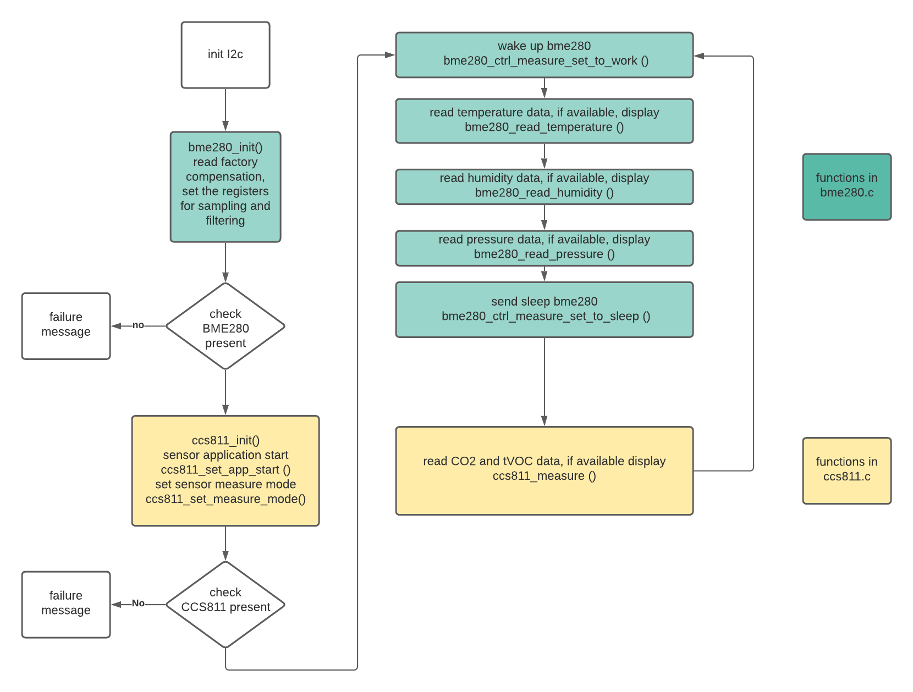
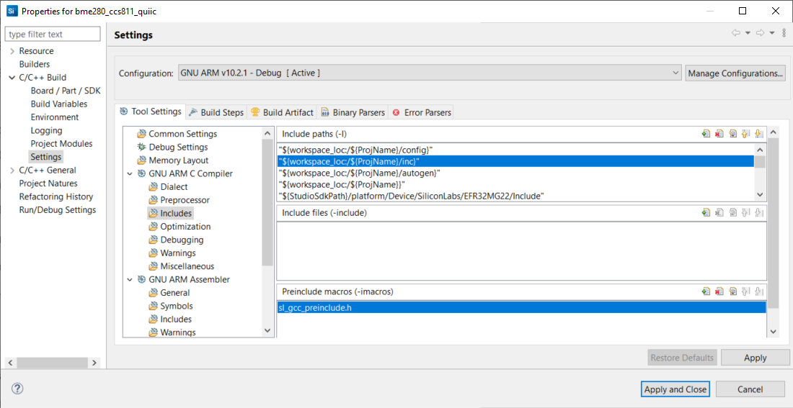
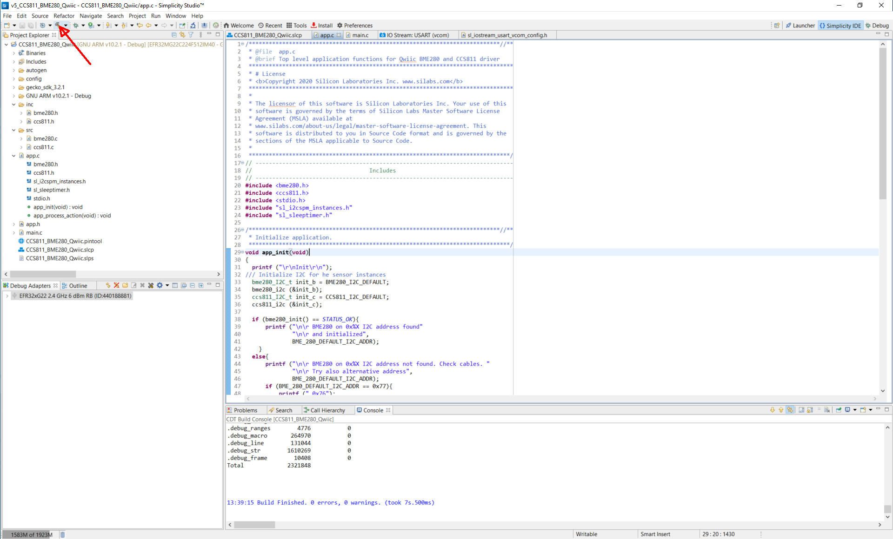
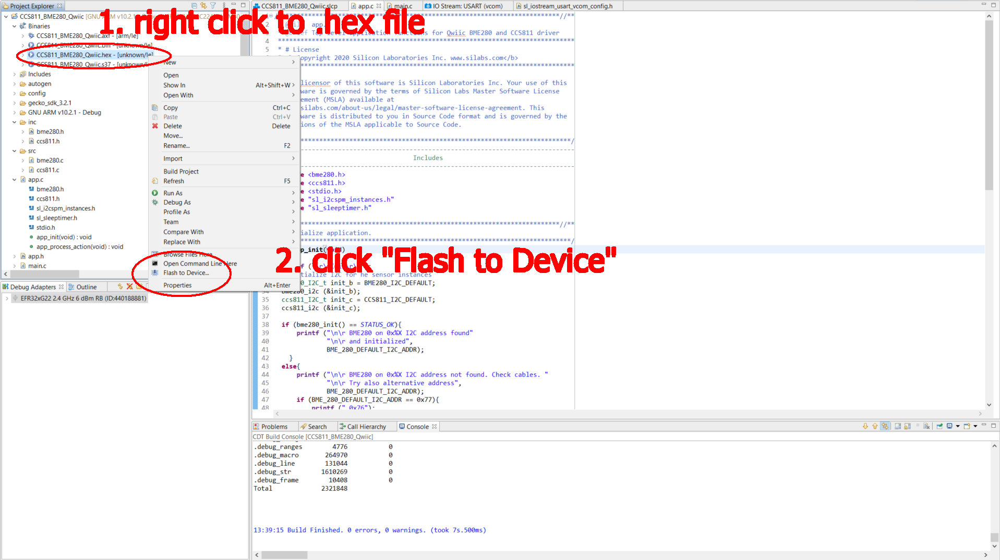
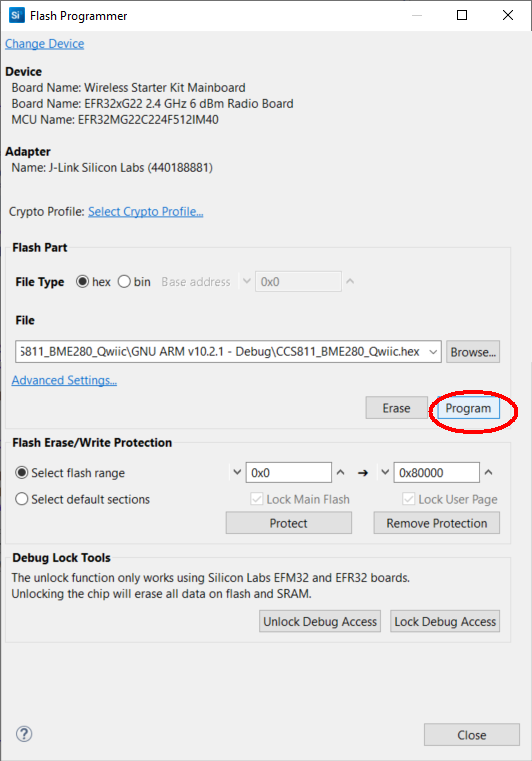
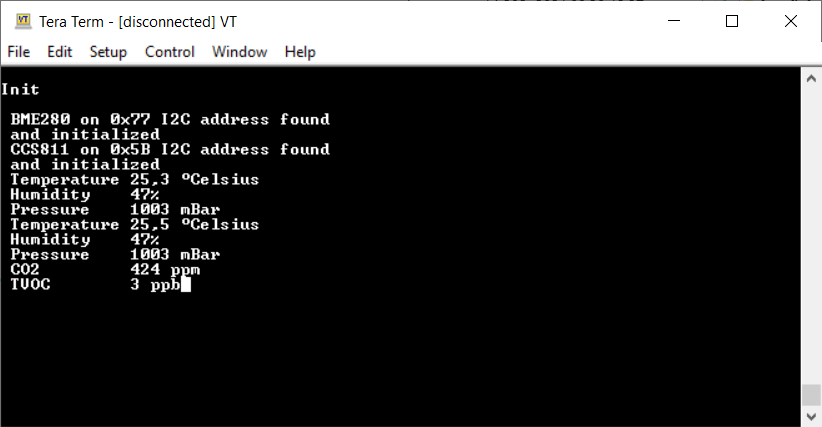

# BME280 CCS811 Qwiic driver #

This project is an I2C based driver for the SparkFun Environmental Combo Breakout - CCS811/BME280 (Qwiic). The driver also works with standalone sensors (CCS811/BME280) via I2C.

## Hardware Required ##

- WSTK Mainboard (BRD4001A)
- EFR32xG22 Radio Board (BRD4182A)

## Software Required ##

- Simplicity Studio 5
- GSDK v3.2.2

Supported boards:

- [SparkFun Environmental Combo Breakout - CCS811/BME280 (Qwiic)](https://www.sparkfun.com/products/14348)
- Standalone CCS811 or BME280 sensors

## About the board - read before measuring ##

This combo sensor is not a very good construction. The problem is that the air quality sensor (CCS811) is heating itself, and since it's too close to the thermometer unit (part of BME280), the temperature values are disturbed. If you want to use the two sensors together, you need to compensate for this measurement deviation.

> **For example:** In a constant temperature environment, power the sensor and measure the first temperature data. After 20 minutes, measure the temperature again, and the difference between the two measures will be the compensation value.

The CCS811 sensor needs a burn-in of 48 hours and a run-in of 20 minutes (you must allow 20 minutes for the sensor to warm up and output valid data).

If you want a more precise measurement, you can use two Environmental Combo sensors on the same I2C bus, but in this case, you need to solder the jumpers in the board to set the alternative I2C addresses.

## Connections Required ##

The environmental sensor board can be easily connected up with two I2C wires (SDA and SCL) along with 3v3 and GND. For the designated boards, SparkFun qwiic compatible STEMMA QT connectors can be used.

## How It Works ##

The driver is using an I2C channel to initialize and read out both sensors. If just one sensor is needed, you can delete the other sensor's header and source file.

The driver uses the sleeptimer for timings. Also, a higher level kit driver I2CSPM (I2C simple poll-based master mode driver) is used for initializing the I2C peripheral as master mode and performing the I2C transfer.

The following diagram shows the program flow as implemented in the app.c file:

It is possible to extend the code if the I2C connection is lost to re-init the sensors.

## Setup ##

To test the environmental combo application, you need to connect the environmental sensor board to the WSTK's designated I2C EXP header pins. 
At the WSTK backside, there is a small table for pin identification.
For testing purposes, it is suggested to solder a DuPont connector to the qwiic board, and connect with the proper jumper cables:

| WSTK markings              |  Qwiic board markings |
|----------------------------|-----------------------|
| Extension PIN 1  GND       |  GND                  |
| Extension PIN 20 3v3       |  3.3V                 |
| Extension PIN 16 I2C_SDA   |  SDA                  |
| Extension PIN 15 I2C_SCL   |  SCL                  |

If you have the same HW mentioned above (BRD4182a radio board and WSTK mainboard  BRD4001 Rev A01), import the attached bme280_ccs811_qwiic.sls project from the SimplictyStudio folder and skip to step 7. If you have a different board, follow these steps:

1. Create an "empty C" example project.
2. Copy the inc and src folders to your project.
3. Copy the header files from the "config" folder in the repository to the "config" folder of the project.
4. Overwrite the app.c file of your project with the one in the "test" folder of the repository.
5. Add the "inc" directory to the project's include paths.

   

6. Add the following software components:
   - **I2CSPM**
     - Create an instance for it and configure it accordingly to your target board.

   - **IO Stream USART** 
     - Create an instance or it and configure it accordingly to your target board.

   - **sleeptimer**

   - **Board Control**
     - In the configuration, enable the *Enable Virtual COM UART* option. Some boards might not require this, consult your board's user guide for details.

   - **Log**

7. Build the program.

   

8. After building, the "Binaries" files will be generated. Right click on the .hex file and flash to device.

   

   

9. Use Tera Term or other program to read the serial output. The WSTK uses by default a baudrate of 115200. You should expecte a similar output to the one below

   