# CAP1166 Capacitive touch driver #


[](https://www.mikroe.com/cap-touch-2-click)


## Overview ##

This project shows the driver implementation of a SPI capacitive touch sensor using the CAP1166 sensor with Silicon Labs Platform.

This driver provides the following features:
- Uses SPI communication between Silicon Labs wireless MCU and CAP1166 sensor
- Sensor configuration:
    - Power mode
    - Sensitivity
    - Sensing cycle
- Touch detection:
    - Single touch detection
    - Multiple touch detection
    - Touch pattern detection
- Proximity detection
- Sensor recalibration
- LED driver:
    - LED mode
    - LED behavior
    - LED direct control

The test projects which are attached with this readme file, use [BGM220P Explorer Kit](https://www.silabs.com/development-tools/wireless/bluetooth/bgm220-explorer-kit) (BRD4314A) board. For more information about example application and the unit test, see section [Testing](#testing)

## Gecko SDK version ##

- GSDK v3.2.1

## Hardware Required ##

- [CAP1166 MikroE board](https://www.mikroe.com/cap-touch-2-click)
- [BGM220P Explorer Kit](https://www.silabs.com/development-tools/wireless/bluetooth/bgm220-explorer-kit) (BRD4314A)

## Connections Required ##

The [CAP1166 MikroE board](https://www.mikroe.com/cap-touch-2-click) support MikroBus, so it can connect easily to [BGM220P Explorer Kit](https://www.silabs.com/development-tools/wireless/bluetooth/bgm220-explorer-kit)'s MikroBus header. Be sure that the board's 45-degree corner matches the Explorer Kit's 45-degree white line.

The hardware connection is shown in the image below:

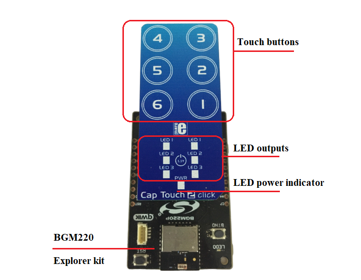

## Setup ##

First step: connect the BMG220 Explorer Kit Board to the PC using a micro-USB cable.

### Example Application Setup ###

You can either import the provided [**cap1166_simple.sls**](SimplicityStudio/cap1166_simple.sls) project file or start with an Empty C project as basis:

1. Create an "Empty C Project" for the "BGM220 Explorer Kit Board" using Simplicity Studio v5. Use the default project settings.

2. Copy the files [test/cap1166_simple/app.c](test/cap1166_simple/app.c) (overwriting existing app.c), [cap1166.c](src/cap1166.c), [cap1166.h](inc/cap1166.h), [cap1166_regs.h](inc/cap1166_regs.h), [cap1166_config.h](inc/cap1166_config.h), into the project root folder.

3. Install the software components:

- Open the .slcp file in the project.

- Select the `SOFTWARE COMPONENTS` tab.

- Install the **[Platform] > [Driver] > [SPI] > [SPIDRV]** component with the default instance name: **mikroe**. By default, this component uses the USART0 peripheral and the pins: PC00 (TX), PC01 (RX), PC02 (CLK), PC03 (CS).  
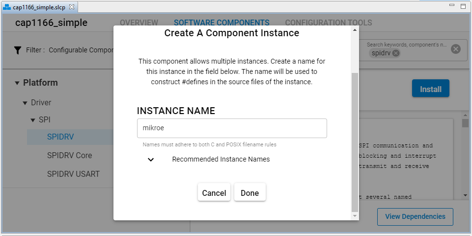

- Install the **[Platform] > [Driver] > [Button] > [Simple Button]** component with the new instance name: **sensor_alt**.  
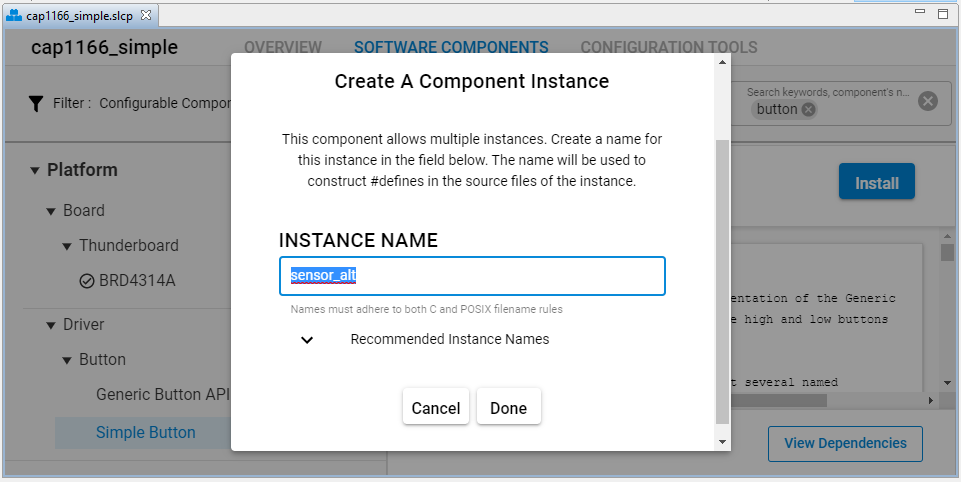
Click on `Configure` button to open Configuration tab.  
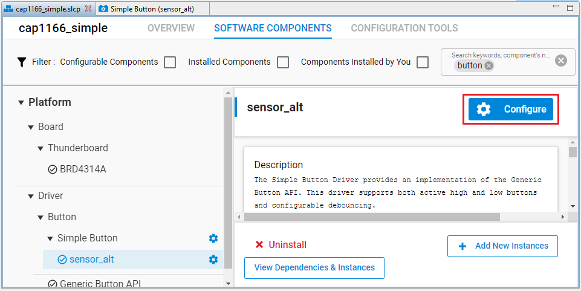
Sellect pin PB03 in the field `Module selected`.  
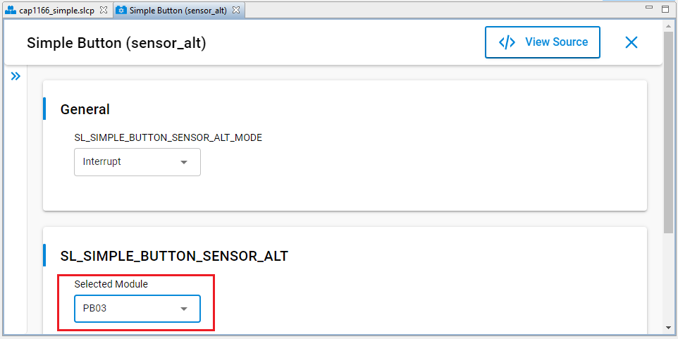

- Install the **[Services] > [Sleep Timer]** component.

- Install the **[Services] > [IO Stream] > [IO Stream: USART]** component with the default instance name: **vcom**.

- Install the **[Services] > [IO Stream] > [IO Stream: USART] > [IO Stream: Retarget STDIO]** component.

- Install the **[Application] > [Utility] > [Log]** component.

### Unit Test Setup ###

This driver has been unit tested by using the CUnit testing framework. CUnit is a lightweight framework for writing, administering, and running unit tests in C. More documents about CUnit can be found at [CUnit homepage](http://cunit.sourceforge.net/).

Follow the steps below to setup the unit test for this driver.

You can either import the provided [**cap1166_unit_test.sls**](SimplicityStudio/cap1166_unit_test.sls) project file or start with an Empty C project as basis:

1. Create an "Empty C Project" for the "BGM220 Explorer Kit Board" using Simplicity Studio v5. Use the default project settings.

2. Copy the files [test/cap1166_unit_test/app.c](test/cap1166_unit_test/app.c) (overwriting existing app.c), [cap1166.c](src/cap1166.c), [cap1166.h](inc/cap1166.h), [cap1166_regs.h](inc/cap1166_regs.h), [cap1166_config.h](inc/cap1166_config.h), [test/cap1166_unit_test/ut_cap1166.c](test/cap1166_unit_test/ut_cap1166.c), [test/cap1166_unit_test/ut_cap1166.h](test/cap1166_unit_test/ut_cap1166.h) and all of the [Cunit framework](test/cap1166_unit_test/cunit_framework) include files and source files into the project root folder.

3. Install the software components:

- Open the .slcp file in the project.

- Select the `SOFTWARE COMPONENTS` tab.

- Install **[Platform] > [Driver] > [SPI] > [SPIDRV]** component with the default instance name: **mikroe**. By default, this component uses the USART0 peripheral and the pins: PC00 (TX), PC01 (RX), PC02 (CLK), PC03 (CS).

- Install the **[Services] > [Sleep Timer]** component.

- Install the **[Services] > [IO Stream] > [IO Stream: USART]** component with the default instance name: **vcom**.

- Install the **[Services] > [IO Stream] > [IO Stream: USART] > [IO Stream: Retarget STDIO]** component.

- Install the **[Application] > [Utility] > [Log]** component.

## How it works ##

### API overview ###

The driver model is shown in the following diagram:
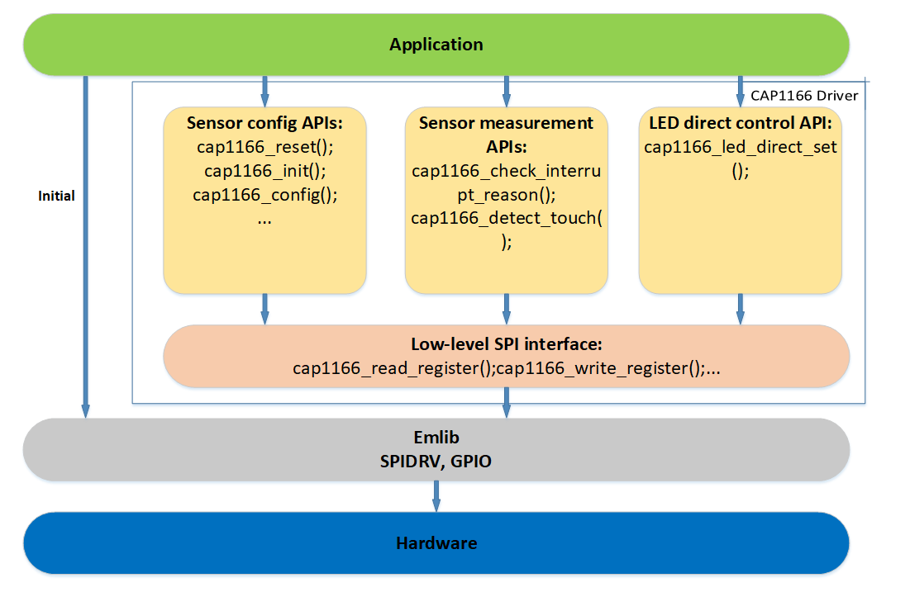

The driver provides to the application several APIs, to use the sensor and control the LED, which can be ordered to three clusters below:

- Sensor configuration
- Sensor measurement
- LED control

A detailed description of each function can be found in [doc/doxygen](doc/doxygen/html/modules.html). More detailed information can be found in [CAP1166 Datasheet](https://download.mikroe.com/documents/datasheets/CAP1166.pdf).

#### Sensor configuration ####

The sensor configuration APIs allow the application to change the sensor's configuration or do some actions to hardware such as reset the sensor and initialize the sensor.

Some basic functions:

- Reset function:
    ```C
    sl_status_t  cap1166_reset(cap1166_handle_t *cap1166_handle)
    ```
    `cap1166_reset` function hard resets the sensor via GPIO output pin connected to the sensor's reset pin, then checks if the reset process is successful or not. After reset, every configuration is cleared to default.

- Initialize function:
    ```C
    sl_status_t  cap1166_init(cap1166_handle_t *cap1166_handle)
    ```
    `cap1166_init` function will test the communication and make sure the sensor is available.

- Config functions:
    ```C
    sl_status_t cap1166_config(cap1166_handle_t *cap1166_handle,
                                  cap1166_cfg_t *cap1166_cfg)
    ```
    `cap1166_config` function will change all configurations as the input parameter.  
    There are also smaller configuration functions that allow changing only a part of the configuration:
    ```C
    sl_status_t  cap1166_sensor_sensitivity_config(cap1166_handle_t *cap1166_handle,
                                               power_state_t state,
                                               sensitivity_control_cfg_t *sensitivity_control);

    sl_status_t  cap1166_sensor_sensing_cycle_config(cap1166_handle_t *cap1166_handle,
                                                 power_state_t state,
                                                 sensing_cycle_cfg_t *sensing_cycle);

    sl_status_t cap1166_set_power_mode(cap1166_handle_t *cap1166_handle,
                                   power_state_t state,
                                   uint8_t analog_gain,
                                   sensor_inputs_cfg_t *sensor_inputs);
    ...                              

    ```

- Sensor recalibration function:  
    Recalibration re-sets the Base Count Registers which contain the “not touched” values used for touch detection comparisons.  
    The sensor inputs will be recalibrated when they are disabled. Use the `cap1166_sensor_recalib_config` function to control the recalibration when sensor inputs are still enabled during runtime:  
    ```C
    sl_status_t cap1166_sensor_recalib_config(cap1166_handle_t *cap1166_handle, recalib_cfg_t *recalib);
    ```
    `cap1166_sensor_recalib_config` function allows the application to change the automatic recalibration configurations or trigger to start the manual recalibration process.  
    More detailed information can be found in section 4.5.2 of the [CAP1166 Datasheet](https://download.mikroe.com/documents/datasheets/CAP1166.pdf).

#### Sensor measurement ####

The following functions allow the application to know which buttons were touched and which event was generated.

```C
sl_status_t cap1166_check_interrupt_reason(cap1166_handle_t *cap1166_handle, uint8_t *interrupt_reason);

sl_status_t cap1166_detect_touch(cap1166_handle_t *cap1166_handle, uint8_t *in_sens);
```

#### LED control ####

The LED's status can be controlled automatically by linking them to the sensor input. The links between LED outputs and the sensor inputs are controlled by the field `led_link_to_sensor_t led_link_to_sensor[6]` in the struct `led_cfg_t`.

The LEDs also can be controlled directly by the application. To control the LEDs directly, the application has to disconnect the automatic links described above and use `cap1166_led_direct_set` function to set LED's status.

```C
sl_status_t  cap1166_led_direct_set(cap1166_handle_t *cap1166_handle,
                                    uint8_t led_index,
                                    uint8_t state)
```

### Application workflow ###

There are two common use cases in application:
- Polling
- Handling an interrupt

Both two cases above use the same process to initialize the sensor but use different processes to detect and process a touch event.

#### Polling ####

The workflow of the polling application is shown in the diagram below:

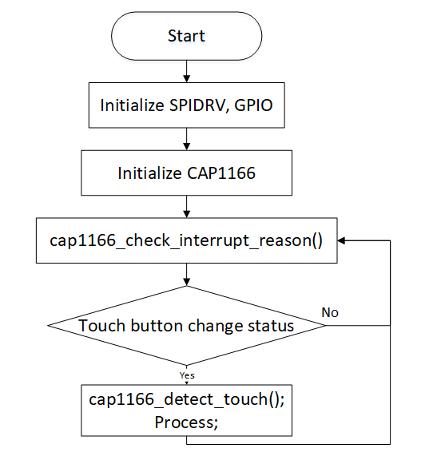

After power on, the application has to initialize the emlib driver (SPIDRV, GPIO) first, then initialize the capacitive touch sensor by SPI communication.

Then application continuously requests the sensor to check if any event is generated and processes it.

#### Handling an alert pin interrupt ####

The workflow of handling an interrupt application is shown in the diagram below:

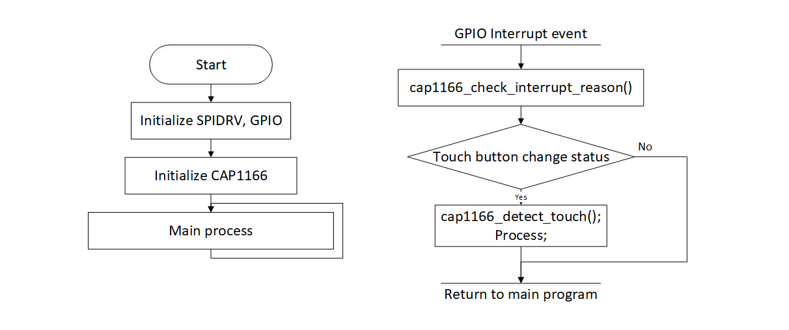

The difference between handling an interrupt method and the polling method is that the main program does not have to spend CPU bandwidth for requesting the sensor frequently, but the application has to implement the GPIO interrupt handler to check the sensor's event automatically.

Handling an interrupt is the most common use case, and will minimize application latency in the response action to a touch, multi-touch, or proximity event.

### Testing ###

#### Example application ####

In the example application, the user can select to run in normal mode or proximity mode by In the example application, the user can select to run in normal mode or proximity mode by uncommenting one or the other of the following macros:
```C
#define CAP1166_MTP_PATTERN
//#define CAP1166_PROXIMITY
```
in file `app.c`.

- In normal mode, after the application initializes the capacitive sensor, the MCU prints a message to the console every time a single touch or multiple touches are detected. The LEDs change status automatically according to the button status.

- In proximity mode, the process is the same as in normal mode but the proximity touches are detected instead of physical touches.

Below is the console output of the example application, the message is sent when a touch is detected:
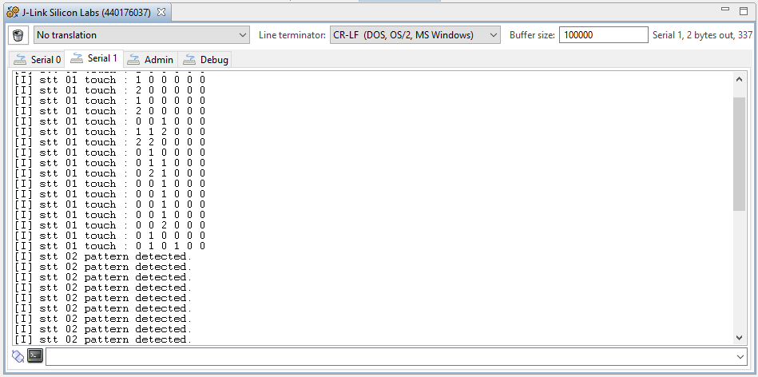

#### Unit test ####

Below is the console output of the unit test when all the test cases are passed:
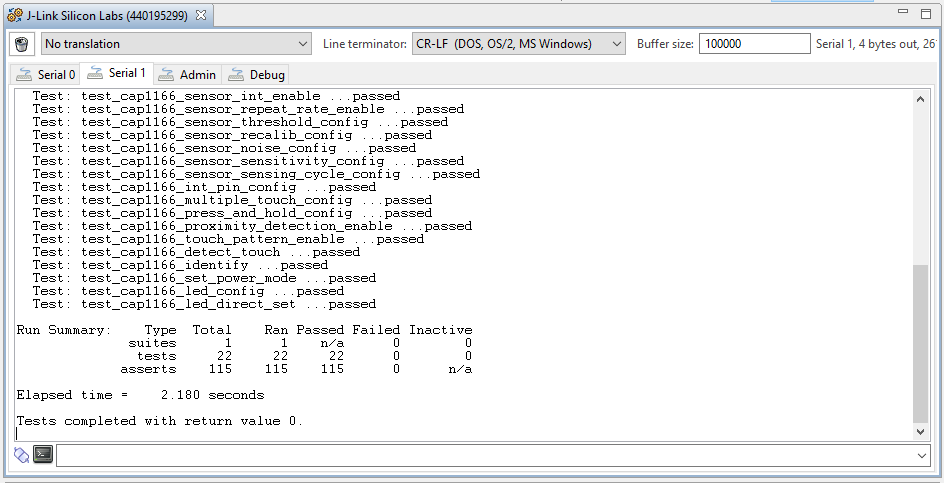

## .sls Projects Used ##

- [**cap1166_simple.sls**](SimplicityStudio/cap1166_simple.sls)
- [**cap1166_unit_test.sls**](SimplicityStudio/cap1166_unit_test.sls)

## Special Notes ##

- The attached code is used for the Explorer kit (**BRD4314A**). The pins used are configured in the `SOFTWARE COMPONENT CONFIGURATION` and the application code:  
    - SPI handle and sensor reset pin are configured in application code (see [test/cap1166_simple/app.c](test/cap1166_simple/app.c)):  
        ```C
        /* SPI driver handle */
        my_cap1166_handle.spidrv_handle = sl_spidrv_mikroe_handle;

        /* sensor reset pin */
        my_cap1166_handle.sensor_rst_port = gpioPortC;
        my_cap1166_handle.sensor_rst_pin = 6;
        ```
    - SPI pins and sensor interrupt pin are configured in `SOFTWARE COMPONENT CONFIGURATION`:
    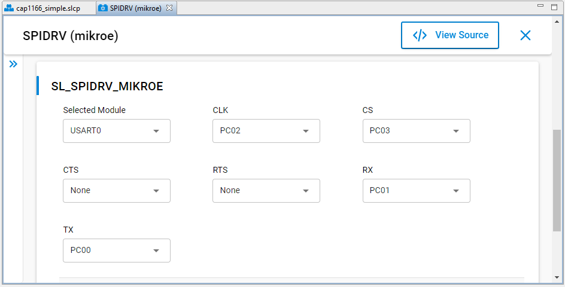
    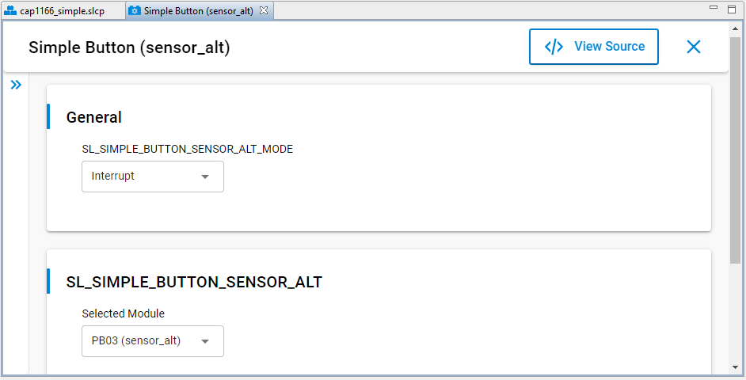

- To use this driver with other Silicon Labs's boards (e.g Thunderboard, Wireless starter kit + radio board, ...), you must use the jumper wires to connect the sensor power pins, SPI pins, sensor reset, and sensor interrupt, then create a new instance for SPIDRV and simple button or change the configurations of the existed instances to match with the hardware connection (see the first note to see how to change the pinouts configuration).

- There is an option to make the hardware connection between Thunderboard/WSTK and Mikrobus sensor board be more simple. That is using [Silabs Click Shield](https://www.mikroe.com/silabs-click-shield). This shield adapter is suitable for almost Silabs boards that use WSTK (brd4162, brd4182, ...) and Thunderboard (brd4184, ...). Example:  
    - [EFR32MG12 Starter Kit](https://www.silabs.com/development-tools/wireless/zigbee/efr32mg12-dual-band-starter-kit)
    - [Silabs Click Shield](https://www.mikroe.com/silabs-click-shield)

    The hardware connection is shown in the image below:
    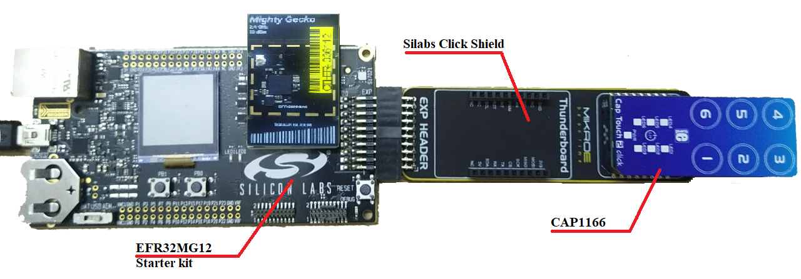

