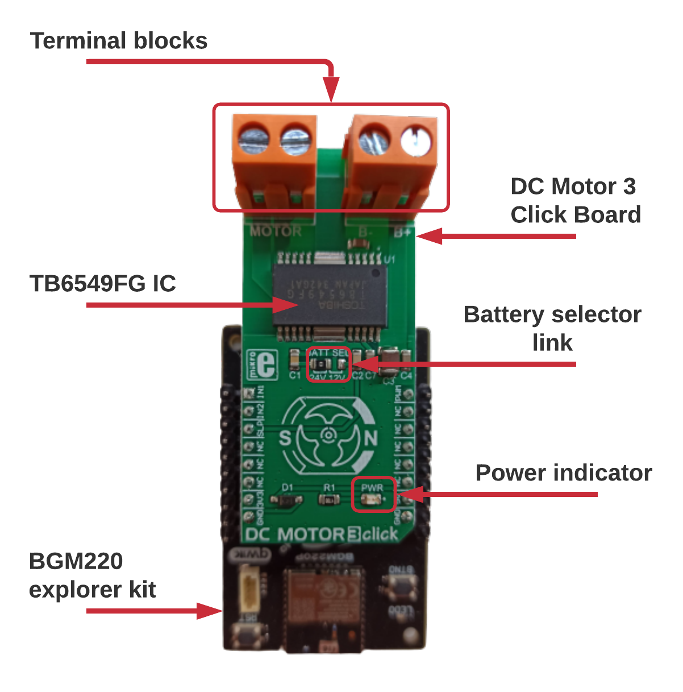
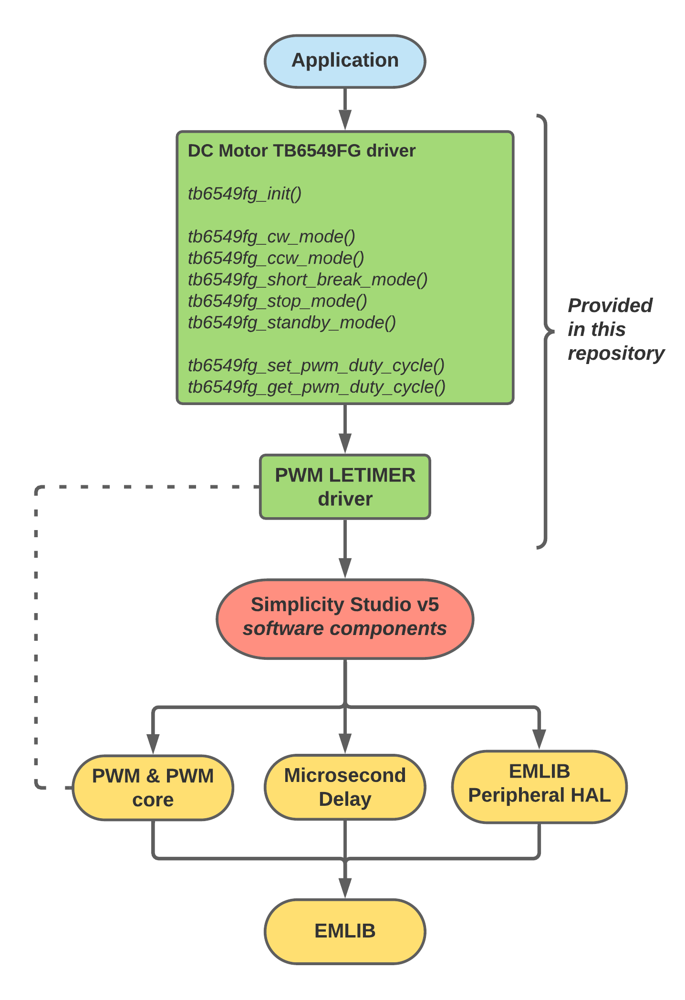
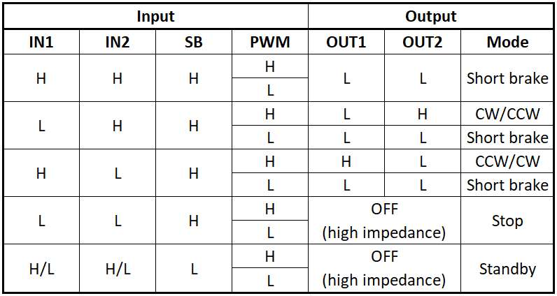
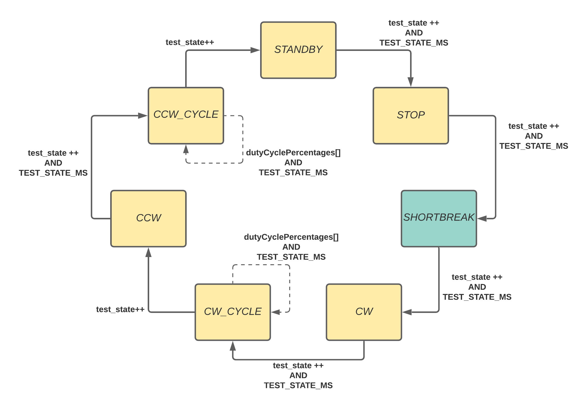
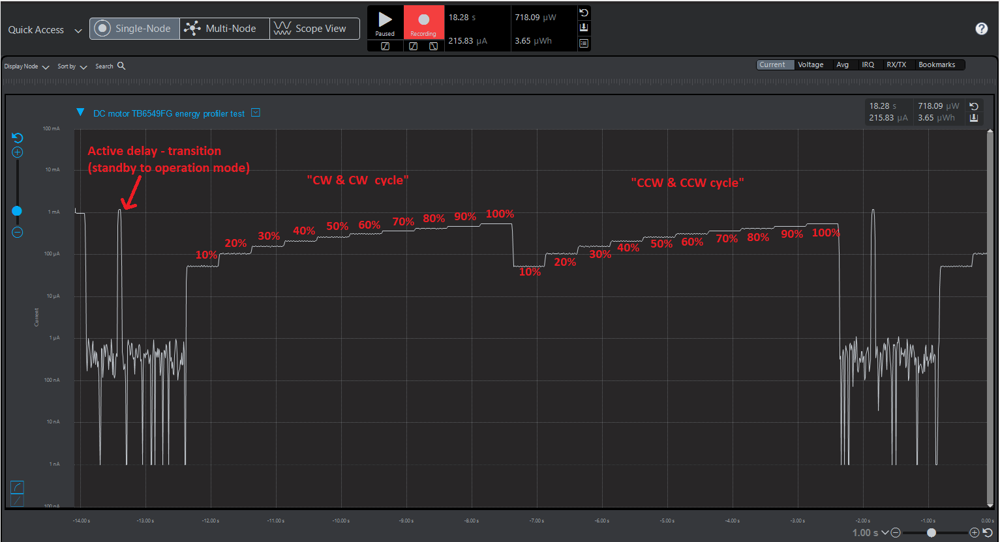

# DC motor driver #

## Summary ##

This project shows the implementation of a DC motor driver using the TB6549FG from Toshiba with the BGM220 Explorer Kit based on PWM and GPIO control.

## Gecko SDK version ##

v3.2.1

## Hardware Required ##

- [**BGM220-EK4314A:**][BGM220_LINK] BGM220 Bluetooth Module Explorer Kit (BRD4314A).

- [**DC Motor 3 click:**][DC_MOTOR3_CLICK_LINK] Board based on the TB6549FG IC from Toshiba.

- **DC Motor:** Any DC motor based between 12 to 30 V up to 3.5A will work. This example was tested using the [290-006, 12V, 639 RPM from Digilent][DC_MOTOR_LINK].

- **External power supply:** Enough to power the DC motor.

## Connections Required ##

The DC Motor 3 Click board can just be "clicked" into its place. Be sure that the board's 45-degree corner matches the Explorer Kit's 45-degree white line. The board has 2 terminal blocks, one for the DC motor and the other for its power supply. The board has a 0-ohm link to select the battery voltage.

<p align="center">

</p>

## Setup ##

To test this example, start by connecting the BMG220 Explorer Kit Board to your PC using a miniUSB cable, plug the DC Motor 3 click board into the mikroBUS header and connect the DC motor and power supply to their respective terminal blocks in the click board.

You can either [import][IMPORT_SLS_LINK] the `.sls` project included with this example or create your example application code using the included source files and adding the necessary software components in Simplicity Studio v5 according to the following instructions below:

1. Create an "*Empty C project*" for the BGM220 Explorer Kit using Simplicity Studio v5 project wizard. See the following [link][START_A_PROJECT_LINK] for details.

2. Copy the files from the "*src*", "*inc*", "*config*" and "*test*" folders into the project's root folder.

3. Open the project's `.slcp` file and add the *PWM Core*, *PWM*, *EMLIB Peripheral HAL*, and *Microsecond Delay* components from the Software Components library.

   3.1 When the PWM component is installed, an instance needs to be created and configured; name it as *motor0*. Select the desired frequency (up to 100 kHz), TIMERx peripheral instance, CCx pin for the output and OUTPUT channel (in the Explorer kit this should be PB4, TIMER0 is recommended as it's 32-bits).

4. the *Sleep Timer* and *Power Manager* components should be added as well for the application example altough they are not required for the driver itself.

5. Save the files, build and flash or debug the project.

   4.1 To build, select the project from the "*Project Explorer*" and then press the hammer icon from the toolbar. If there were no errors, then there should be a binaries folder in the project. Expand the folder and right-click on the `.s37` file and select "*Flash to Device...*". The Flash Programmer dialog will open, press "*Program*".

## API Documentation ##

### Overview ###

<p align="center">

</p>

>***Note:** The source files currently include the **sl_pwm_letimer** driver. This is needed as the current iteration of the PWM driver can't use the LETIMER peripheral to generate a PWM. This custom driver allows the device to sleep (EM2/3) and still have a valid PWM waveform output. Future iterations of this example may remove this extra driver once the LETIMER feature is added to the PWM Driver.*

The DC motor driver provides a set of functions to operate a DC motor in every mode allowed by the TB6549FG. It also provides a couple of utility functions to initialize the required peripherals and modify or get the duty cycle of the PWM waveform on the fly.

Fundamentally, the DC motor control is based on a combination of GPIO inputs to determine a specific operation mode and the PWM duty cycle to determine the speed. The following table is based on the one found in the TB6549FG datasheet, it shows the truth table for the GPIO control pins and their corresponding operation mode:

<p align="center">

</p>

The driver handles the GPIO states based on the desired mode of operation and also manages the PWM waveform and its duty cycle based on the TIMER and LETIMER peripherals, the latter enables a PWM output while the device is sleeping (EM2/EM3) ideal for low-energy applications.

Note that the TB6549FG has certain limitations such as a maximum PWM frequency of 100 kHz and a minimum high period of 2 us for its PWM. All of these conditions are checked by the API and return an error message when the desired configuration is out of limits. Keep in mind that the PWM's frequency and duty cycle has a finite resolution mainly affected by the timer's bit size and the "*peripheral clock to PWM frequency ratio*". The following rules of thumb can be followed but for specific details such as formulas you should check the devices' reference manual and datasheet:

- A larger TIMER (32 bits) will have better resolution than a smaller one (16 bits).

  - For the Explorer kit and series 2 devices, this is TIMER0; for series 1 devices use WTIMER.

- PWM frequencies that are multiples of the TIMER/LETIMER source clock are better.

- A higher PWM frequency will result in a lower duty cycle resolution as the clock count per PWM period decreases.

### Peripherals Usage ###

- 1x TIMER/LETIMER instance for PWM generation.
- 3x GPIO pins for logic control of the TB6549FG.

### Software component dependencies ###

The driver requires the following software component for proper operation

- **PWM, PWM Core:** Required for PWM waveform control (TIMER).
- **EMLIB Peripheral HAL:** Adds all compatible EMLIB APIs with the target device. We're interested in the GPIO and LETIMER.
- **Microsecond Delay:** Used to add a necessary delay for the TB6549FG when transitioning from standby to operation modes

Additionally, the example application uses the following software component:

- **Sleep Timer:** Used to time the transitions of the state machine.
- **Power Manager:** Used to manage energy modes.

### Special notes ###

Since the PWM waveform is controlled by the PWM software component or the included PWM LETIMER driver, the related output GPIO must be configured through their respective interfaces:

- **PWM software component**: See step 3.1 in the ["**Setup**"](##setup##) section above
- **PWM LETIMER driver**: Open the included file `sl_pwm_letimer_instances.h` and configure the output GPIO and PWM frequency through the symbols provided. Since the LETIMER is sourced by a low-frequency clock, it's advisable to keep the PWM frequency low to increase the duty cycle resolution.

The API functions call for a pointer of type `tb6549fg_inst_t` this is the driver handle. Two members are of special importance: *pwm* and *pwm_letimer* both pointers to the corresponding PWM driver handle. Furthermore, the *enable_sleep* member is used across the APIs to determine which PWM handle to use (PWM or PWM LETIMER) so, ensure that a valid pointer is assigned to the driver handle depending on the mode to be used.

## Application example ##

The test example provided showcases the DC motor TB6549FG driver through a state machine. Each operation mode provided by the TB6549FG IC is implemented as an individual state along with a special case where the speed of the connected DC motor is ramped up by cycling through predefined duty cycles which can be modified through the array `dutyCyclePercentages`. The transition time between states can be configured through the `TEST_STATE_MS` symbol, the example also provides the `DEBUG_PIN` symbol used to enable a GPIO to toggle its output on each state transition. The diagram below shows the transition order:

<p align="center">

</p>

When calling the function `dc_motor3_app_init` the boolean parameter `enable_sleep` is received to determine if a PWM driver handle (false) or PWM LETIMER driver handle (true) should be used. Set to true if your application will go to sleep mode and the PWM waveform should be available. Note that current consumption will increase depending on the duty cycle of the waveform. The image below shows an energy profiler capture of the full cycle of the example's state machine, note how the current increases as the PWM's duty cycle increase.

<p align="center">

</p>

## .sls Projects Used ##

[TB6549FG_example.sls](SimplicityStudio/reference_component_DC_MOTOR3_driver_app_ExplorerBGM220.sls)

## How to Port to Another Part ##

Open the **"Project Properties"** and navigate to the **"C/C++ Build -> Board/Part/SDK"** item. Select the new board or part to target and **"Apply"** the changes.

The GPIO needs to be configured as well to match the desired configuration of your target platform, this can be done through the symbols in the file `dc_moto_TB6549FG_config.h`.

```c
#define TB6549FG_IN1_PORT   gpioPortA
#define TB6549FG_IN1_PIN    8

#define TB6549FG_IN2_PORT   gpioPortA
#define TB6549FG_IN2_PIN    7

#define TB6549FG_SB_PORT    gpioPortC
#define TB6549FG_SB_PIN     6

#define TB6549FG_PWM_PORT   gpioPortB
#define TB6549FG_PWM_PIN    0
#define TB6549FG_PWM_LOC    0 
```

Refer to the [**"Special notes"**](###special-notes###) section above for details on configuring the *PWM/PWM LETIMER drivers*.

*Note*: there may be dependencies that need to be resolved when changing the target architecture.

[BGM220_LINK]:https://www.silabs.com/development-tools/wireless/bluetooth/bgm220-explorer-kit
[DC_MOTOR3_CLICK_LINK]:https://www.mikroe.com/dc-motor-3-click
[DC_MOTOR_LINK]:https://store.digilentinc.com/motor-gearbox-1-19-gear-ratio-custom-12v-motor-designed-for-digilent-robot-kits/
[IMPORT_SLS_LINK]: https://docs.silabs.com/simplicity-studio-5-users-guide/latest/ss-5-users-guide-about-the-simplicity-ide/import-and-export
[START_A_PROJECT_LINK]:https://docs.silabs.com/simplicity-studio-5-users-guide/latest/ss-5-users-guide-getting-started/start-a-project
[PWM_DRIVER_LINK]:https://docs.silabs.com/gecko-platform/3.0/driver/api/group-pwm