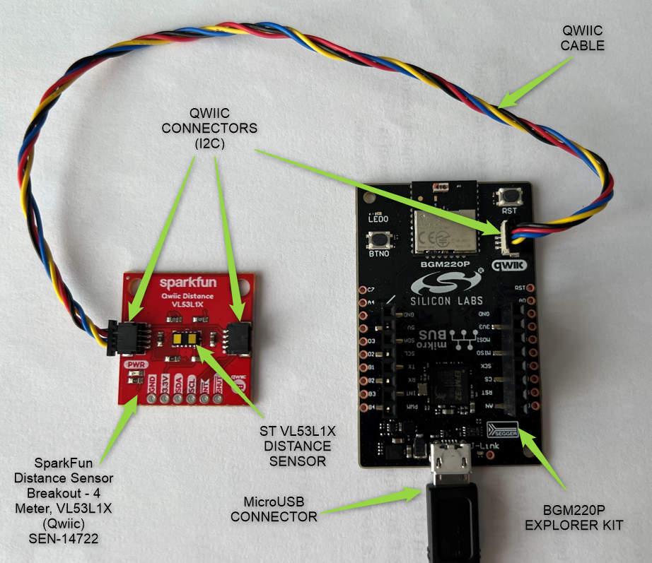
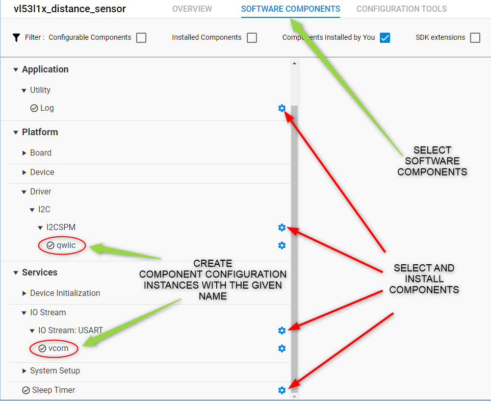
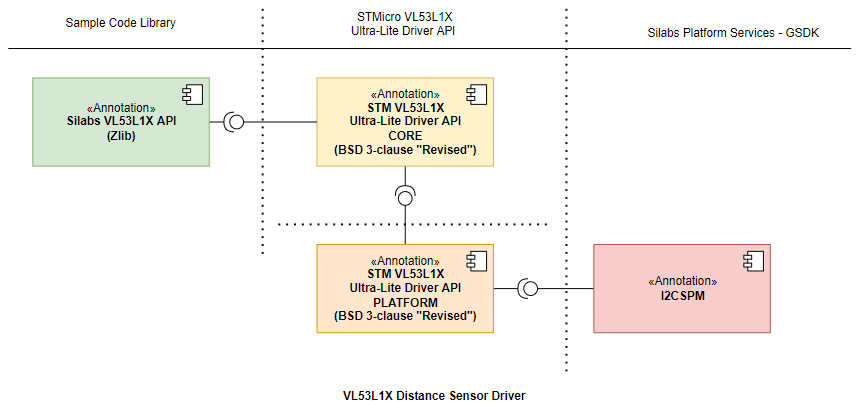
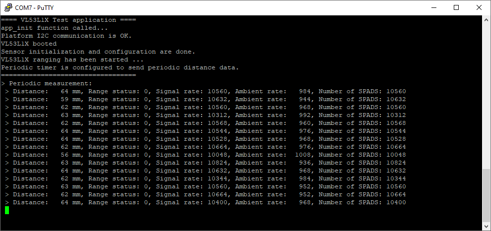

# VL53L1X Distance Sensor Driver #

## Overview ##
This project shows the integration of the ST's [VL53L1X distance sensor ultra-lite driver](https://www.st.com/en/imaging-and-photonics-solutions/vl53l1x.html#tools-software) API with GSDK.

VL53L1X is a state-of-the-art, Time-of-Flight (ToF), laser-ranging sensor.
It is the fastest miniature ToF sensor on the market with accurate ranging up to 4 m and fast ranging frequency up to 50 Hz Housed in a miniature and reflowable package, it integrates a SPAD receiving array, a 940 nm invisible Class1 laser emitter, physical infrared filters, and optics to achieve the best ranging performance in various ambient lighting conditions with a range of cover window options.

## Gecko SDK version ##

GSDK v4.0.2

## Hardware Required ##

- [BGM220 Explorer Kit board](https://www.silabs.com/development-tools/wireless/bluetooth/bgm220-explorer-kit)
- [SparkFun Distance Sensor Breakout - 4 Meter, VL53L1X (Qwiic)](https://www.sparkfun.com/products/14722) or [MikroE LIGHTRANGER 4 Click](https://www.mikroe.com/lightranger-4-click)

## Connections Required ##

A VL53L1X sensor board can be easily connected up with two I2C wires (SDA and SCL) along with 3v3 and GND. For the designated boards, SparkFun Qwiic compatible STEMMA QT connectors can be used.

## Setup ##

To test this application, you should connect the BMG220 Explorer Kit Board to the PC using a microUSB cable. 

You can either import the provided **vl53l1x_distance_sensor.sls** project file or start with an empty example project as basis:

1. Create a "Empty C Project" project for the "BGM220 Explorer Kit Board" using Simplicity Studio 5. Use the default project settings. Be sure to connect and select the BGM220 Explorer Kit Board from the "Debug Adapters" on the left before creating a project.

2. Copy all attached files in *inc* and *src* folders into the project root folder (overwriting existing app.c).

3. Install the software components:

   - Open the .slcp file in the project.

   - Select the SOFTWARE COMPONENTS tab.

   - Install the following components
      - [Services] →  [Sleep Timer]
      - [Services] →  [IO Stream] → [IO Stream: USART] → instance name: **vcom** 
      - [Platform] →  [Driver]→ [I2C] →  [I2CSPM] → instance name: **qwiic**
      - [Application] →  [Utility] → [Log]

    ***

    

4. Build and flash the project to your device.

## How It Works ##

### API Overview ###

The driver diveded into three layers, a platform, a core, and an interface layer. The core layer implements the key features, the platform layer provides integration to the host microcontroller hardware-dependent codes. (In practice it integrates the I2CSPM platform service.). Above these levels, the upper layer provides an interface with standard Silabs return codes and complies with Silicon Labs coding standard. 

[vl53l1_platform.c](src/vl53l1_platform.c): Integrates the Silabs I2CSPM driver for I2C communication.

[vl53l1x_core.c](src/vl53l1x_core.c): ST Ultra-Lite Driver Core API, implements VL53L1X sensor core features.

[vl53l1x_calibration.c](src/vl53l1x_calibration.c): ST Ultra-Lite Driver Calibration API, implements VL53L1X sensor calibration features.

[vl53l1x.c](src/vl53l1x.c): Implements public interfaces to interact with ST ULD Core features.

### Testing ###
Use Putty or other program to read the serial output. The BGM220P uses by default a baudrate of 115200. You should expect a similar output to the one below.

