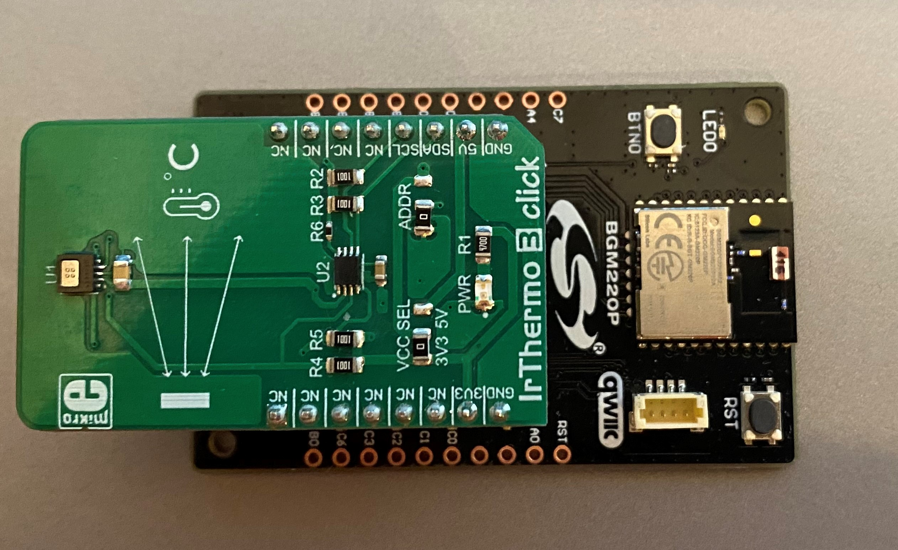
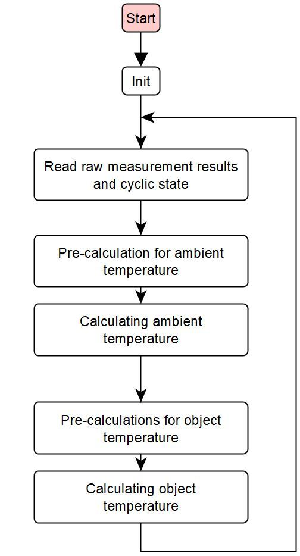

# MLX90632 IrThermo 3 click Driver

## Overview ##

This project shows the implementation of an I2C temperature sensor driver using MLX90632 FIR sensor from Melexis with BGM220 Explorer Kit. A target application of a temperature sensor could be ideal for:
- Non-contact temperature measurements
- Temperature sensing element for residential, commercial and industrial building air conditioning
- Home appliances with temperature control
- Industrial temperature control of moving parts

## Gecko SDK version ##

GSDK v3.1.2

## Hardware Required ##

- [**BGM220-EK4314A** BGM220 Bluetooth Module Explorer Kit (BRD4314A BGM220 Explorer Kit Board)](https://www.silabs.com/development-tools/wireless/bluetooth/bgm220-explorer-kit)
- [**IrThermo 3 Click**(MLX90632 FIR sensor)](https://www.mikroe.com/ir-thermo-3-click)

## File and API Documentation ##

Application only calls mlx90632_init and measurment_cb which are both in [mlx90632.c](src/mlx90632.c).

[mlx90632.c](src/mlx90632.c) - This is the top-level API implementation. The user application should only use the APIs listed below.
- `mlx90632_init`: Initialize MLX90632 driver, confirm EEPROM version.
- `mlx90632_addressed_reset`: Reset mlx90632.
- `measurment_cb`: Function gives back both temperature values.

[mlx90632_i2c.c](src/mlx90632_i2c.c) - Implements mlx90632 I2C communication.
- `mlx90632_i2c_read`: I2C read implementation for 16-bit values.
- `mlx90632_i2c_read32`: I2C read implementation for 32-bit values.
- `mlx90632_i2c_write`: I2C write implementation.

## How it works ##

The device is factory calibrated with calibration constants stored in the EEPROM memory. The ambient and object temperature can
be calculated based on these calibration constants and the measurement data. 

The MLX90632 is factory calibrated in the ambient temperature range from -20 to 85˚C and from -20 to 200˚C for
the object temperature range. The measured value is the average temperature of all objects in the Field Of View
of the sensor (50 degrees).

The thermopile sensing element voltage signal is amplified and digitized. After digital filtering, the raw measurement result is stored in the RAM memory. 
Furthermore, the MLX90632 contains a sensor element to measure the temperature of the sensor itself. The raw information of this  sensor is also stored in RAM after processing. 
The result of each measurement conversion is accessible via I2C. From the measurement data and the calibration data the external unit can calculate both the sensor
temperature and the object temperature.

### Workflow

A typical ambient and object temperature measurements are shown in the following figure.

The `mlx90632_init` function configures the sensor, in this way the user only needs to call one init function during startup. The factory-programmed calibration values are also read from the sensor in the init function.
After init function, in case of using the `measurment_cb` API function this whole measurement and calculation process is done internally by the driver. 

## Create an example application ##

Simplicity Studio 5-series was used to create the example code.

You can either create an example application code as basis and modify it according to the instructions below or use the ready made .sls-project.

1.) Create a "Empty C Project" project for the" BGM220 Explorer Kit Board" using SimplicityStudio 5 Launcher-perspective EXAMPLE PROJECTS-tab. Use the default project settings. Be sure to connect and select the BGM220 Explorer Kit Board from the "Debug Adapters" on the left before creating a project.

2.) Then copy the files [app.c](src/app.c), [mlx90632.c](src/mlx90632.c), [mlx90632_i2c.c](src/mlx90632_i2c.c), [mlx90632.h](inc/mlx90632.h) and [mlx90632_i2c.h](inc/mlx90632_i2c.h) in to the project root folder (app.c is replacing the old app.c).

3.) Install software components in the .slcp
#### Bluetooth:
- Log
#### Platform:
- I2CSPM Core
- I2C
- I2CSPM (Fast mode)
- USART
#### Services:
- CLI: CLI Core
- CLI: Command Line Interface
- IO Stream
- IO Stream: USART Core
- IO Stream: USART
#### Third Party:
- Tiny print 

4.) Save the files, build and ready to flash or debug! To build select the project from the "Simplicity IDE"-perspectives "Project Explorer" and then press the hammer sign from the above toolbar. If there were 0 warnings, then there should be a Binaries-folder in the project. Expand the folder and use the right menu button for the .s37 file and select "Flash to Device". Flash Programmer dialog should be opened. The correct file is selected so just select Program.

5.)Lunch console and then choose Serial 1, finally press enter.

Bluetooth application example can be found here:
https://github.com/SiliconLabs/bluetooth_applications_staging/tree/feature/bluetooth_irthermo_3_click/bluetooth_fir_sensor_mlx90632
  

