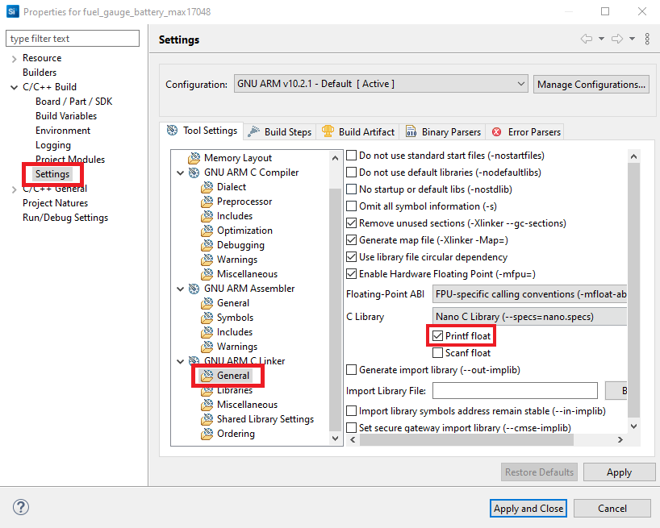

# Battery Fuel Gauge MAX17048 #

## Overview ##

This project shows the implementation of an I2C fuel gauge driver using MAX17048EVKIT from Maxim Integrated with EFR32xG21 Radio Board and Wireless Starter Kit Mainbard.

## Gecko SDK Version ##

v3.2.3

## Hardware Required ##

- [MAX17048XEVKIT Evalue Kit](https://www.maximintegrated.com/en/products/power/battery-management/MAX17048XEVKIT.html)

- [EFR32xG21 Radio Board (SLWMB4001A)](https://www.silabs.com/development-tools/wireless/wireless-starter-kit-mainboard)

- Wireless Starter Kit Mainbard SLWRB4180A

## Connections Required ##

A battery fuel gauge kit can be easily connected up with two I2C wires (SDA and SCL) along with 3.3V and GND.

## Setup ##
To test this application, you should connect the MAX17048EVKIT Board to the WSTK's I2C EXP header pins.

| WSTK                      |  Fuel Gauge board markings |
|---------------------------|----------------------------|
| Extension PIN 1  GND      |  GND                       |
| Extension PIN 20 3v3      |  3.3V                      |
| Extension PIN 9 I2C_SDA   |  SDA                       |
| Extension PIN 7 I2C_SCL   |  SCL                       |
| Extension PIN 6 GPIO      |  ALRT                      |

You can either import the provided **fuel_gauge_baterry_max17048.sls** project file or start with an empty example project as basis:

1. Create a "Platform - Empty C Project" project for the "EFR32xG21 Radio Board" using Simplicity Studio v5. Use the default project settings. Be sure to connect and select the Wireless Starter Kit Mainbard SLWRB4180A from the "Debug Adapters" on the left before creating a project.

2. Copy the files app.c, max17048.h, max17048.c, max17048_config.h into the project root folder (overwriting existing app.c).

3. Install the software components:

- Open the project's .slcp file.

- Select the SOFTWARE COMPONENTS tab.

- Install **[Platform] > [Driver] > [I2CSPM]** component with the new instance name: **sensor**. Set this component to use I2C0 peripheral, SDL to PD02 pin, SDA to PD03 pin.

- Install **[Platform] > [Board Control]** component. Set **Enable Virtual COM UART**.

- Install **[Services] > [IO Stream] > [IO Stream: USART]** component with the default instance name **vcom**.

- Install **[Application] > [Utility] > [Log]** component.

- Install **[Platform] > [Driver] > [GPIOINT]** component.

- Install **[Platform] > [Board Drivers] > [Memory LCD with usart SPI driver]** component.

- Install **[Platform] > [Driver] > [GLIB Graphics Library]** component.

- Install **[Platform] > [Driver] > [TEMPDRV]** component.

4. Install printf float

- Open Properties of the project.

- Select **C/C++ Build > Settings > Tool Settings >GNU ARM C Linker > General**. Check **Printf float**.

5. Build and flash the project to your device.

## .sls Projects Used ##

**fuel_gauge_baterry_max17048.sls** - Import this project to have a ready-to-compile project.
    

