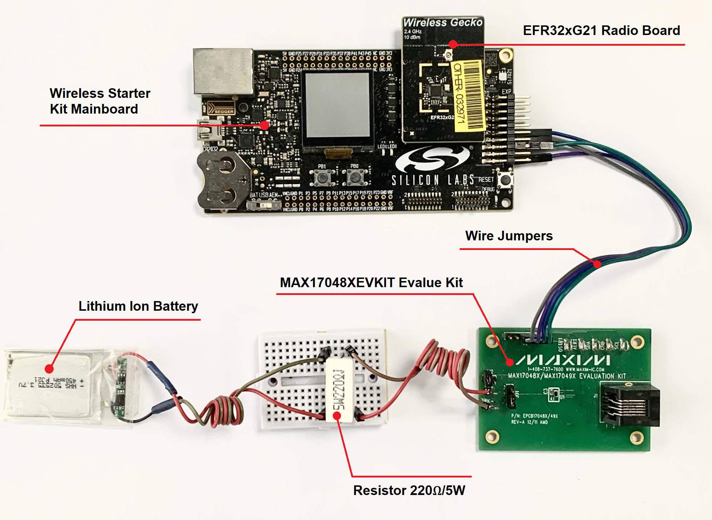
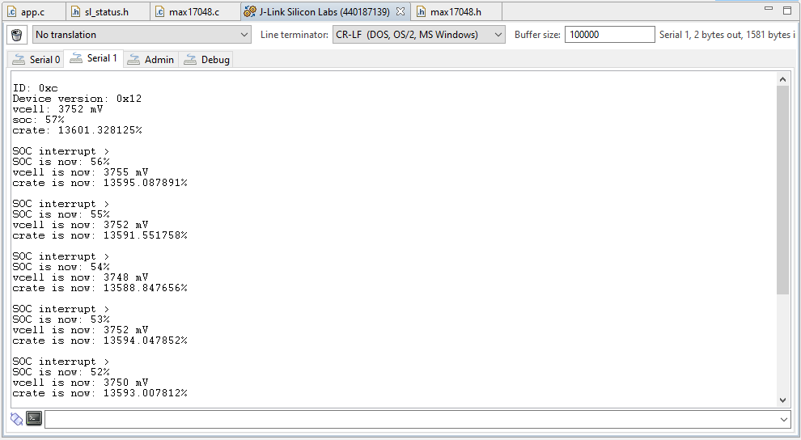

# Battery Fuel Gauge MAX17048 #


[](https://www.maximintegrated.com/en/products/power/battery-management/MAX17048XEVKIT.html)


## Overview ##

This project shows the implementation of an I2C Fuel Gauge driver using the MAX17048EVKIT Evalue Kit from the Maxim Integrated with the EFR32xG21 Radio Board and the Wireless Starter Kit Mainboard.

The block diagram of this example is shown in the image below:


## Gecko SDK Version ##

GSDK v4.0.2

## Hardware Required ##

- [MAX17048XEVKIT Evalue Kit](https://www.maximintegrated.com/en/products/power/battery-management/MAX17048XEVKIT.html)

- [Wireless Starter Kit Mainboard](https://www.silabs.com/development-tools/wireless/wireless-starter-kit-mainboard)

- [10dBm EFR32xG21 Radio Board](https://www.silabs.com/development-tools/wireless/slwrb4181b-efr32xg21-wireless-gecko-radio-board)

- [Lithium Ion Battery](https://www.sparkfun.com/products/13851)

- A high power resistor (e.g 220Ω/5W) is as the load of the battery.

## Connections Required ##

We can use some [Wire Jumpers Female to Female](https://www.mikroe.com/wire-jumpers-female-to-female-30cm-10pcs) to connect between the EFR32xG21 Wireless Starter Kit and the MAX17048XEVKIT Evalue Kit, and between the MAX17048XEVKIT Evalue Kit to the Lithium Ion Battery and the load as shown below.



| WSTK markings             |  MAX17048XEVKIT Evalue Kit markings |
|---------------------------|:-----------------------------------:|
| Extension PIN 1  - GND    |  J2-4: GND                          |
| Extension PIN 9 - PD03    |  J2-5: SDA                          |
| Extension PIN 7 - PD02    |  J2-3: SCL                          |
| Extension PIN 6 - PC01    |  J2-6: ALRT                         |

| MAX17048XEVKIT Evalue Kit markings |  Lithium Ion Battery |
|:----------------------------------:|:--------------------:|
| PK+                                |  BAT+                |
| PK-                                |  BAT-                |

**Note:** The MAX17048 EV kit is set by default to evaluate 1-cell Li+ batteries. LDO U2 is provided so that only a single supply is needed to power the EV kit in the case a 2-cell battery is used. When evaluating the MAX17048, set jumper JU1 to pins 1-2 and remove any shunt installed on JU2 to bypass the LDO.

## Setup ##

You can either import the provided **max17048_simple.sls** project file or start with an empty example project as basis:

1. Create a "Platform - Empty C Project" project for the "EFR32xG21 Radio Board" using Simplicity Studio v5. Use the default project settings. Be sure to connect and select the Wireless Starter Kit Mainbard SLWRB4180A from the "Debug Adapters" on the left before creating a project.

2. Copy the files app.c, max17048.h, max17048.c, max17048_config.h into the project root folder (overwriting existing app.c).

3. Install the software components:

   - Open the project's .slcp file.

   - Select the SOFTWARE COMPONENTS tab.

   - Install **[Platform] > [Driver] > [I2CSPM]** component with the new instance name: **inst**. Set this component to use I2C0 peripheral, SDL to PD02 pin, SDA to PD03 pin.

        

        

   - Install **[Services] > [Sleep Timer]** component.

   - Install **[Services] > [IO Stream] > [IO Stream: USART]** component with the default instance name: **vcom**.

   - Set **Enable Virtual COM UART** in **[Platform] > [Board Control]** component.

        

   - Install **[Platform] > [Driver] > [GPIOINT]** component.

   - Install **[Platform] > [Driver] > [TEMPDRV]** component.

   - Install **[Application] > [Utility] > [Log]** component.

4. Install printf float

   - Open Properties of the project.

   - Select **C/C++ Build > Settings > Tool Settings >GNU ARM C Linker > General**. Check **Printf float**.

     

5. Build and flash the project to your device.

## How it works ##

### API overview ###

A detailed description of each function can be found in [doc/doxygen](doc/doxygen/html/modules.html).

**Note:** When Power Manager is used, I2C transfers to and from the MAX17048 always complete because the driver adds a Power Manager requirement that prevents EM2 or EM3 entry. In cases where Power Manager is not used, it may be desirable to mark sections of code that call driver functions as atomic or critical if an interrupt can cause entry into EM2 or EM3.

The APIs of the driver can be grouped into as follows:

1. Initialization:
  
     The driver is using an I2C module that is connected to the MAX17048. This function does not write to any of the MAX17048 registers.

     For initialization, it assigns the I2C used to communicate with the device, configures the GPIO(s) used for the ALRTn and optional QSTRT pin(s), and starts a software timer to trigger temperature (RCOMP) updates at the user-specified rate.

     For de-initialization, its sole purpose is to return the GPIO pin(s) used for the ALRTn and optional QSTRT pins to the disabled state. Manually disable all of its interrupts (or set those with thresholds to min/max values that cannot be reached) and then place the device in sleep mode by calling max17048_enter_sleep(), which disables battery monitoring altogether.

     - Initalize the MAX17048 driver with the values provided in the max17048_config.h file:

          ```c
          sl_status_t max17048_init(void)
          ```

     - De-initalize the MAX17048 driver:

          ```c
          sl_status_t max17048_deinit(void)
          ```

2. Read Battery State Information

     These functions return VCELL and the state-of-charge for the battery.

     - This function returns the cell voltage in millivolts:

          ```c
          sl_status_t max17048_get_vcell(uint32_t *vcell)
          ```

     - This function returns SOC as an integer %:

          ```c
          sl_status_t max17048_get_soc(uint32_t *soc)
          ```

     - This function gets an approximate value for the average SOC rate of change:

          ```c
          sl_status_t max17048_get_crate(float *crate)
          ```

3. Temperature measurement

     The MAX17048 requires updates to the RCOMP temperature compensation factor at least once every minute. The driver creates a periodic Sleeptimer software timer that retrieves the temperature and updates the MAX17048 CONFIG register with an updated RCOMP value calculated from the temperature. The driver allows the user to select one of two temperature measurement options that is used upon expiration of the periodic Sleeptimer: EMU temperature sensor or User-provided temperature measurement callback function.

     Some of the APIs in this group can be listed as:

     - MAX17048 temperature external temperature measurement callback function:

          ```c
          typedef int32_t (*max17048_temp_callback_t)(void);
          ```

     - Register the temperature update callback for the MAX17048 driver:

          ```c
          sl_status_t max17048_register_temperature_callback(max17048_temp_callback_t temp_cb)
          ```

     - Unregister the temperature update callback for the MAX17048 driver:

          ```c
          sl_status_t max17048_unregister_temperature_callback(void)
          ```

     - Set the RCOMP update interval:

          ```c
          sl_status_t max17048_set_update_interval(uint32_t interval)
          ```

     - Get the RCOMP update interval:

          ```c
          uint32_t max17048_get_update_interval(void);
          ```

4. Interrupt Management

     The MAX17048 has several interrupt sources. The state of these interrupts is determined by polling the STATUS register in response to assertion of the active-low ALRTn pin. The driver uses a GPIO pin to connect to the MAX17048 active-low ALRTn pin. The MAX17048 does not have a global interrupt enable/disable bit. However, assertion of the active-low ALRTn pin is controlled by the ALRT global alert status bit in the CONFIG register. After clearing the specific alert source by writing a 0 to its corresponding STATUS register bit, it is also necessary to write a 0 to the CONFIG register ALRT bit to 0 to de-assert the ALRTn pin.

     The driver provides a way to enable and register callbacks for the following interrupts:

     - State-of-Charge (SOC): This interrupt is enabled by writing a 1 to the ALSC bit in the CONFIG register (0x0C) and is triggered any time the SOC changes by 1%. At its simplest, this interrupt can be used to updated a graphical fuel gauge display.

     - Empty Threshold: This interrupt is always enabled and is triggered at a threshold inversely specified by the CONFIG register ATHD field.

     - Voltage Alert Threshold: These are two separate interrupts that are triggered if VCELL is greater than or less than user-specified maximum and minimum values.

     - Reset Threshold: This interrupt is used to detect battery removal or a drop in the cell output voltage below which system functionality may be impaired.

     Some of the APIs in this group can be listed as:

     - MAX17048 interrupt callback function:

          ```c
          typedef void (*max17048_interrupt_callback_t)(sl_max17048_irq_source_t irq, void *data)
          ```

     - Mask MAX17048 interrupts:

          ```c
          void max17048_mask_interrupts(void)
          ```

     - Unmask MAX17048 interrupts:

          ```c
          void max17048_unmask_interrupts(void)
          ```

     - Enables the MAX17048 state-of-charge (SOC) interrupt and registers  a user-provided callback function to respond to it:

          ```c
          sl_status_t max17048_enable_soc_interrupt(max17048_interrupt_callback_t irq_cb, void *cb_data)
          ```

     - Disables the MAX17048 state-of-charge (SOC) interrupt and unregisters the user-provided callback function:

          ```c
          sl_status_t max17048_disable_soc_interrupt(void)
          ```

     - Enables the MAX17048 empty alert interrupt, sets its threshold, and registers a user-provided callback function to respond to it:

          ```c
          sl_status_t max17048_enable_empty_interrupt(uint8_t athd, max17048_interrupt_callback_t irq_cb, void *cb_data);
          ```

     - Disables the MAX17048 empty alert interrupt and unregisters the user-provided callback function:

          ```c
          sl_status_t max17048_disable_empty_interrupt(void)
          ```

     - Set the empty threshold:

          ```c
          sl_status_t max17048_set_empty_threshold(uint8_t athd)
          ```

     - Get the empty threshold:

          ```c
          uint8_t max17048_get_empty_threshold(void)
          ```

     - Enables the MAX17048 voltage high alert interrupt, sets its threshold, and registers a user-provided callback function to respond to it:

          ```c
          sl_status_t max17048_enable_vhigh_interrupt(uint32_t valrt_max_mv, max17048_interrupt_callback_t irq_cb, void *cb_data)
          ```

     - Disables the MAX17048 voltage high alert interrupt and unregisters the user-provided callback function:

          ```c
          sl_status_t max17048_disable_vhigh_interrupt(void)
          ```

     - Set the voltage high alert interrupt threshold:

          ```c
          sl_status_t max17048_set_vhigh_threshold(uint32_t valrt_max_mv)
          ```

     - Get the voltage high alert interrupt threshold:

          ```c
          uint32_t max17048_get_vhigh_threshold(void)
          ```

     - Enables the MAX17048 voltage low alert interrupt, sets its threshold, and registers a user-provided callback function to respond to it:

          ```c
          sl_status_t max17048_enable_vlow_interrupt(uint32_t valrt_min_mv, max17048_interrupt_callback_t irq_cb, void *cb_data)
          ```

     - Disables the MAX17048 voltage low alert interrupt and unregisters the user-provided callback function:

          ```c
          sl_status_t max17048_disable_vlow_interrupt(void)
          ```

     - Set the voltage low alert interrupt threshold:

          ```c
          sl_status_t max17048_set_vlow_threshold(uint32_t valrt_min_mv)
          ```

     - Get the voltage low alert interrupt threshold:

          ```c
          uint32_t max17048_get_vlow_threshold(void)
          ```

     - Enables the MAX17048 reset alert interrupt, sets its threshold, and registers a user-provided callback function to respond to it:

          ```c
          sl_status_t max17048_enable_reset_interrupt(uint32_t vreset_mv, max17048_interrupt_callback_t irq_cb, void *cb_data)
          ```

     - Disables the MAX17048 reset alert interrupt and unregisters the user-provided callback function:

          ```c
          sl_status_t max17048_disable_reset_interrupt(void)
          ```

     - Set the reset alert interrupt threshold:

          ```c
          sl_status_t max17048_set_reset_threshold(uint32_t vreset_mv)
          ```

     - Get the reset alert interrupt threshold:

          ```c
          uint32_t max17048_get_reset_threshold(void)
          ```

5. Power management

     The MAX17048/9 has a hibernate mode that allows it to accurately monitor SOC when the battery charge/discharge rate is low. There are manual and automatic mechanisms for entering and exiting hibernate mode.
     The MAX17048/9 also has a sleep mode in which SOC monitoring is suspended, and its current consumption is reduced to below 1 µA.

     Some of the APIs in this group can be listed as:

     - Enables MAX17048 automatic hibernation by setting the activity and CRATE (rate of discharge/charge) thresholds to non-min/max values:

          ```c
          sl_status_t max17048_enable_auto_hibernate(float hib_thr, uint32_t act_thr)
          ```

     - Disables automatic hibernation by setting the activity and CRATE thresholds to 0x0:

          ```c
          sl_status_t max17048_disable_auto_hibernate(void)
          ```

     - Set the hibernate threshold level:

          ```c
          sl_status_t max17048_set_hibernate_threshold(float hib_thr)
          ```

     - Get the hibernate threshold level:

          ```c
          float max17048_get_hibernate_threshold(void)
          ```

     - Set the activity threshold level:

          ```c
          sl_status_t max17048_set_activity_threshold(uint32_t act_thr)
          ```

     - Get the activity threshold level:

          ```c
          uint32_t max17048_get_activity_threshold(void)
          ```

     - Disabling the MAX17048 reset comparator in hibernate mode reduces current consumption by 0.5 uA:

          ```c
          sl_status_t max17048_enable_reset_comparator(bool enable)
          ```

     - Check if the MAX17048 is in hibernate mode:

          ```c
          sl_status_t max17048_get_hibernate_state(max17048_hibstate_t *hibstat)
          ```

     - Places the MAX17048 into sleep mode:

          ```c
          sl_status_t max17048_enter_sleep(void)
          ```

     - Forces the MAX17048 to exit sleep mode:

          ```c
          sl_status_t max17048_exit_sleep(void)
          ```

6. Reset managemnet

     The MAX17048 incorporates a reset comparator for battery swap detection. When VCELL falls below and then rises above the programmable reset threshold (VRST), the device debounces the open cell voltage to determine the new VCELL and then initiates a quick start operation to determine state of charge. These readings are available after 17 and 175 ms, respectively.

     - Forces the MAX17048 to initate a power-on reset (POR):

          ```c
          sl_status_t max17048_force_reset(void)
          ```

     - Forces the MAX17048 to initate a battery quick start:

          ```c
          sl_status_t max17048_force_quick_start(void)
          ```

7. Custom model and Other Functions

     The driver provides an API to load a custom battery model into the TABLE registers (0x40 - 0x7F).

     ```c
     sl_status_t max17048_load_model(const uint8_t *model)
     ```

     Miscellaneous APIs that do not fall into the above categories are also documented here:

     ```c
     sl_status_t max17048_get_id(uint8_t *id)

     sl_status_t max17048_get_production_version(uint16_t *ver)
     ```

### Testing ###

The following diagram shows the program flow as implemented in the app.c file:


Below is the console output of the example application. The message is sent to the console every time SOC changes by at least 1%.



## .sls Projects Used ##

- [**max17048_simple.sls**](SimplicityStudio/max17048_simple.sls)
