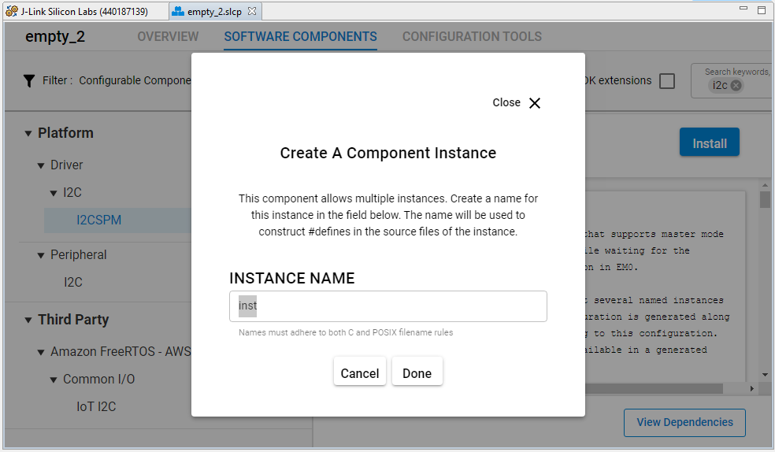

# Battery Fuel Gauge MAX17048 #

## Overview ##

This project shows the implementation of an I2C fuel gauge driver using MAX17048EVKIT from Maxim Integrated with EFR32xG21 Radio Board and Wireless Starter Kit Mainbard.

## Gecko SDK Version ##

GSDK v4.0.2

## Hardware Required ##

- [MAX17048XEVKIT Evalue Kit](https://www.maximintegrated.com/en/products/power/battery-management/MAX17048XEVKIT.html)

- [EFR32xG21 Radio Board (SLWMB4001A)](https://www.silabs.com/development-tools/wireless/wireless-starter-kit-mainboard)

- [Wireless Starter Kit Mainbard SLWRB4180B](https://www.silabs.com/development-tools/wireless/slwrb4181b-efr32xg21-wireless-gecko-radio-board)

- [Lithium Ion Battery](https://www.sparkfun.com/products/13851)

## Connections Required ##

We can use some [Wire Jumpers Female to Females](https://www.mikroe.com/wire-jumpers-female-to-female-30cm-10pcs) to connect between the EFR32xG21 Wireless Starter Kit and the MAX17048XEVKIT Evalue Kit, and between the MAX17048XEVKIT Evalue Kit and the Lithium Ion Battery as shown below.

| WSTK                      |  Fuel Gauge board markings |
|---------------------------|:--------------------------:|
| Extension PIN 1  - GND    |  J2-4: GND                 |
| Extension PIN 9 - PD03    |  J2-5: SDA                 |
| Extension PIN 7 - PD02    |  J2-3: SCL                 |
| Extension PIN 6 - PC01    |  J2-6: ALRT                |

## Setup ##

You can either import the provided **fuel_gauge_baterry_max17048.sls** project file or start with an empty example project as basis:

1. Create a "Platform - Empty C Project" project for the "EFR32xG21 Radio Board" using Simplicity Studio v5. Use the default project settings. Be sure to connect and select the Wireless Starter Kit Mainbard SLWRB4180A from the "Debug Adapters" on the left before creating a project.

2. Copy the files app.c, max17048.h, max17048.c, max17048_config.h into the project root folder (overwriting existing app.c).

3. Install the software components:

   - Open the project's .slcp file.

   - Select the SOFTWARE COMPONENTS tab.

   - Install **[Platform] > [Driver] > [I2CSPM]** component with the new instance name: **inst**. Set this component to use I2C0 peripheral, SDL to PD02 pin, SDA to PD03 pin.

        

        

   - Install **[Services] > [Sleep Timer]** component.

   - Install **[Services] > [IO Stream] > [IO Stream: USART]** component with the default instance name **vcom**.

   - Set **Enable Virtual COM UART** in **[Platform] > [Board Control]** component.

        

   - Install **[Platform] > [Driver] > [GPIOINT]** component.

   - Install **[Platform] > [Driver] > [TEMPDRV]** component.

   - Install **[Application] > [Utility] > [Log]** component.

4. Install printf float

- Open Properties of the project.

- Select **C/C++ Build > Settings > Tool Settings >GNU ARM C Linker > General**. Check **Printf float**.

     

5. Build and flash the project to your device.

## How it works ##

### API overview ###

TBD

### Testing ###

Below is the console output of the example application. The message is sent whenever SOC changes by at least 1%.

