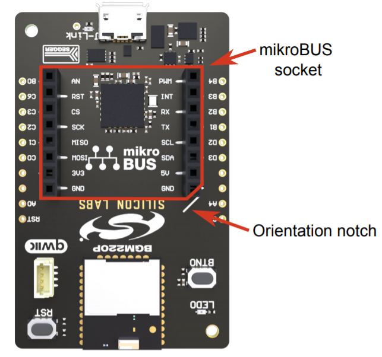

# GPS Driver #


[](https://www.mikroe.com/gps-click)


## Overview ##
This project shows the implementation of a GPS module that outputs NMEA 0183 sentences. The NMEA 0183 standard is from the [National Marine Electronics Association](https://www.nmea.org/).

## Gecko SDK version ##
v3.0.0 and later

## Hardware Required ##
- [BGM220P Explorer Kit](https://www.silabs.com/development-tools/wireless/bluetooth/bgm220-explorer-kit) (BRD4314A)
- [MikroE GPS Click Board](https://www.mikroe.com/gps-click) (MIKROE-1032)

The driver should work with minimal porting on other series 2 EFR devices and with other GPS modules that outputs NMEA 0183 sentences.

## Setup ##
If the BGM220P Explorer Kit and MikroE Click board are used, then the click board can be mounted onto the Explorer Kit with the MikroBus pin headers.




Import the [gps_simple.sls](SimplicityStudio/gps_simple.sls) project into Simplicity Studio 5 or follow the steps in the following section to add the driver into a custom project.

### Creating a new project ###
Any starter project can be used with this project, but the provided [gps_simple.sls](SimplicityStudio/gps_simple.sls) project uses the `Empty C Project` as its base. 

Once you have your new starter project, copy the driver files into the project. The driver requires the `EUSART` peripheral library. In Simplicity Studio 5, the new configurator tool was added to easily install software components into your project. Install the `EUSART` peripheral component through the *.slcp configurator.


There is a test [app.c](test/app.c) that holds the application used for the [gps_simple.sls](SimplicityStudio/gps_simple.sls). If the new project implements a technology such as Bluetooth Low Energy, then do not overwrite the new project's existing app.c source file. Instead, manually copy the `app_init()` and `app_process_action()` functions and the gps include statements from the test [app.c](test/app.c) to the new app.c, so the whole file will not be overwritten. More information on the APIs can be found in in the [API Documentation](#api-documentation) section.

## How It Works ##
The GPS module outputs NMEA 0183 strings through UART periodically every 1 second. Whenever the GPS module receives a signal from four or more satellites, valid NMEA sentences will be sent from the GPS module to the EFR32. With this driver, the Recommended Minimum Navigation Information ("$--RMC") is parsed to gather GPS data. This a National Marine Electronics Association standard sentence.

## .sls Projects Used ##
[gps_simple.sls](SimplicityStudio/gps_simple.sls)

## API Documentation ##


### Configuration ###
There are macro definitions in [gps_config.h](inc/gps_config.h) that can be modified to get the desired pin connections.

### Initialization ###
The `gps_init` function should be called before the main loop. The EUART0 and GPIO peripherals are initialized. The EUART0 peripheral is initialized to interrupt whenever a byte is received. The GPS module's baud rate is 9600bps. EUART can operate in EM2 since the baud rate is 9600bps.

The GPIO pins are for enabling the LDO and wakeup the GPS module. For this example, the GPS module stays in continuous mode so the wakeup pin is not used.

The `gps_init` function requires the gps initialization struct to be passed into the function. There are macro definitions to allocate and configure the initialization struct with default parameters: `GPS_DECLARE_BUFFER` and `GPS_INIT_DEFAULT`. The `GPS_DECLARE_BUFFER` needs to be allocated as a global variable if `GPS_INIT_DEFAULT` is used. The correct length buffer will be allocated for the driver.

### Process Action ###
The `gps_process_action()` needs to be called in the main loop. Whenever the device wakes up, this function should be called in order to process fully received NMEA sentences. Do not call this inside an interrupt handler beacuse it is not thread safe.

### Get Data ###
The `gps_get_data` function will get the most recent data reading. The data reading may either be valid or a warning so holding onto the last valid data may be required to keep your position if no satellite signals have been received by the GPS module.

The getter function parses the **Recommended Minimum Navigation Information** NMEA sentence. The format of the sentence is as followed:
```
RMC Recommended Minimum Navigation Information
                                                             12
       1         2 3       4 5        6  7   8   9      10 11|  13
       |         | |       | |        |  |   |   |      |  | |   |
$--RMC,hhmmss.ss,A,llll.ll,a,yyyyy.yy,a,x.x,x.x,xxxxxx,x.x,a,m,*hh<CR><LF>
1) Time (UTC)
2) Status, V = Navigation receiver warning
3) Latitude
4) N or S
5) Longitude
6) E or W
7) Speed over ground, knots
8) Track made good, degrees true
9) Date, ddmmyy
10) Magnetic Variation, degrees
11) E or W
12) Checksum
```

### OPTIONAL: GPS Command ###
The GPS driver has `gps_send_cmd` API call to send a NMEA command string to the GPS module. This function can be used to send data to configure the device. By default, the GPS module does not need to be configured in order to receive satellite signals.

To keep the API call flexible, whatever string that is passed as the input pararmeter to `gps_send_cmd` will be sent unaltered to the GPS module.

### OPTIONAL: GPS Enable ###
The LDO on the Click board can be controlled to power cycle the GPS module. This can be done by calling the `gps_enable` function. This is particularly useful if you want to reset the GPS module or save the extra current when not in use.

## Peripherals Usage ##


- Blue blocks operate in EM0.
    - The CPU must be running to execute the interrupt handler and process all the data.
- Green blocks operate in EM2.
    - EUART can be used in EM2 because the baud rate is 9600bps.
- Yellow blocks are external components.

## Software Workflow ##


After the peripherals are initialized, the system will constantly check if a full NMEA sentence has been received. Once a full NMEA sentence is received, the data will be parsed and stored. After this check, if there are no other events to handle the system will go into EM2. The next flow chart image shows more details of what happens in the EUART interrupt handler, but whenever an interrupt occurs to receive the character from the GPS module, the system will wake-up and complete another iteration.


For every byte that is received, the interrupt will be triggered and execute the sequence of events in the interrupt handler. First, it will discard data until the '$' character first appears which indicate the start of a new NMEA sentence. After the '$' has been seen, the data will be recorded into a buffer until the newline character appears which inidicate the end of a NMEA sentence. Once a full sentence has been received, the application will process the data.

## Testing ##
The basic implementation of the GPS driver is in the [gps_simple.sls](SimplicityStudio/gps_simple.sls) test project. There is a green bug icon in the top left corner of Simplicity Studio that can be pressed to open the debugger. To test the project, open the debugger. Add the `gps_data` global as an _Expression_ in the right section like shown in the image below. Run the project. In `app_process_action()`, there is a breakpoint expression `__BKPT()` that will stop the program whenever a new valid NMEA string has been received and processed.


