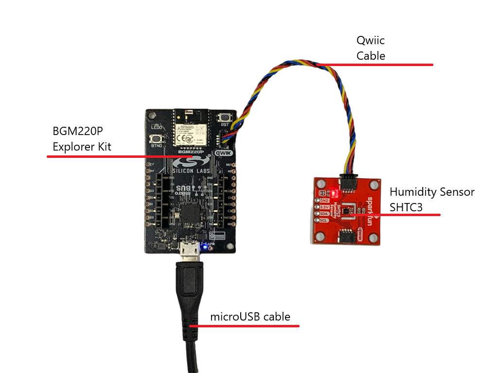
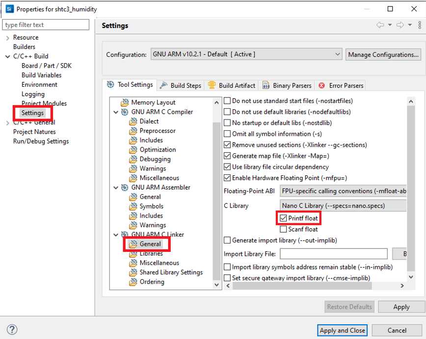
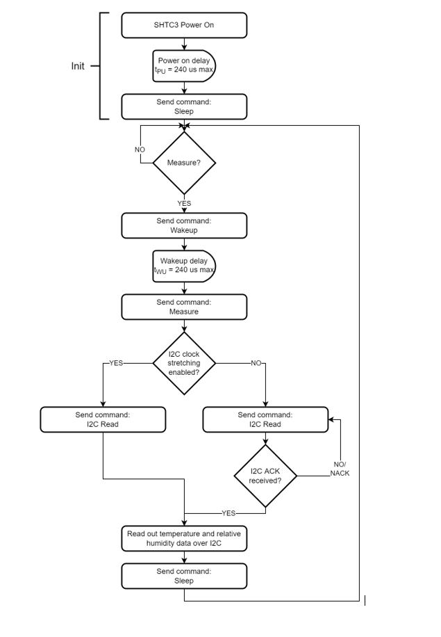
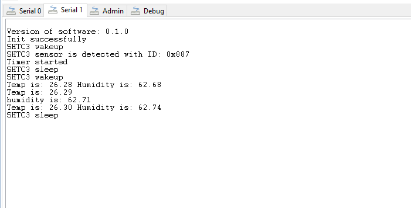

# SHTC3 Humidity Sensor Driver #
 
## Overview ##
This project shows the implementation of the Humidity Sensor using an **Humidity Sensor- SHTC3** with **BGM220 Explorer Kit** based on Qwiic communication.

The SHTC3 is a low cost, easy-to-use, highly accurate digital humidity and temperature sensor.

## Gecko SDK version ##

GSDK v4.1.0

## Hardware Required ##

- [A BGM220 Explorer Kit board](https://www.silabs.com/development-tools/wireless/bluetooth/bgm220-explorer-kit).

- [A Humidity Sensor - SHTC3 Board](https://www.sparkfun.com/products/16467).
  
## Connections Required ##

A SHTC3 sensor board can be easily connected up with two I2C wires (SDA and SCL) along with 3v3 and GND. For the designated boards, SparkFun Qwiic compatible STEMMA QT connectors can be used.

## Setup ##

To test this application, you should connect the BMG220 Explorer Kit Board to the PC using a microUSB cable. 

You can either import the provided **shtc3_humidity.sls** project file or start with an empty example project as basis:

1. Create a "Empty C Project" project for the "BGM220 Explorer Kit Board" using Simplicity Studio 5. Use the default project settings. Be sure to connect and select the BGM220 Explorer Kit Board from the "Debug Adapters" on the left before creating a project.

2. Copy all attached files in *inc* and *src* folders into the project root folder (overwriting existing app.c).

3. Install the software components:

   - Open the .slcp file in the project.

   - Select the SOFTWARE COMPONENTS tab.

   - Install the following components
      - **[Services] →  [Microsecond Delay]**
      - **[Services] →  [Sleep Timer]**
      - **[Services] →  [IO Stream] → [IO Stream: USART]** → default instance name: **vcom** 
      - **[Platform] →  [Driver]→ [I2C] →  [I2CSPM]** → default instance name: **qwiic**
      - **[Application] →  [Utility] → [Log]**
      - **[Application] →  [Utility] → [Assert]**

4. Active printf float

  - Open Properties of the project.

  - Select C/C++ Build > Settings > Tool Settings >GNU ARM C Linker > General. Check Printf float.

   
   
5. Build and flash the project to your device.

## How It Works ##

### API Overview ###
A higher level kit driver I2CSPM (I2C simple poll-based master mode driver) is used for initializing the I2C peripheral as master mode and performing the I2C transfer.

[shtc3.c](src/shtc3.c): Communicate with the microcontroller through the Silabs I2CSPM platform service as well as implements public APIs to interface with the SHTC3 humidity sensor.

### Testing ###

This example demonstrates some of the available features of the Humidity Sensor - SHTC3. After initialization, the Humidity Sensor - SHTC3 measures the hudimity and temperature values and send them via the UART port.

The following diagram shows the program flow as implemented in the app.c file:

Use J-Link Silicon Labs or other program to read the serial output. The BGM220P uses by default a baudrate of 115200. You should expect a similar output to the one below.

## .sls Projects Used ##

- [**shtc3_humidity.sls**](SimplicityStudio/shtc3_humidity.sls)