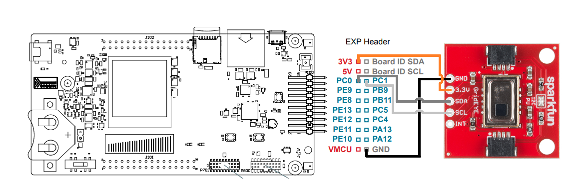

# Ir Array AMG8833 Driver #

## Overview ##

This project shows the implementation of the [Panasonic amg88xx infrared array](https://industry.panasonic.eu/components/sensors/industrial-sensors/grid-eye/amg88xx-high-performance-type/amg8833-amg8833) driver using the [EFM32GG11 starter kit](https://www.silabs.com/development-tools/mcu/32-bit/efm32gg11-starter-kit) and the [SparkFun Grid-EYE AMG8833 infrared array](https://www.sparkfun.com/products/14607). The driver includes every known functionality of the amg88xx device, such as sensor readings, power settings, interrupt setup, and more.

## Gecko SDK version ##

v3.2 or later

## Hardware Required ##

- EFM32GG11 Giant Gecko Series 1 Starter Kit (SLSTK3701A)
- SparkFun Grid-EYE Infrared Array Breakout - AMG8833 (Qwiic)

## Setup ##

The amg88xx driver provides the ir_array_amg88xx.sls application example to test the basic functionality of the driver and hardware. To use this test project, connect the Sparkfun Grideye module to the GG11 starter kit as shown in the diagram below.

Next, import the included .sls file into Studio, then build and flash the project to the starter kit.
In Simplicity Studio select "File->Import" and navigate to the directory with the .sls project file. After you connect the STK,
right-click on the project, and select Run As -> 1 Silicon Labs ARM Program.

## Application example ##

The included application example reads the temperature registers of the grideye amg88xx ir sensor array continuously, and prints the values in celsius to the display with a background color changing acording to the current temperature.

Additional software components needed in order to use the example:

- Color Sharp Memory LCD
- Memory LCD with usart SPI driver
- GLIB Graphics Library
- GLIB driver for SHARP Memory LCD
- I2CSPM

## Driver Usage ##

Before you start using the driver:

- Add I2CSPM software component. Set the settings of it according to your needs.
- Check the sparkfun_grideye_amg8833_config.h to ensure the setting are correct for the board you're using.

## Porting ##

This driver should work without any issue with a wide range of Silicon Labs boards. You may need to adjust the I2C settings in the ir_array_amg88xx_driver_config.h file.
Please note, that the test example (.sls) works only with 128x128 3bit display STKs.