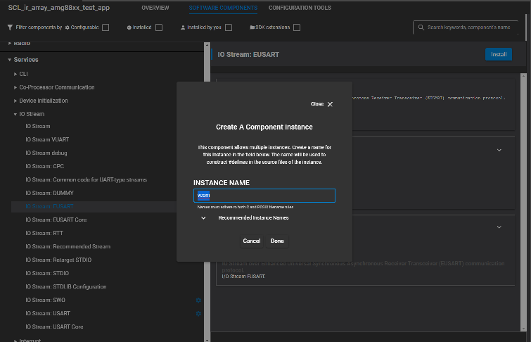

# Ir Array AMG8833 Driver #

## Summary ##

This project shows the implementation of the [Panasonic amg88xx infrared array](https://industry.panasonic.eu/components/sensors/industrial-sensors/grid-eye/amg88xx-high-performance-type/amg8833-amg8833) driver using the [EFR32xG24 Dev Kit](https://www.silabs.com/development-tools/wireless/efr32xg24-dev-kit?tab=overview) and the [SparkFun Grid-EYE AMG8833 infrared array](https://www.sparkfun.com/products/14607). The driver includes every known functionality of the amg88xx device, such as sensor readings, power settings, interrupt setup, and more.

## Gecko SDK version ##

v4.1.2 or later

## Hardware Required ##

- [EFR32xG24 Dev Kit (BRD2601B)](https://www.silabs.com/development-tools/wireless/efr32xg24-dev-kit?tab=overview)
- [SparkFun Grid-EYE Infrared Array Breakout - AMG8833 (Qwiic)](https://www.sparkfun.com/products/14607)

## Connections Required ##

The breakout board is connected to the dev kit with a Qwiic connector

## File and API Documentation ##

ir_array_amg88xx_driver - This is the top-level API implementation.

- `amg88xx_init` : Initialise the driver.
- `amg88xx_get_thermistor_temperature` : Gets the thermistor temperature.
- `amg88xx_get_sensor_array_temperatures` : Gets the temperatures of the IR sensor array.
- `amg88xx_wake` : Puts the device to normal mode from any other state.
- `amg88xx_sleep` : Puts device into sleep mode.
- `amg88xx_60_sec_standby` : Puts the device into 60 sec update interval mode.
- `amg88xx_10_sec_standby` : Puts the device into 10 sec update interval mode.
- `amg88xx_enable_moving_average` : Enables "Twice Moving Average".
- `amg88xx_disable_moving_average` : Disables "Twice Moving Average".

## Setup ##

You can either import the .sls project included with this example or create your example application code using the included source files and adding the necessary software components in Simplicity Studio v5 according to the following instructions below:

1.) Create an "Empty C Project" project for the EFR32xG24 Dev Kit using SimplicityStudio 5. Use the default project settings. Be sure to connect and select the EFR32xG24 Dev Kit from the "Debug Adapters" on the left before creating a project.

2.) Then copy the files [app.c](src/app.c), [ir_array_amg88xx_driver.c](src/ir_array_amg88xx_driver.c) and [ir_array_amg88xx_driver.h](inc/ir_array_amg88xx_driver.h) into the project root folder.

3.) Install software components in the .slcp

- IO Stream: EUSART

    
    

- CLI: Command Line interface

    
    

- I2CSPM

    

4.) Save the files, build and ready to flash or debug!

5.) Launch a terminal or console, open the communication to your device.

6.) The device communicates over CLI, so if you type help you will see how to control the device.

## How It Works ##

The following diagram presents the operation of the driver.

Application only needs to call amg88xx_init() once at startup, then with amg88xx_get_sensor_array_temperatures() function it's possible to request an array of temperatures for all 64 pixels. For more features or possibilities please refer to the API function descriptions found in amg88xx_get_sensor_array_temperatures.h.

amg88xx_init requires 3 parameters : an i2cspm instance and an i2c server address. The i2cspm instance is created by adding the I2CSPM software component. The I2C address for the AMG8833 sparkfun module is 0x69, so it's recommended to use the AMG88XX_ADDRESS_OPEN macro. The temperature scale for setup the scale (Celsius scale or Fahrenheit scale) of the temperature value.

However it's possible to change the server address by entering a custom address as a parameter.

## .sls Projects Used ##

[ir_amg88xx_test](SimplicityStudio/ir_array_amg88xx_test.sls)

## Generating image with Python ##

There is a python script included in the repository (image_generator.py) which could control the device over serial port and print out the actual temperature array. In the script you can setup your serial port number.
The required python package for the app: numpy, seaborn, matplotlib.pylab, pyserial.

## Porting ##

This driver should work without any issue with a wide range of Silicon Labs boards.
