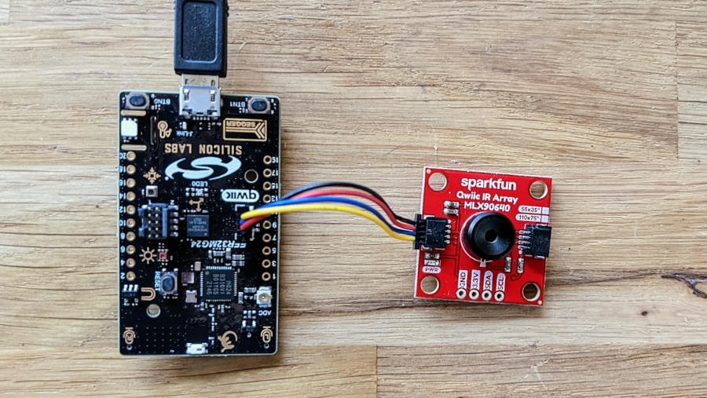
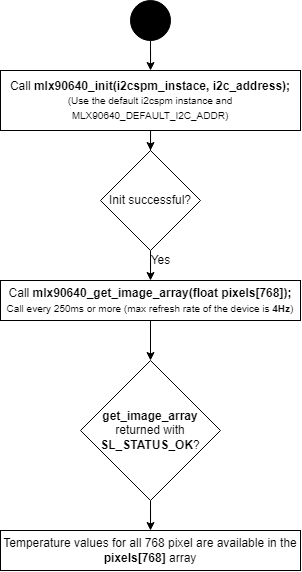
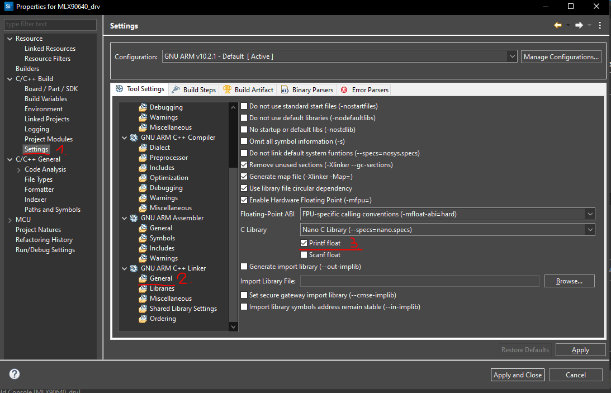
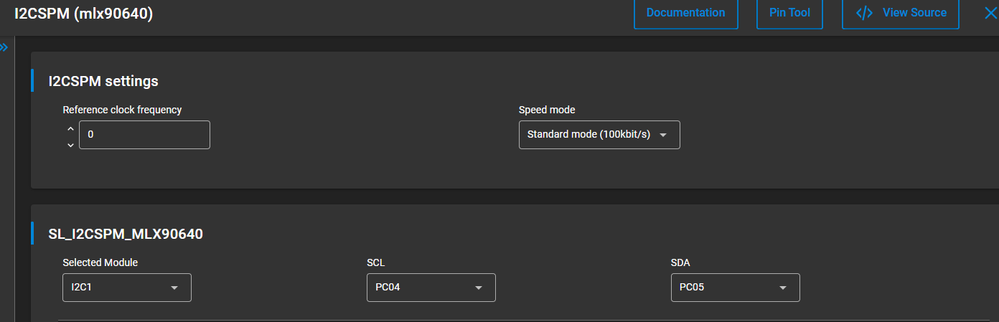
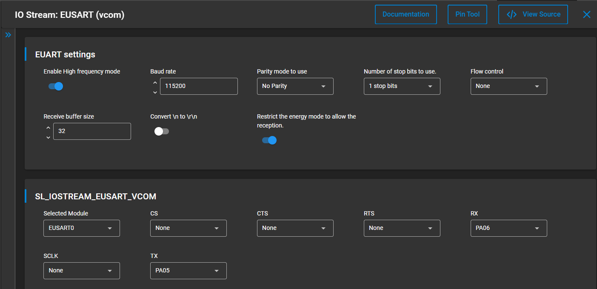

# MLX90640 Far Infrared Sensor Driver

## Overview ##

This project shows the implementation of a FIR sensor driver using the MLX90640 from Melexis with the EFR32xG24 Dev Kit.

## Gecko SDK version ##

GSDK v4.1.0

## Hardware Required ##

- [**EFR32xG24-DK2601B** EFR32xG24 Dev Kit (BRD2601B EFR32xG24 Dev Kit)](https://www.silabs.com/development-tools/wireless/efr32xg24-dev-kit?tab=overview)
- [**Sparkfun MLX90640 IR Array**(MLX90640 FIR sensor)](https://www.sparkfun.com/products/14844)

## File and API Documentation ##

[mlx90640.c](src/mlx90640.c) - This is the top-level API implementation. The user application should only use the APIs listed below.
- `mlx90640_init`: Initialize mlx90640 driver
- `mlx90640_get_image_array`: Provides an array of temperatures for all 768 pixel.

[mlx90640_i2c.c](src/mlx90640_i2c.c) - Implements mlx90640 I2C communication.
- `mlx90640_i2c_read`: I2C read implementation for 16-bit values.
- `mlx90640_i2c_write`: I2C write implementation.

## How it works ##

The device is factory calibrated with calibration constants stored in the EEPROM memory. The ambient and object temperature can
be calculated based on these calibration constants and the measurement data. 

The mlx90640 is factory calibrated in the ambient temperature range from -20 to 85˚C and from -20 to 200˚C for
the object temperature range. The measured value is the average temperature of all objects in the Field Of View
of the sensor (55 degrees).

The thermopile sensing element voltage signal is amplified and digitized. After digital filtering, the raw measurement result is stored in the RAM memory. 
Furthermore, the mlx90640 contains a sensor element to measure the temperature of the sensor itself. The raw information of this  sensor is also stored in RAM after processing. 
The result of each measurement conversion is accessible via I2C. From the measurement data and the calibration data the external unit can calculate both the sensor
temperature and the object temperature.

### Workflow

Initializing the driver and getting a temperature array from the sensor happens in the following way:

Application only needs to call mlx90640_init once at startup, then with mlx90640_get_image_array() function it's possible to request an array of temperatures for all 768 pixels. 
For more features or possibilites please refer to the API function descriptions found in mlx90640.h.

mlx90640_init required 2 parameters : an i2cspm instance and an i2c slave address. 
The i2cspm instance is created by adding the I2CSPM software component.
The I2C address for the MLX90640 sparkfun module is 0x33, so it's recommended to use the MLX90640_DEFAULT_I2C_ADDR macro.

However it's possible to change the slave address by entering a custom address as a parameter. In this case the driver tries to use the default address to communicate with the module, and update the address.
If successful, then a power-reset is necessary for the changes to take effect.
In case the device is not using the default address, the update will fail. In this event it's necessary to find out the current address of the module, then edit the MLX90640_DEFAULT_I2C_ADDR macro to that address.

## Create an example application ##

Simplicity Studio 5-series was used to create the example code.

You can either create an example application code as basis and modify it according to the instructions below or use the ready made .sls-project.

1.) Create a "Empty C Project" project for the EFR32xG24 Dev Kit using SimplicityStudio 5. Use the default project settings. Be sure to connect and select the EFR32xG24 Dev Kit from the "Debug Adapters" on the left before creating a project.

2.) The driver stores the contents of the EEPROM, so the HEAP and STACK sizes needs to be increased. Edit the config/sl_memory_config.h file and increase SL_STACK_SIZE to 10240 and SL_HEAP_SIZE to 6144

3.) Printing of float values on UART shall be enabled, this can be done in the Project properties window->Settings->GCC ARM C++ Linker->General-> "Printf float".

4.) Then copy the files [app.c](src/app.c) into the project root folder, and [mlx90640.c](src/mlx90640.c), [mlx90640_i2c.c](src/mlx90640_i2c.c), [mlx90640.h](inc/mlx90640.h) and [mlx90640_i2c.h](inc/mlx90640_i2c.h) into a folder called mlx90640.

5.) Install software components in the .slcp
- Log
- Utility/Assert
- Services/Sleeptimer
- I2CSPM 

- IO Stream: EUSART

6.) Save the files, build and ready to flash or debug!

7.) Launch a terminal or console, open the communication to your device.

8.) The device will report back a temperature array of 32x24 pixels every 3 seconds. 

## Generating image with Python ##

There is a python script included in the repository (image_generator.py) which parses the array of temperatures provided by the driver and generates an image based on the data.
By listening on the COM port, it's possible to generate a low-refresh-rate live video out of the images.
For this the following python packages are needed:
numpy
seaborn
matplotlib.pylab
pyserial

Simply replace the "COM19" in the script with the actual COM port your device is connected to. 
Then run the script, and the live image will be visible in a new window.
