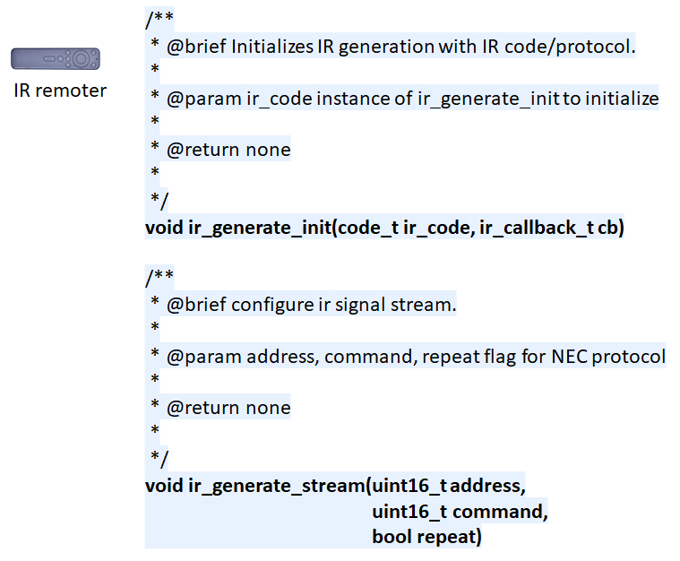
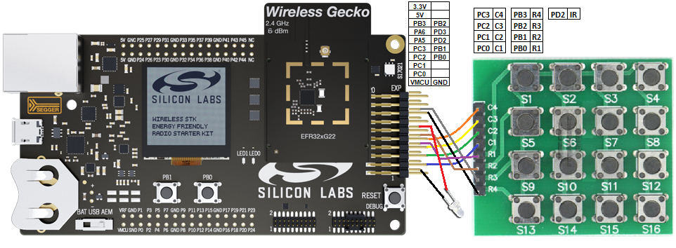
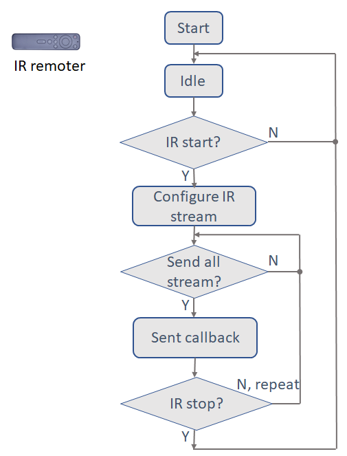

# IR Generator Driver #

## Overview ##

This project shows the implementation of IR generator driver using WSTK kit.

## Gecko SDK version ##

v2.7.6

## Hardware Required ##
- WSTK Mainboard (BRD4001A)
- EFR32MG22 Radio Board (BRD4182A)

## Setup ##

To test the IR component, you need to connect an [Infrared diode](https://www.amazon.com/Digital-Receiver-Transmitter-Arduino-Compatible/dp/B01E20VQD8/ref=sr_1_14?dchild=1&keywords=IR+receiver&qid=1591754671&s=aht&sr=1-14) to WSTK board through the expansion header. 
Then import the ir_component.sls file, build and program the MCU with the hex file.

## How It Works ##

After power on and initiliaze it keep send out IR signal.initiliaze it keep send out IR signal, just check the waveform by logic analyzer or oscilloscope.

## .sls Projects Used ##

- ir_component.sls

## API Documentation ##

Based on the operation, the key pad driver API can be broken into 2 categories:

- Initialization.
    - ir_generate_init() function initialize the key pad with callback.
    - code_t ir_code, set the IR protocol, currently support NEC and SONY type.
    - ir_callback_t cb, is called if one frame stream is sent.
- Running the IR generate
    - ir_generate_stream() function configure the data that desire to send and start, repeat flag use in NEC IR protocol.
    - ir_generate_stop() function can stop the IR generate.
## Peripherals Usage ##

The figure above shows an overview of the IR generator driver.

- 1 GPIOs, output the IR signal, control by carrier timer.
- 2 MCU timers, one for carrier, the other one for bit control.

## Software Workflow ##

After initialization, the system in a idle status. When IR send is required, configure the stream according to given data, send out all the stream bit. If don't got stop command, it keep repeat. If no need to repeat the IR signal, system will back to idle status.  Start/stop can control by key event. The demo is keep sending IR signal after initialize, for NEC type you can find it send 4 repeat frame then restart.