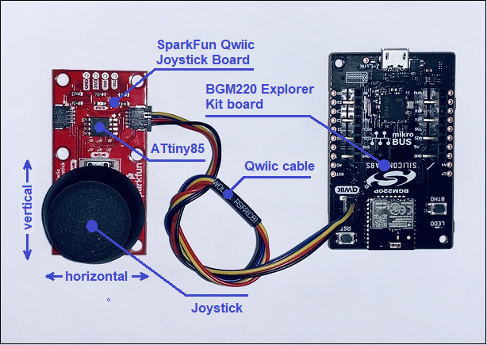
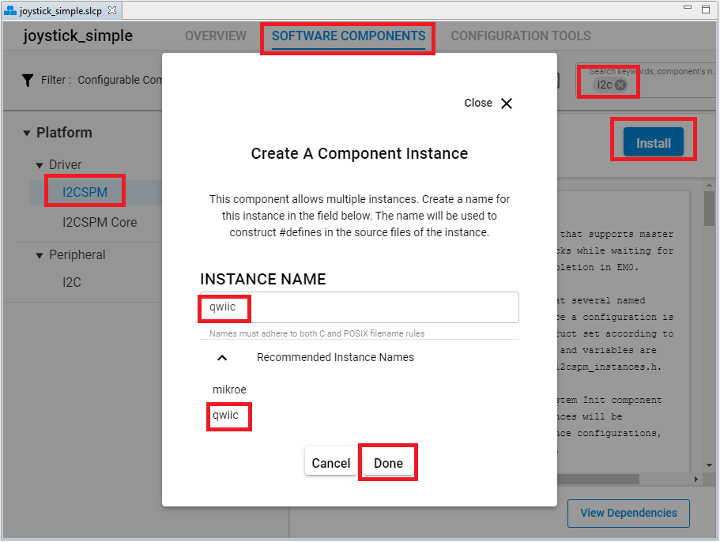
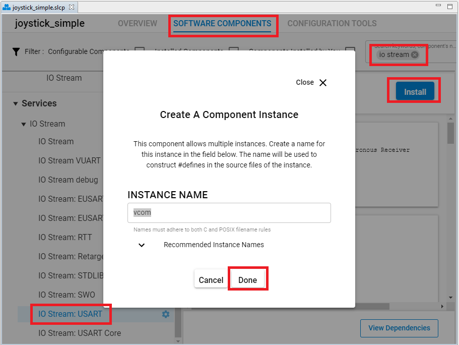
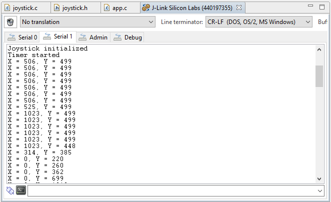

# Joystick driver #

## Description ##

This project shows the implementation of a Joystick module that is integrated on the SparkFun Qwiic Joystick board.

The SparkFun Qwiic Joystick board combines the convenience of the Qwiic connection system and an analog Joystick that is similar to the analog Joysticks on PS2 (PlayStation 2) controllers. Directional movements are simply measured with two 10 kΩ potentiometers, connected with a gimbal mechanism that separates the horizontal and vertical movements. This Joystick also has a select button that is actuated when the Joystick is pressed down. With the pre-installed firmware, the ATtiny85 acts as an intermediary (microcontroller) for the analog and digital inputs from the Joystick. This allows the Qwiic Joystick to report its position over I2C. 

For more information about the SparkFun Qwiic Joystick, see the [specification page](https://learn.sparkfun.com/tutorials/qwiic-joystick-hookup-guide).

## Gecko SDK version ##

GSDK v3.1.1

## Hardware Required ##

- [A BGM220P Explorer Kit board.](https://www.silabs.com/development-tools/wireless/bluetooth/bgm220-explorer-kit)

- [A SparkFun Qwiic Joystick Board.](https://www.sparkfun.com/products/15168)

## Connections Required ##

The Sparkfun Qwiic Joystick board can be easily connected by using a Qwiic cable.

## Setup ##

To test this application, you should connect the BMG220 Explorer Kit Board to the PC using a microUSB cable.

You can either import the provided **joystick_simple.sls** project file or start with an empty example project as basis:

1. Create a "Platform - Empty C Project" project for the "BGM220 Explorer Kit Board" using Simplicity Studio v5. Use the default project settings. Be sure to connect and select the BGM220 Explorer Kit Board from the "Debug Adapters" on the left before creating a project.

2. Copy the files *app.c*, *joystick.h*, *joystick.c* into the project root folder (overwriting existing app.c).

3. Install the software components:

- Open the .slcp file in the project.

- Select the SOFTWARE COMPONENTS tab.

- Install **[Platform] > [Driver] > [I2CSPM]** component with the instance name: **qwiic**.

- Install **[Services] > [IO Stream] > [IO Stream: USART]** component with the default instance name: **vcom**.

- Install the **[Services] > [IO Stream] > [IO Stream: Retarget STDIO]** component.

- Install the **[Bluetooth] > [Utility] > [Log]** component.

- Install the **[Services] > [Sleep Timer]** component.

4. Build and flash the project to your device.

## How It Works ##

### API Overview ###

- *joystick_init()*: Initialize the Joystick module. This function should be called before the main loop.

- *joystick_get_firmware_version()*: Read Firmware Version from the Joystick. Helpful for tech support.

- *joystick_read_horizontal_position()*: Read Current Horizontal Position from the Joystick.

- *joystick_read_vertical_position()*: Read Current Vertical Position from the Joystick.

- *joystick_read_button_position()*: Read Current Button Position from the Joystick.

- *joystick_present()*: Check whether a Joystick is present on the I2C bus or not.

- *joystick_send_command()*: Send a command and read the result over the I2C bus.

### Peripherals Usage ###

- An I2C peripheral is for communicating with the SparkFun Qwiic Joystick Board.
- A Timer is used to periodically read data from the Joystick.
- A USART peripheral used to print out the logs.

### Testing ###

This example demonstrates some of the available features of the Joystick module. Follow the below steps to test the example:

1. On your PC open a terminal program, such as the Console that is integrated in Simplicity Studio or a third-party tool terminal like TeraTerm to receive the logs from the virtual COM port.

2. Try to move the Joystick in some direction and check the logs on the terminal.

## .sls Projects Used ##

[**joystick_simple.sls**](SimplicityStudio/joystick_simple.sls)
