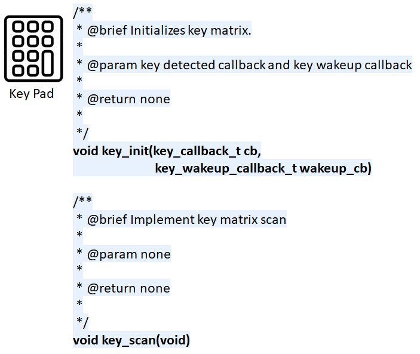
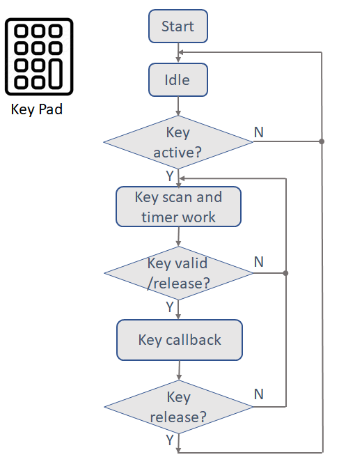

# Key Pad Driver #

## Overview ##

This project shows the implementation of Key Pad driver using WSTK kit.

It detect key on key matrix, log key informaiton on Serial port.

## Gecko SDK version ##

v2.7.6

## Hardware Required ##
- WSTK Mainboard (BRD4001A)
- EFR32MG22 Radio Board (BRD4182A)

## Setup ##

To test the key pad component, you need to connect a [matrix(4x4) key pad](https://www.amazon.com/Tegg-Matrix-Button-Arduino-Raspberry/dp/B07QKCQGXS/ref=sr_1_4?dchild=1&keywords=Key+matrix&qid=1591754882&sr=8-4) to WSTK board through the expansion header. 
Then import the keypad_component.sls file, build and program the MCU with the hex file.

## How It Works ##

When key is pressed, "key detect x" will be show, key release will show our "key release".

## .sls Projects Used ##

- keypad_component.sls

## API Documentation ##

Based on the operation, the key pad driver API can be broken into 2 categories:

- Initialization.
    - key_init() function initialize the key pad with 2 callback, set GPIO direction and interrupt.
    - key_wakeup_callback_t wakeup_cb, is called in GPIO IRQ. It start the key timer.
    - key_callback_t cb, is called in the key detection, report which key is detected and key release.
- Running the key Detection
    - key_scan() functions run in a key time slice, check which key and how long is pressed then report key status.

## Peripherals Usage ##

The figure above shows an overview of the key pad driver.

- 8 GPIOs, 4x4 matrix, 16 keys.
- Timer can be protocol stack timer or one of MCU timer.

## Software Workflow ##

After initialization, the system should enter idle status. When key active, GPIO interrupt wakeup system, then key scan and key timer(10ms) start to work. When key is available or key release, key callback is invoked to indicate which key is detected or release, after key release the system back to idle again.