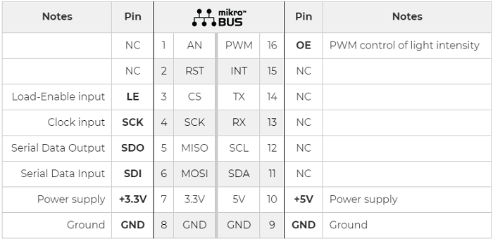
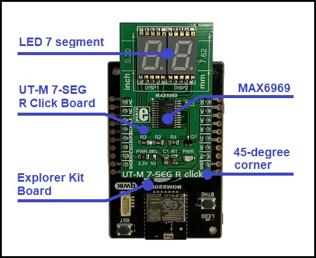
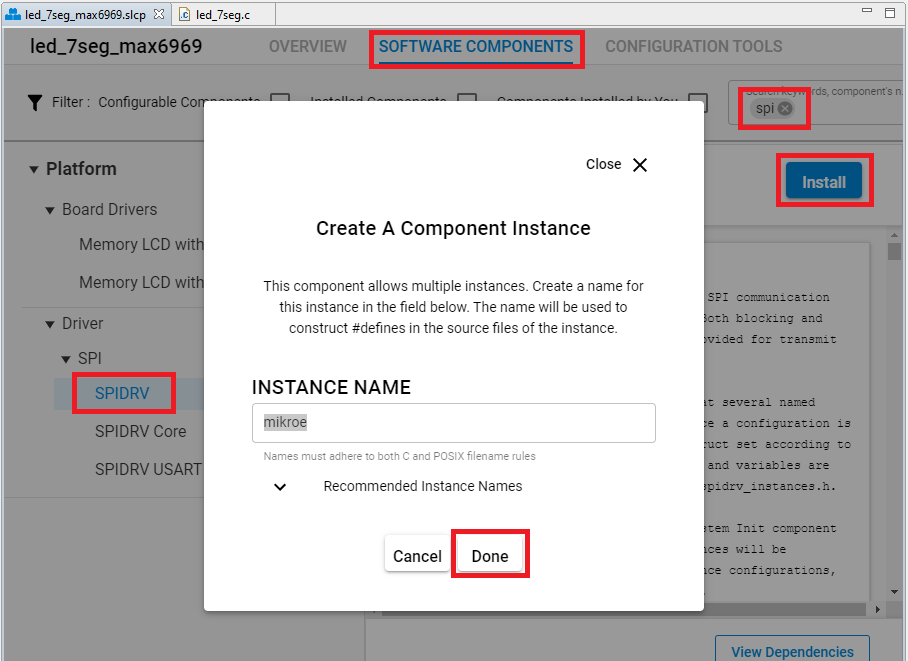
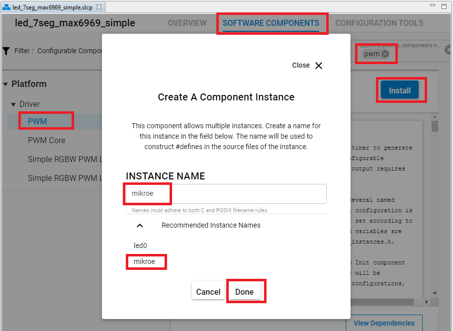
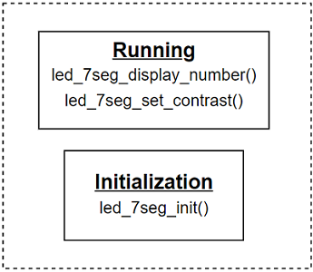

# 7-Segment LED driver #

## Description ##

This project shows the driver implementation of a 7-Segment LED module that is integrated on the UT-M 7-SEG R Click board.

UT-M 7-SEG R Click board carries two SMD ultra-thin 7-Segment LED displays and the MAX6969 constant-current LED driver from Maxim Integrated. It communicates with the target microcontroller over SPI interface that corresponds to the pinout on the mikroBUS™ socket as shown below.

For more information about the MAX6969 constant-current LED driver, see the [specification page](https://datasheets.maximintegrated.com/en/ds/MAX6969.pdf).

## Gecko SDK version ##

GSDK v3.1.1

## Hardware Required ##

- [A BGM220P Explorer Kit board.](https://www.silabs.com/development-tools/wireless/bluetooth/bgm220-explorer-kit)

- [A MikroE UT-M 7-SEG R Click Board.](https://www.mikroe.com/ut-m-7-seg-r-click)

## Connections Required ##

The UT-M 7-SEG R click board can just be "clicked" into its place. Be sure that the board's 45-degree corner matches the Explorer Kit's 45-degree white line.

## Setup ##

To test this application, you should connect the BMG220 Explorer Kit Board to the PC using a microUSB cable.

You can either import the provided [**led_7seg_simple.sls**](SimplicityStudio/led_7seg_simple.sls) project file or start with an empty example project as basis:

1. Create a "Platform - Empty C Project" project for the "BGM220 Explorer Kit Board" using Simplicity Studio v5. Use the default project settings. Be sure to connect and select the BGM220 Explorer Kit Board from the "Debug Adapters" on the left before creating a project.

2. Copy the files *app.c*, *led_7seg.h*, *led_7seg.c* into the project root folder (overwriting existing app.c).

3. Install the software components:

- Open the .slcp file in the project.

- Select the SOFTWARE COMPONENTS tab.

- Install **Platform->Driver->SPI->SPIDRV** component with the default instance name: **mikroe**. By default, this component uses the USART0 peripheral and the pins: PC00 (TX), PC01 (RX), PC02 (CLK), PC03 (CS).

- Install **Platform->Driver->PWM** component with the instance name: **mikroe**. By default, this component uses the PB4 pin and the TIMER4 peripheral.

4. Build and flash the project to your device.

## How It Works ##

### API Overview ###

#### Initialization ####

The *led_7seg_init()* function should be called before the main loop.

#### Running ####

The *led_7seg_display_number()* function show a number on the 7-Segment LED module.

The *led_7seg_set_contrast()* function can control the light intensity of the 7-Segment LED module.

### Peripherals Usage ###

- A GPIO is output of the PWM signal used to control the light intensity of the 7-Segment LED module.
- A SPI peripheral is for communicating with the MikroE UT-M 7-SEG R Click Board.
- A Timer is used to generate Pulse Width Modulated (PWM) waveforms.

### Testing ###

This example demonstrates some of the available features of the 7-Segment LED module. After initialization, the module displays all of the segments while changing the light intensity of the LEDs from 0 to 100 percent, and from 100 back to 0. Then it displays the numbers 0 to 9 on both LEDs.

## .sls Projects Used ##

[**led_7seg_simple.sls**](SimplicityStudio/led_7seg_simple.sls)
