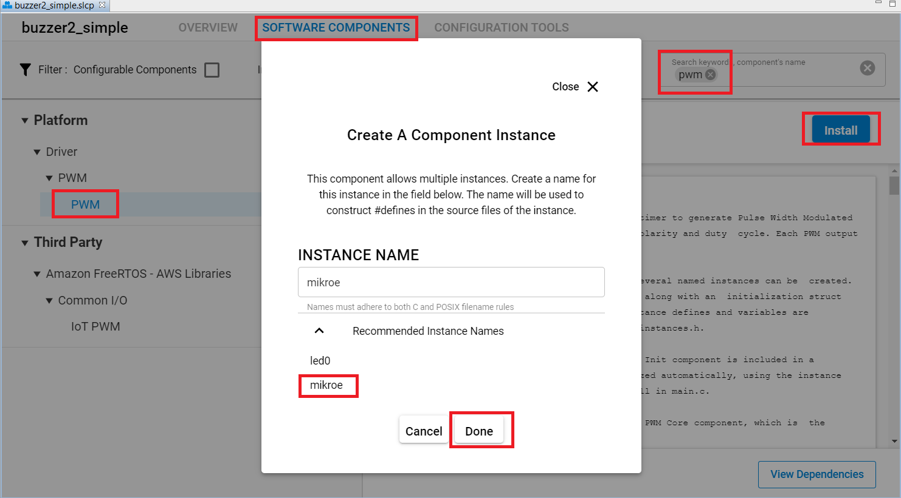

# Buzzer 2 click driver

## Overview

This project shows the driver implementation of the **CMT-8540S-SMT magnetic buzzer** that is integrated on the **buzz 2 click** with Silicon Labs Platform.

## Gecko SDK Suite version

GSDK v3.2.3

## Hardware Required

- [**BGM220-EK4314A**(BGM220 Bluetooth Module Explorer Kit).](https://www.silabs.com/development-tools/wireless/bluetooth/bgm220-explorer-kit)

- [Buzz 2 click board.](https://www.mikroe.com/buzz-2-click)

## Connections Required

The buzz 2 click board support MikroBus, so it can connect easily to BGM220P Explorer Kit's MikroBus header. Make sure that the board's 45-degree corner matches the Explorer Kit's 45-degree white line.

The hardware connection is shown in the image below:


## Setup

To test this application, you should connect the BMG220 Explorer Kit Board to the PC using a MicroUSB cable.

You can either import the provided [buzzer2_simple.sls](SimplicityStudio/buzzer2_simple.sls) project file or start with an empty example project as the following:

1. Create a **Platform - Empty C** project for the **BGM220 Explorer Kit Board** using Simplicity Studio 5. Use the default project settings. Make sure to connect and select the **BGM220 Explorer Kit Board** from the **Debug Adapters** on the left before creating a project.

2. Copy all attached files in _test_, _inc_ and _src_ folders into the project root folder (overwriting existing app.c).

3. Open the .slcp file. Select the **SOFTWARE COMPONENTS** tab and do the following changes:

   **Platform:**

   - Install **PWM** component with the instance name: **mikroe**

     

   - Install **Simple Button** component with the default instance name: **btn0**

     

   **Services:**

   - Install **IO Stream: USART** component with the default instance name: **vcom**

     

   - Install **IO Stream: Retarget STDIO** component.

   - Install the **Sleep Timer** component.

   **Utility:**

   - Install the **Log** component.

4. Build and flash the project to your device.

## How it works

### API overview

- ```C
  buzz2_cfg_setup(buzz2_t *buzz2,
                  sl_pwm_instance_t pwm,
                  sl_pwm_config_t pwm_config)
  ```

  Configures the buzzer 2 click.

- ```C
  buzz2_init (buzz2_t *buzz2)
  ```

  Initializes all necessary pins and peripherals used for the buzzer 2 click.

- ```C
  buzz2_set_duty_cycle(buzz2_t *buzz2, uint8_t duty_cycle)
  ```

  Sets the PWM duty cycle in percentages (Range[0..9]) that determines the amplitude (sound volume).

- ```C
  buzz2_play_sound(buzz2_t *buzz2,
                  uint16_t freq,
                  uint8_t volume,
                  uint16_t duration)
  ```

  Plays a sound on the buzzer, a sound is characteristic by the frequency and the amplitude.

- ```C
  buzz2_pwm_stop(buzz2_t *buzz2)
  ```

  Stops the PWM module output.

- ```C
  buzz2_pwm_start(buzz2_t *buzz2)
  ```

  Starts the PWM module output.

### Peripherals Usage

- A GPIO pin `PB04` is the output of the PWM signal used to control the frequency that provides for the buzzer.
- A GPIO pin `PC07` is for the button.
- A `TIMER4` for generating Pulse Width Modulation (PWM) waveforms.
- A `USART1` peripheral is used to print out the logs.

### Testing

This example demonstrates some of the available features of the buzzer 2 click. Follow the below steps to test the example:

1.  The buzzer plays a pre-programmed melody.

2.  Press the button on **BGM220 Explorer Kit** to change the volume and check the logs on the terminal.

    

## .sls Projects Used

- [buzzer2_simple.sls](SimplicityStudio/buzzer2_simple.sls)

## Special Notes

The attached code is used for the [BGM220 Explorer Kit](https://www.silabs.com/development-tools/wireless/bluetooth/bgm220-explorer-kit). So to use this driver with other Silicon Labs's boards (e.g Thunderboard, Wireless starter kit + radio board, ...), you should use the jumper wires to connect the power pins, PWM output pin, then create a new instance for PWM or change the configurations of the existed instances to match with the hardware connection.
