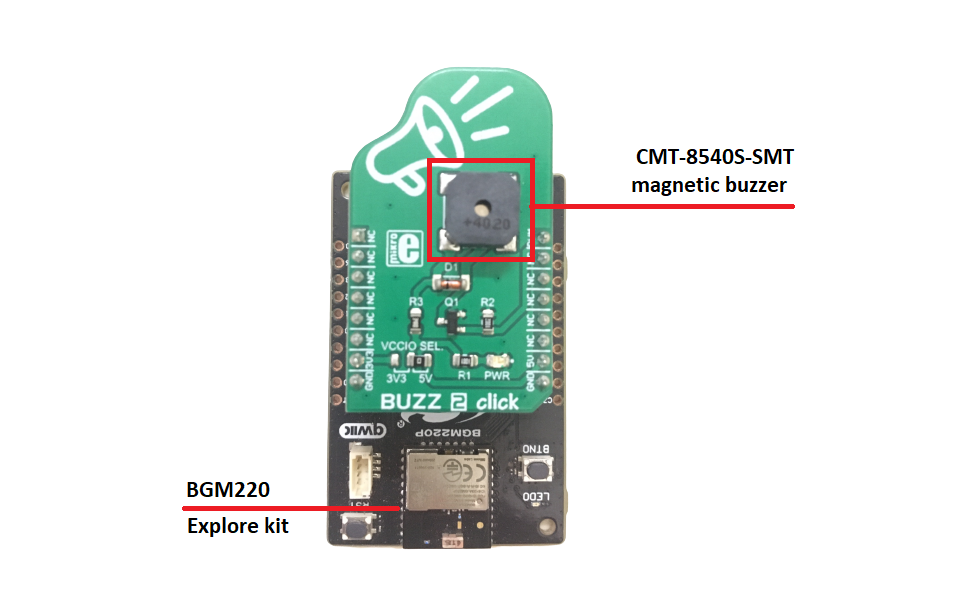
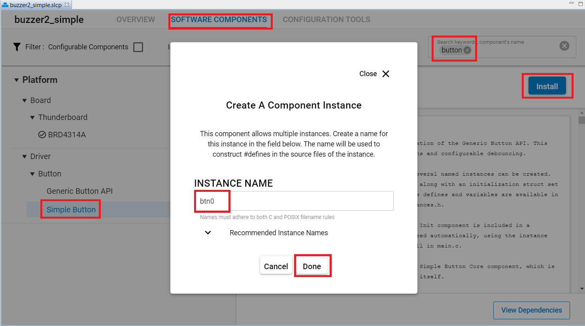
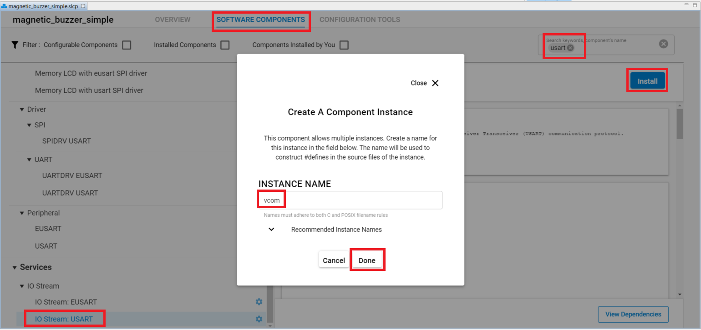
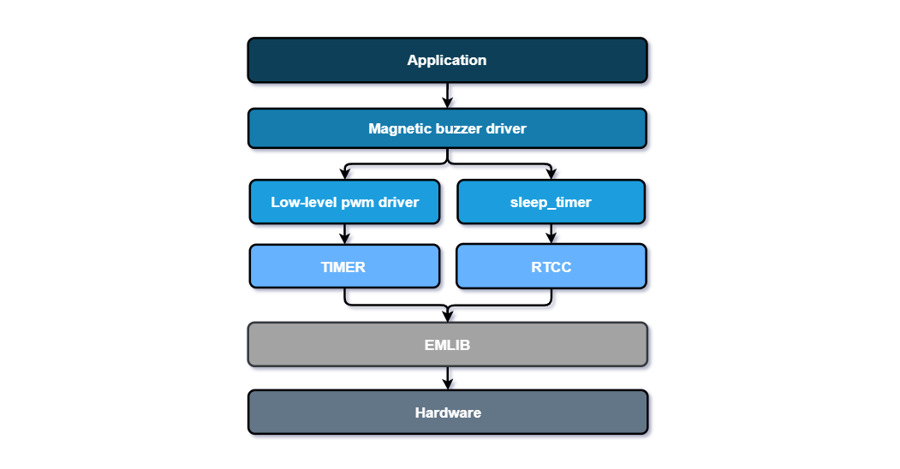
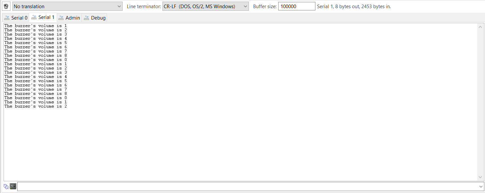

# Magnetic Buzzer Driver

## Overview

This project shows the driver implementation of the **CMT-8540S-SMT magnetic buzzer** that is integrated on the **BUZZ 2 click** with Silicon Labs Platform.

## Gecko SDK Suite version

GSDK v3.2.3

## Hardware Required

- [**BGM220-EK4314A**(BGM220 Bluetooth Module Explorer Kit).](https://www.silabs.com/development-tools/wireless/bluetooth/bgm220-explorer-kit)

- [BUZZ 2 click board.](https://www.mikroe.com/buzz-2-click)

## Connections Required

The BUZZ 2 click board support MikroBus, so it can connect easily to BGM220P Explorer Kit's MikroBus header. Make sure that the board's 45-degree corner matches the Explorer Kit's 45-degree white line.

The hardware connection is shown in the image below:



## Setup

To test the driver, you should connect the BMG220 Explorer Kit Board to the PC using a MicroUSB cable.

You can either import the provided [magnetic_buzzer_simple.sls](SimplicityStudio/magnetic_buzzer_simple.sls) project file or start with an empty example project as follows:

1. Create a **Platform - Empty C** project for the **BGM220 Explorer Kit Board** using Simplicity Studio 5. Use the default project settings. Make sure to connect and select the **BGM220 Explorer Kit Board** from the **Debug Adapters** on the left before creating a project.

2. Copy all attached files in the _test_, _inc_ and _src_ folders into the project root folder (overwriting existing app.c).

3. Open the .slcp file. Select the **SOFTWARE COMPONENTS** tab and do the following:

   **Platform:**

   - Install **Simple Button** component with the default instance name: **btn0**

     

   - Install **TIMER** component.

   **Services:**

   - Install **IO Stream: USART** component with the default instance name: **vcom**

     

   - Install **IO Stream: Retarget STDIO** component.

   - Install the **Sleep Timer** component.

   **Utility:**

   - Install the **Log** component.

4. Build and flash the project to your device.

## How it works

The driver model is shown in the following diagram:



### API overview

- ```C
  buzzer_init(buzzer_t *buzzer);
  ```

  Initializes all necessary pins and peripherals used for the BUZZ 2 click.

- ```C
  buzzer_deinit(buzzer_t *buzzer);
  ```

  Deinitializes all necessary pins and peripherals used for the BUZZ 2 click.

- ```C
  buzzer_set_volume(buzzer_t *buzzer, buzzer_volume_t volume)
  ```

  Sets the buzzer volume level in percentages (range[0..100%]).

- ```C
  buzzer_get_volume(buzzer_t *buzzer, buzzer_volume_t *volume)
  ```

  Gets the buzzer volume in percentages (range[0..100%]).

- ```C
  buzzer_play_sound(buzzer_t *buzzer,
                    uint16_t freq,
                    uint16_t duration)
  ```

  Plays a sound on the buzzer, a sound is characteristic by the frequency and the amplitude.

- ```C
  buzzer_play_melody(buzzer_melody_t *melody);
  ```

  Plays a melody on the buzzer.

- ```C
  buzzer_end_sound(buzzer_t *buzzer)
  ```

  Ends playing a sound.

- ```C
  buzzer_begin_sound(buzzer_t *buzzer, uint16_t freq);
  ```

  Begins playing a sound.

### Peripherals Usage

- GPIO pin `PB04` is the output of the PWM signal used to control the frequency that provides for the buzzer.
- GPIO pin `PC07` is for the button.
- `TIMER4` for generating PWM waveforms.
- `USART1` peripheral is used to print out the logs.

### Testing

This example demonstrates some of the available features of the BUZZ 2 click. Follow the below steps to test the example:

1.  The buzzer plays a pre-programmed melody.

2.  Press the button on **BGM220 Explorer Kit** to change the volume and check the logs on the terminal.

    

## .sls Projects Used

- [magnetic_buzzer_simple.sls](SimplicityStudio/magnetic_buzzer_simple.sls)

## Special Notes

Since the **sl_pwm** is a poor PWM implementation that has shortcomings, so we add some APIs helpful to custom driver **sl_pwm_custom** which is based on **sl_pwm**. Therefore, the user installs **TIMER** instead of the **PWM** software component.

## How to Port to Another Part

The attached code is used for the [BGM220 Explorer Kit](https://www.silabs.com/development-tools/wireless/bluetooth/bgm220-explorer-kit). To use this driver with other Silicon Labs's boards (e.g Thunderboard, Wireless starter kit + radio board, ...), use the jumper wires to connect the power pins and PWM output pin to match the desired hardware connections and configure PWM TIMER peripheral. This can be done through the symbols in the file [sl_pwm_config.h](inc/sl_pwm_config.h)

```C
// PWM frequency [Hz]
#define SL_PWM_FREQUENCY       10000

/*
* Polarity
* - <PWM_ACTIVE_HIGH=> Active high
* - <PWM_ACTIVE_HIGH=> Active low
* Default: PWM_ACTIVE_HIGH
*/
#define SL_PWM_POLARITY        PWM_ACTIVE_HIGH

#define SL_PWM_PERIPHERAL                 TIMER4
#define SL_PWM_PERIPHERAL_NO              4
#define SL_PWM_OUTPUT_CHANNEL             0

// TIMER4 CC0 on PB04
#define SL_PWM_OUTPUT_PORT                gpioPortB
#define SL_PWM_OUTPUT_PIN                 4
```

Note: there may be dependencies that need to be resolved when changing the target architecture.
