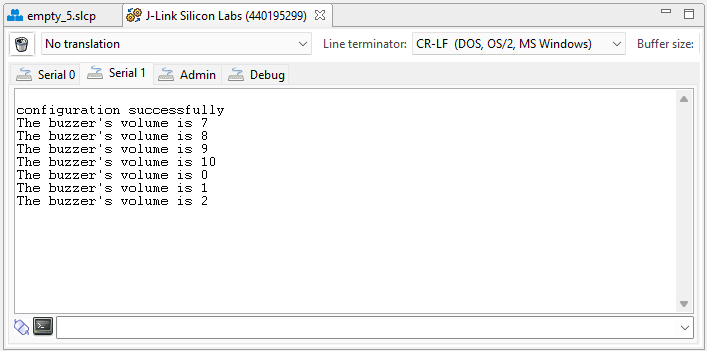

# Magnetic Buzzer Driver #


[](https://www.mikroe.com/buzz-2-click)


## Overview ##

This project shows the driver implementation of the **CMT-8540S-SMT magnetic buzzer** that is integrated on the **BUZZ 2 click** with Silicon Labs Platform.

## Gecko SDK version ##

GSDK v4.0.2

## Hardware Required ##

- [BGM220-EK4314A Explorer Kit.](https://www.silabs.com/development-tools/wireless/bluetooth/bgm220-explorer-kit)

- [BUZZ 2 click board.](https://www.mikroe.com/buzz-2-click)

## Connections Required ##

The BUZZ 2 click board support MikroBus, so it can connect easily to BGM220P Explorer Kit's MikroBus header. Make sure that the board's 45-degree corner matches the Explorer Kit's 45-degree white line.

The hardware connection is shown in the image below:


## Setup ##

To test the driver, you should connect the BMG220 Explorer Kit Board to the PC using a MicroUSB cable.

You can either import the provided [buzzer_simple.sls](SimplicityStudio/buzzer_simple.sls) project file or start with an empty example project as follows:

1. Create a **Platform - Empty C** project for the **BGM220 Explorer Kit Board** using Simplicity Studio 5. Use the default project settings. Make sure to connect and select the **BGM220 Explorer Kit Board** from the **Debug Adapters** on the left before creating a project.

2. Copy all attached files in the _test_, _inc_ and _src_ folders into the project root folder (overwriting existing app.c).

3. Open the .slcp file. Select the **SOFTWARE COMPONENTS** tab and install the software components:

   - [Platform] →  [Driver]→ [Button] →  [Simple Button] → instance name: **btn0**
   - [Platform] →  [Peripheral] → [TIMER]
   - [Services] →  [IO Stream] → [IO Stream: USART] → instance name: **vcom**
   - [Services] →  [Sleep Timer]
   - [Application] →  [Utility] → [Log]

4. Build and flash the project to your device.

## How it works ##

### API overview ###

The driver model is shown in the following diagram:


[buzzer_pwm.c](src/buzzer_pwm.c): Custom driver for the PWM which is based on **sl_pwm**.

[buzzer.c](src/buzzer.c): Implements the top level APIs for application.

A detailed description of each function can be found in [doc/doxygen](doc/doxygen/html/modules.html).

- Initializes all necessary pins and peripherals used for the BUZZ 2 click.

  ```C
  buzzer_init(buzzer_t *buzzer);
  ```

- Deinitializes all necessary pins and peripherals used for the BUZZ 2 click.

  ```C
  buzzer_deinit(buzzer_t *buzzer);
  ```

- Sets the buzzer volume level in percentages (range[0..100%]).

  ```C
  buzzer_set_volume(buzzer_t *buzzer, buzzer_volume_t volume)
  ```

- Gets the buzzer volume in percentages (range[0..100%]).

  ```C
  buzzer_get_volume(buzzer_t *buzzer, buzzer_volume_t *volume)
  ```

- ```C
  buzzer_play_sound(buzzer_t *buzzer,
                    uint16_t freq,
                    uint16_t duration)
  ```

Plays a sound on the buzzer, a sound is characteristic by the frequency and the amplitude.

- Plays a melody on the buzzer.

  ```C
  buzzer_play_melody(buzzer_melody_t *melody);
  ```

- Ends playing a sound.

  ```C
  buzzer_end_sound(buzzer_t *buzzer)
  ```

- Begins playing a sound.

  ```C
  buzzer_begin_sound(buzzer_t *buzzer, uint16_t freq);
  ```

### Peripherals Usage ###

- GPIO pin `PB04` is the output of the PWM signal used to control the frequency that provides for the buzzer.
- GPIO pin `PC07` is for the button.
- `TIMER4` for generating PWM waveforms.
- `USART1` peripheral is used to print out the logs.

### Testing ###

This example demonstrates some of the available features of the BUZZ 2 click. Follow the below steps to test the example:

1. The buzzer plays a pre-programmed melody.

2. Press the button on **BGM220 Explorer Kit** to change the volume and check the logs on the terminal.

    

## .sls Projects Used

- [buzzer_simple.sls](SimplicityStudio/buzzer_simple.sls)

## Special Notes ##

Since the **sl_pwm** is a poor PWM implementation that has shortcomings, so we add some APIs helpful to custom driver **buzzer_pwm** which is based on **sl_pwm**. Therefore, the user installs **TIMER** instead of the **PWM** software component.

## How to Port to Another Part ##

The attached code is used for the [BGM220 Explorer Kit](https://www.silabs.com/development-tools/wireless/bluetooth/bgm220-explorer-kit). To use this driver with other Silicon Labs's boards (e.g Thunderboard, Wireless starter kit + radio board, ...), use the jumper wires to connect the power pins and PWM output pin to match the desired hardware connections and configure PWM TIMER peripheral. This can be done through the symbols in the file [buzzer_pwm_config.h](inc/buzzer_pwm_config.h)

```C
// PWM frequency [Hz]
#define BUZZER_PWM_FREQUENCY                    10000

/*
 * Polarity
 * - <PWM_ACTIVE_HIGH=> Active high
 * - <PWM_ACTIVE_LOW=> Active low
 * Default: PWM_ACTIVE_HIGH
 */
#define BUZZER_PWM_POLARITY                     PWM_ACTIVE_HIGH

#define BUZZER_PWM_PERIPHERAL                   TIMER4
#define BUZZER_PWM_PERIPHERAL_NO                4
#define BUZZER_PWM_OUTPUT_CHANNEL               0

// TIMER4 CC0 on PB04
#define BUZZER_PWM_OUTPUT_PORT                  gpioPortB
#define BUZZER_PWM_OUTPUT_PIN                   4
#define BUZZER_PWM_OUTPUT_LOC                   0
```

**Note:** There may be dependencies that need to be resolved when changing the target architecture.
