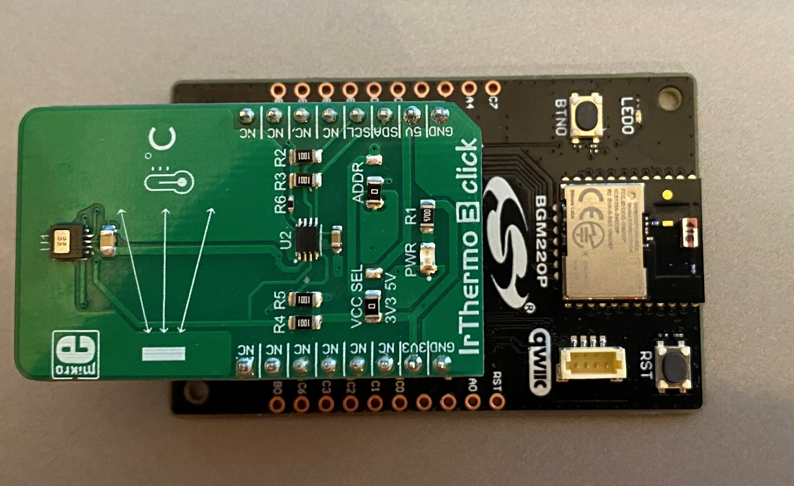
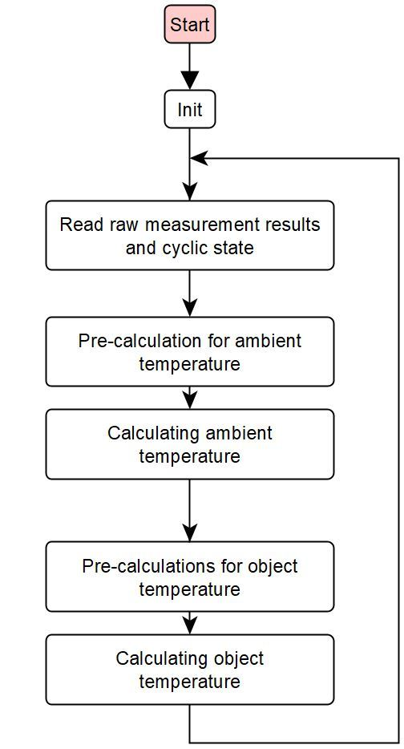

# MLX90632 IrThermo 3 click Driver

## Overview ##

This project shows the implementation of an I2C temperature sensor driver using MLX90632 FIR sensor from Melexis with BGM220 Explorer Kit. A target application of a temperature sensor could be ideal for:
- Non-contact temperature measurements
- Temperature sensing element for residential, commercial and industrial building air conditioning
- Home appliances with temperature control
- Industrial temperature control of moving parts

## Gecko SDK version ##

GSDK v3.1.1

## Hardware Required ##

- [**BGM220-EK4314A** BGM220 Bluetooth Module Explorer Kit (BRD4314A BGM220 Explorer Kit Board)](https://www.silabs.com/development-tools/wireless/bluetooth/bgm220-explorer-kit)
- [**IrThermo 3 Click**(MLX90632 FIR sensor)](https://www.mikroe.com/ir-thermo-3-click)

## File and API Documentation ##

Application only calls mlx90632_init and measurment_cb which are both in [mlx90632.c](src/mlx90632.c).

[mlx90632.c](src/mlx90632.c) - This is the top-level API implementation. The user application should only use the APIs listed below.
- `mlx90632_init`: Initialize MLX90632 driver, confirm EEPROM version.
- `mlx90632_addressed_reset`: Reset mlx90632.
- `measurment_cb`: Function gives back both temperature values.

[mlx90632_i2c.c](src/mlx90632_i2c.c) - Implements mlx90632 I2C communication.
- `mlx90632_i2c_read`: I2C read implementation for 16-bit values.
- `mlx90632_i2c_read32`: I2C read implementation for 32-bit values.
- `mlx90632_i2c_write`: I2C write implementation.

## How it works ##

The device is factory calibrated with calibration constants stored in the EEPROM memory. The ambient and object temperature can
be calculated based on these calibration constants and the measurement data. 

The MLX90632 is factory calibrated in the ambient temperature range from -20 to 85˚C and from -20 to 200˚C for
the object temperature range. The measured value is the average temperature of all objects in the Field Of View
of the sensor (50 degrees).

The thermopile sensing element voltage signal is amplified and digitized. After digital filtering, the raw measurement result is stored in the RAM memory. 
Furthermore, the MLX90632 contains a sensor element to measure the temperature of the sensor itself. The raw information of this  sensor is also stored in RAM after processing. 
The result of each measurement conversion is accessible via I2C. From the measurement data and the calibration data the external unit can calculate both the sensor
temperature and the object temperature.

### Workflow

A typical ambient and object temperature measurements are shown in the following figure.

The `mlx90632_init` function configures the sensor, in this way the user only needs to call one init function during startup. The factory-programmed calibration values are also read from the sensor in the init function.
After init function, in case of using the `measurment_cb` API function this whole measurement and calculation process is done internally by the driver. 

## Setup ##

To test this application, you should connect the BMG220 Explorer Kit Board to the PC using a miniUSB cable.

I2CSPM (I2C simple poll-based master mode driver) is used for initializing the I2C peripheral as master mode and performing the I2C transfer. 
These modules are need to be added to the include paths and its sources need to be copied to the project.

1. Add the inc and src directory to the project's paths.
2. Add software components I2CSPM Core, I2CSPM, configure SCL and SDA pins and set speed mode to Fast Mode.
  

