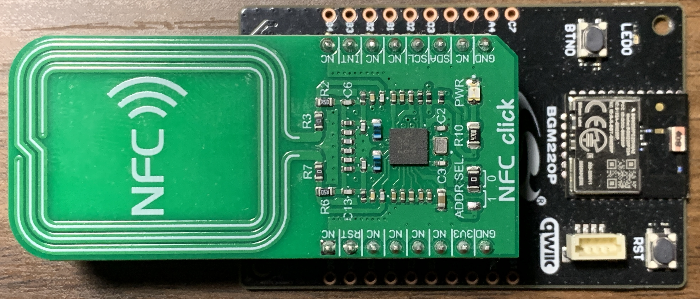
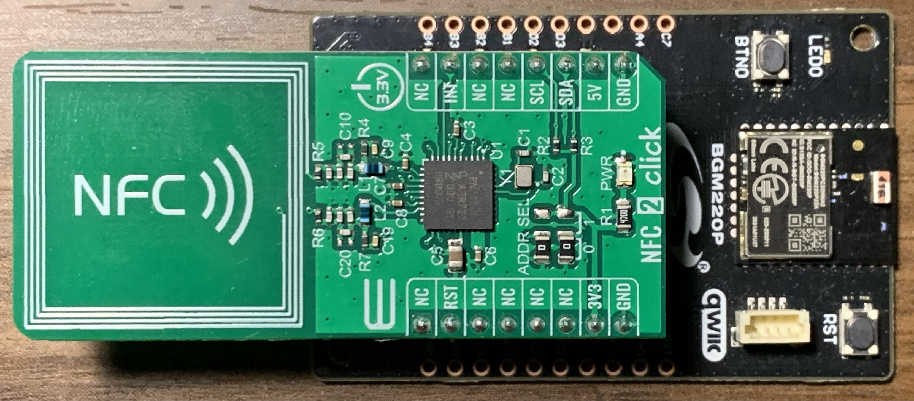

# PN71x0 NCI NFC Controller Driver


[](https://www.mikroe.com/nfc-click)

Driver to enable EFR/EFM devices to work with [PN7120](https://www.nxp.com/products/rfid-nfc/nfc-hf/nfc-readers/nfc-controller-with-integrated-firmware-and-nci-interface-for-home-appliances:PN7120) and [PN7150](https://www.nxp.com/products/rfid-nfc/nfc-hf/nfc-readers/high-performance-nfc-controller-with-integrated-firmware-for-smart-devices:PN7150) NFC Controller.

**Note: This driver will not work without the NCI library.**

## Gecko SDK Version

Tested on v2.7.x and v3.0.x

## Hardware

### EFM/EFR Boards
This driver should work with most of Silicon Labs' EFR/EFM radio boards except the ones that do not come with enough GPIO pins such as BRD4183A and BRD4309B. 

### PN71x0 Boards

[Mikroe NFC Click](https://www.mikroe.com/nfc-click) (PN7120)



[Mikroe NFC 2 Click](https://www.mikroe.com/nfc-2-click) (PN7150)



## File and API Documentation

Application only calls pn71x0_init and pn71x0_reset which are both in [pn71x0.c](src/pn71x0.c).

```
      ---------------------------------------------                                                     ---------------
 /-- |                 Application                 | ----------- pn71x0_init, pn71x0_reset ----------> |               |
 |    ---------------------------------------------                                                    |               |
 |                                                                                                     |               |
 | (NCI API calls)                                                                                     | PN71x0 Driver |
 |                                                                                                     |               |
 |    ---------------------------------------------                                                    |               |
 \-> |                 NCI Library                 | ------ nci_tml_receive, nci_tml_transceive -----> |               |
      ---------------------------------------------                                                     ---------------
```

[pn71x0.c](src/pn71x0.c) - This is the top-level API implementation. The user application should only use the APIs listed below.
- `pn71x0_init`: Initialize interfacing with PN71x0, including GPIO and I2C. This is a wrapper function for `pn71x0_i2c_init` and `pn71x0_gpio_init`. I2C and GPIO pin settings are passed in as parameters to this function. Please refer to the example project for usage of this function.
- `pn71x0_reset`: Reset PN71x0, this is wrapper function for `pn71x0_gpio_reset`.

[pn71x0_i2c.c](src/pn71x0_i2c.c) - Implements PN71x0 I2C initialization and communication.
- `pn71x0_i2c_init`: Initialize I2C for PN71x0 communication. This is called by `pn71x0_init` in [pn71x0.c](src/pn71x0.c).
- `pn71x0_i2c_read`: I2C read implementation, called by nci_tml_receive.
- `pn71x0_i2c_write`: I2C write implementation, called by nci_tml_transceive.
- `nci_tml_receive`: This is the NCI transport mapping layer (TML) receive function implementation. It manages I2C read for NCI. This function is called by the NCI library instead of by user application.
- `nci_tml_transceive`: This is the NCI transport mapping layer (TML) transceive function implementation. It manages I2C write for NCI. This function is called by the NCI library instead of by user application.

[pn71x0_gpio.c](src/pn71x0_gpio.c) - Implements PN71x0 GPIO initialization and APIs.
- `pn71x0_gpio_init`: Set up GPIO for VEN (reset) and IRQ (interrupt request) pins. This is called by `pn71x0_init` in [pn71x0.c](src/pn71x0.c).
- `pn71x0_gpio_reset`: Reset PN71x0, this is called by `pn71x0_reset` in [pn71x0.c](src/pn71x0.c).

## How it works

The application initializes the NCI and peripheral (PN71x0 I2C and GPIO) interfaces with the `pn71x0_i2c_init` function call. The rest of the function calls to this driver are handled by the NCI library. The `nci_tml_receive` and `nci_tml_transceive` calls are mandatory to implement to use with NCI. These NCI calls these two functions to perform read and write to the NCI controller (PN71x0 in this case).

## Application Examples

Detailed usage of this driver and hardware setup please refer to the following examples.

[nci_pn71x0_t2t_read]()

[nci_pn71x0_t2t_write]()
