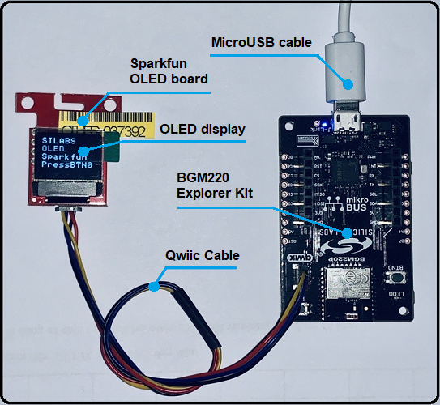
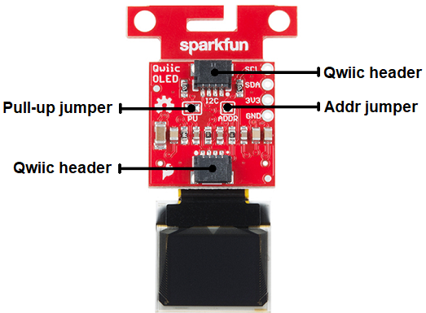
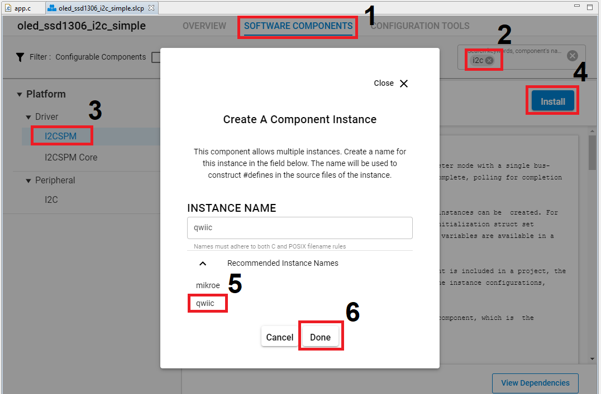
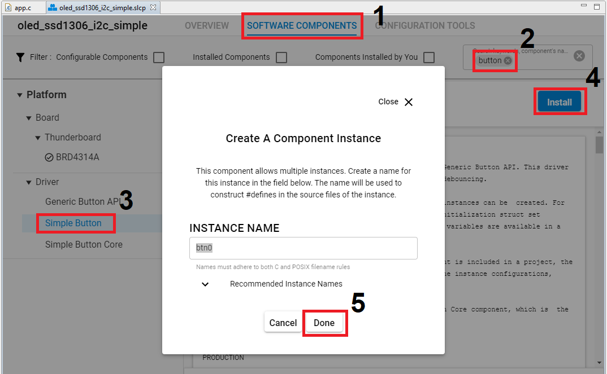

# SparkFun Micro OLED Breakout (Qwiic) Driver #

## Description ##

This project shows the implementation of the OLED driver using a **SparkFun Micro OLED Breakout (Qwiic) board** with **BGM220 Explorer Kit** based on I2C communication.

The SparkFun Micro OLED Breakout (Qwiic) board carries a monochrome, 64 x 48px and blue-on-black OLED display. It uses a SSD1306 controller to drive the display. It's built-in functionalities include contrast control, normal or inverse image display, vertical and horizontal scrolling functions and more. 

For more information about the SSD1306 controller, see the [specification page](https://cdn.sparkfun.com/assets/learn_tutorials/3/0/8/SSD1306.pdf).

>Please note that this is a monochrome OLED driver.

## Gecko SDK version ##

GSDK v3.1.1

## Hardware Required ##

- [A BGM220 Explorer Kit board.](https://www.silabs.com/development-tools/wireless/bluetooth/bgm220-explorer-kit)

- [A SparkFun Micro OLED Breakout (Qwiic) board.](https://www.sparkfun.com/products/14532)

## Connections Required ##

You simply connect a *SparkFun Micro OLED Breakout (Qwiic) board* to a *BGM220 Explorer Kit* board using a Qwiic cable.



**Note:** There are several jumpers on *SparkFun Micro OLED Breakout (Qwiic) board* that can be changed to facilitate several different functions. The first of which is the ADDR jumper. The ADDR jumper can be used to change the I2C address of the board. The default jumper is open by default, pulling the address pin high and giving us an I2C address of 0X3D. Closing this jumper will ground the address pin, giving us an I2C address of 0X3C.

The second of which is the I2C pull-up jumper. If multiple boards are connected to the I2C bus, the equivalent resistance goes down, increasing your pull up strength. If multiple boards are connected on the same bus, make sure only one board has the pull-up resistors connected.



## Setup ##

To test this application, you should connect the BMG220 Explorer Kit Board to the PC using a microUSB cable. 

You can either import the provided **oled_ssd1306_i2c_simple.sls** project file or start with an empty example project as basis:

1. Create a "Platform - Empty C Example" project for the "BGM220 Explorer Kit Board" using Simplicity Studio 5. Use the default project settings. Be sure to connect and select the BGM220 Explorer Kit Board from the "Debug Adapters" on the left before creating a project.

2. Copy all attached files in *inc* and *src* folders into the project root folder (overwriting existing app.c).

3. Install the software components:

- Open the .slcp file in the project.

- Select the SOFTWARE COMPONENTS tab.

- Install **I2CSPM** component with the instance name: **qwiic**.



- Install **Simple Button** component with the default instance name: **btn0**.



4. Build and flash the project to your device.

5. Do not forget to flash a bootloader to your board, if you have not done so already.

*Note*: You need to create the bootloader project and flash it to the device before flashing the application. When flash the application image to the device, use the .hex or .s37 output file. Flashing the .bin files may overwrite (erase) the bootloader.

## How It Works ##

### API Overview ###

```
 --------------------------------------------
|                 application                | 
|--------------------------------------------|
|                    glib.c                  | 
|--------------------------------------------|
|                  ssd1306.c                 |
|--------------------------------------------|
|                 ssd1306_i2c.c              |
|--------------------------------------------|
|                    emlib                   |
 --------------------------------------------
```

[glib.c](src/glib.c): implements the top level APIs for application. The user application should only use the APIs listed in this file.

[ssd1306.c](src/ssd1306.c): implements SSD1306 specific APIs, called by *glib.c*.
- Initialization API: initialize SSD1306.
- Fundamental and graphic APIs: such as contrast control, normal or inverse image display, vertical and horizontal scrolling functions and more.

[ssd1306_i2c.c](src/ssd1306_i2c.c): implements SSD1306 specific I2C APIs, called by *ssd1306.c*.
- Initialization API: initialize I2C communication.
- I2C write APIs: write a command block or a data block via I2C.

### Testing ###

After initialization, the OLED displays the text with the font 6x8. If Button 0 is pressed the OLED will display an image with some graphic effects.

The OLED display will look something like the GIF below.


