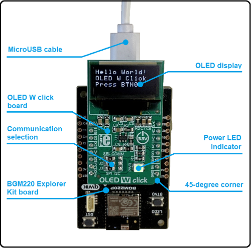
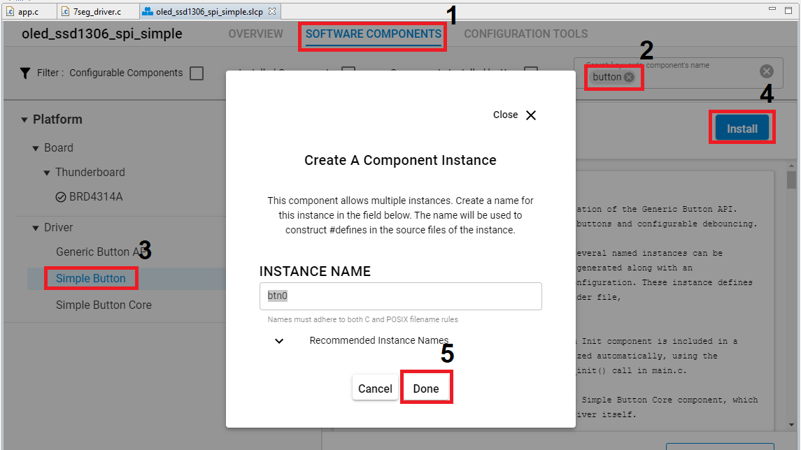

# OLED W Click Driver #


[](https://www.mikroe.com/oled-w-click)


## Description ##

This project shows the implementation of the OLED driver using an **OLED W click** with **BGM220 Explorer Kit** based on SPI communication.

The OLED W click carries a 96 x 39px white monochrome passive matrix OLED display. The OLED W click uses a SSD1306 controller to drive the display. Its built-in functionalities include contrast control, normal or inverse image display, vertical and horizontal scrolling functions and more. 

For more information about the SSD1306 controller, see the [specification page](https://cdn.sparkfun.com/assets/learn_tutorials/3/0/8/SSD1306.pdf).

>Please note that this is a monochrome OLED driver.

## Gecko SDK version ##

GSDK v3.1.1

## Hardware Required ##

- [A BGM220 Explorer Kit board](https://www.silabs.com/development-tools/wireless/bluetooth/bgm220-explorer-kit).

- [An OLED W Click board](https://www.mikroe.com/oled-w-click).

## Connections Required ##

The OLED W Click board can just be "clicked" into its place. Be sure that the board's 45-degree corner matches the Explorer Kit's 45-degree white line. The OLED W click can communicate with the target board MCU either through SPI or I2C mikroBUS™ lines. Just be sure that the click board is configured into SPI-mode (the default) by the resistors and not into I2C-mode.



## Setup ##

To test this application, you should connect the BMG220 Explorer Kit Board to the PC using a microUSB cable. 

You can either import the provided oled_ssd1306_spi_simple.sls project file or start with an empty example project as basis:

1. Create a "Platform - Empty C Example" project for the "BGM220 Explorer Kit Board" using Simplicity Studio 5. Use the default project settings. Be sure to connect and select the BGM220 Explorer Kit Board from the "Debug Adapters" on the left before creating a project.

2. Copy all attached files in *inc*, *src* and *test* folders into the project root folder (overwriting existing app.c).

3. Install the software components:

- Open the .slcp file in the project.

- Select the SOFTWARE COMPONENTS tab.

- Install **SPIDRV** component with the default instance name: **mikroe**.


- Install **Simple Button** component with the default instance name: **btn0**.



- Find and install **Microsecond Delay** component.

4. Build and flash the project to your device.

5. Do not forget to flash a bootloader to your board, if you have not done so already.

*Note*: You need to create the bootloader project and flash it to the device before flashing the application. When flash the application image to the device, use the .hex or .s37 output file. Flashing the .bin files may overwrite (erase) the bootloader.

## How It Works ##

### API Overview ###

```
 --------------------------------------------
|                 application                | 
|--------------------------------------------|
|                    glib.c                  | 
|--------------------------------------------|
|                  ssd1306.c                 |
|--------------------------------------------|
|                 ssd1306_spi.c              |
|--------------------------------------------|
|                    emlib                   |
 --------------------------------------------
```

[glib.c](src/glib.c): implements the top level APIs for application. The user application should only use the APIs listed in this file.

[ssd1306.c](src/ssd1306.c): implements SSD1306 specific APIs, called by *glib.c*.
- Initialization API: initialize SSD1306.
- Fundamental and graphic APIs: such as contrast control, normal or inverse image display, vertical and horizontal scrolling functions and more.

[ssd1306_spi.c](src/ssd1306_spi.c): implements SSD1306 specific SPI APIs, called by *ssd1306.c*.
- Initialization API: initialize SPI communication.
- SPI write APIs: write a command block or a data block via SPI.

### Testing ###

This example demonstrates some of the available features of the OLED. After initialization, the OLED displays the text with the font 6x8. If Button 0 is pressed the OLED will display an image with some graphic effects.

The OLED display will look something like the GIF below.


