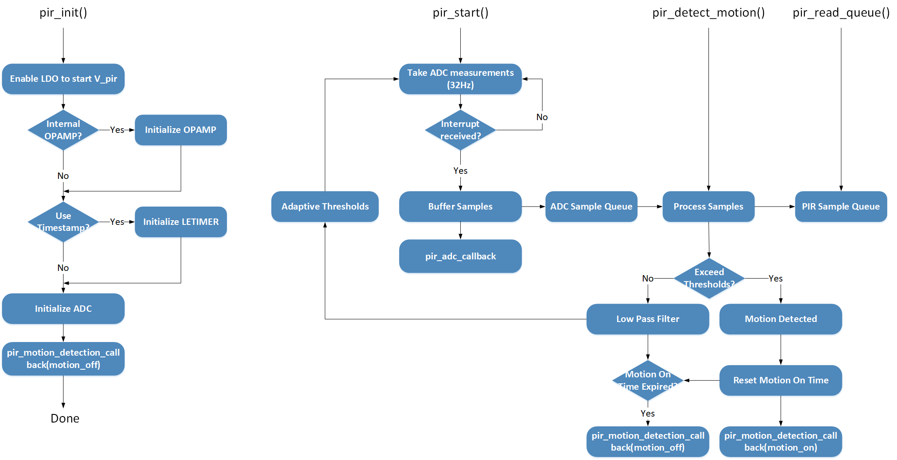

# PIR Sensor Driver #

## Overview ##

This project shows the implementation of PIR sensor driver using the PIR sensor on the occupancy sensor EXP board.

The target application of the PIR sensor would be smart lighting or alarm systems in home automation. Whenever certain motion of the human body is detected, the system will either turn on the light or the alarm.

## Gecko SDK version ##

v2.7.3

## Hardware Required ##

- EFM32PG12 Pearl Gecko STK (BRD2401A)
- Occupancy Sensor EXP board (BRD8030A)

Or

- WSTK Mainboard (BRD4001A)
- EFR32MG12 Radio Board (BRD4162A)
- Occupancy Sensor EXP board (BRD8030A)

The driver should work with minimal porting on other series 1 EFM/EFR devices and with other
PIR sensors having similar designs as the one on the Occupancy Sensor EXP board.

## Setup ##

To test the PIR sensor, you need to connect the occupancy sensor EXP board to the Pearl Gecko STK/WSTK board through the expansion header. Then, you should program the MCU with the pir_simple.sls project.

## How It Works ##

Wheverever motion is detected, the red LED on the occupancy sensor EXP board will be turned on. If no motion is detected for 4 seconds, the red LED will be turned off.

## .sls Projects Used ##

- pir_simple.sls

## API Documentation ##

Based on the operation, the PIR sensor driver API can be broken into 4 categories:

- Initialization.
    - pir_init() function will power up the PIR sensor and initialize all peripherals required to perform the measurement
    - pir_configure() function is not currently implemented yet. The PIR sensor we used is an analog sensor which doesn't have internal registers to program.
- Running the Motion Detection
    - pir_start() and pir_stop() functions are used to start/stop ADC measurements.
    - pir_detect_motion() is a simple algorithm that tells if motion is detected. It also adaptively update the ADC threshold to trigger interrupts.
- Callbacks
    - pir_adc_irq_callback() function is called in ADC IRQ. It's up to the application layer to decide how to set up flags/events to call the motion detection algorithm.
    - pir_motion_detection_callback() function is called in the motion detection algorithm to notify the application layer whenever motion on/off is detected.
- Debug Utilities
    - The application layer can provide a buffer for the PIR driver to save PIR samples to a sample queue for debugging purpose.

## Peripherals Usage ##

The figure above shows an overview of all peripherals used in the PIR sensor driver.

- Yellow blocks are external hardware components.
- Green blocks are peripherals that can operate in EM2.
    - 3 GPIOs, PRS, CRYTIMER(32Hz) and ADC are MUST have.
    - OPAMP can be either external or internal.
    - LETIMER is optional for processing/debugging samples.
- Motion detection can only run in EM0 as shown in the blue block.

## Software Workflow ##

After initialization, users can call pir_start() function to start ADC measurements (32Hz). If an ADC interrupt is received, host MCU will be wakened up to buffer ADC samples and call the pir_adc_irq_callback function. Users should run the motion detection algorithm on the latest ADC sample to detect motions.