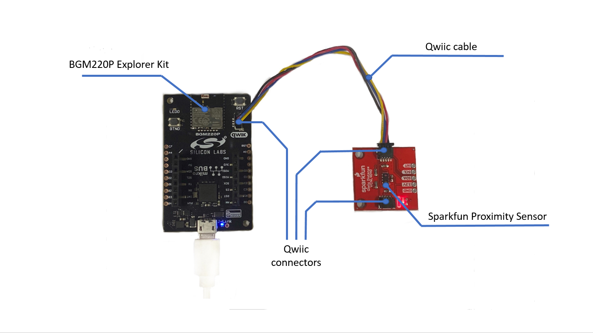
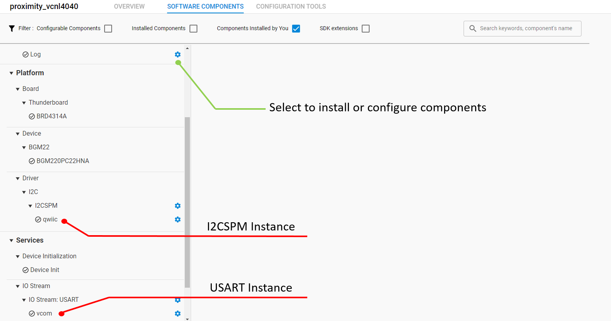
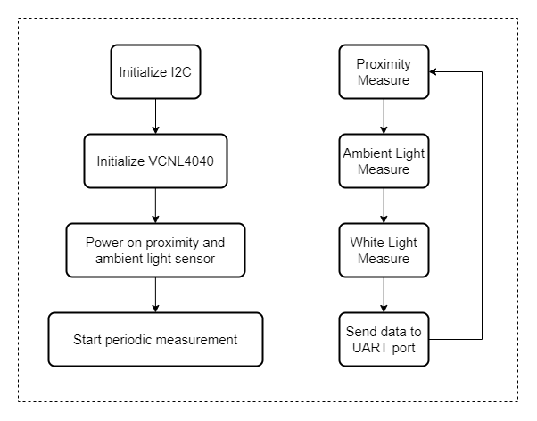
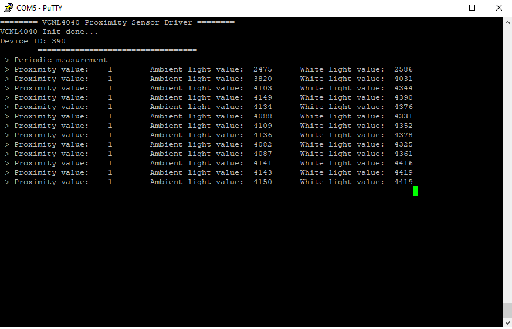

# VCNL4040 Proximity Sensor Driver #

## Overview ##
This project aims to implement a hardware driver interacting with the [VCNL4040 proximity sensor](https://www.vishay.com/ppg?84274) via APIs of GSDK.

VCNL4040 is integrated with a proximity sensor (PS) and an ambient light sensor (ALS). With the ability to detect objects that up to 20cm away it is often used in automatic towel and soap dispensers or automatic faucets. VCNL4040 Proximity sensor is a great digital alternative to the traditional analog sensor because it has no dead zone and can read all the way up to the face of the sensor. This sensor also has an ambient light sensor built it which is excellent if you need a digital light sensor for your next glitter cannon.

## Gecko SDK version ##

GSDK v4.1.0

## Hardware Required ##

- [BGM220 Explorer Kit board](https://www.silabs.com/development-tools/wireless/bluetooth/bgm220-explorer-kit)
- [SparkFun Proximity Sensor Breakout - 20cm, VCNL4040 (Qwiic)](https://www.sparkfun.com/products/15177)

## Connections Required ##

A VCNL4040 sensor board can be easily connected up with two I2C wires (SDA and SCL) along with 3v3 and GND. For the designated boards, SparkFun Qwiic compatible STEMMA QT connectors can be used.

## Setup ##

To test this application, you should connect the BMG220 Explorer Kit Board to the PC using a microUSB cable.

You can either import the provided **vcnl4040_proximity_simple.sls** project file or start with an empty example project as basis:

1. Create a "Empty C Project" project for the "BGM220 Explorer Kit Board" using Simplicity Studio 5. Use the default project settings. Be sure to connect and select the BGM220 Explorer Kit Board from the "Debug Adapters" on the left before creating a project.

2. Copy all attached files in *inc* and *src* folders into the project root folder, overwriting existing app.c by the app.c file in *test* folder.

3. Install the software components:

   - Open the .slcp file in the project.

   - Select the SOFTWARE COMPONENTS tab.

   - Install the following components
      - [Services] →  [Simple Timer]
      - [Services] →  [IO Stream] → [IO Stream: USART] → instance name: **vcom**
      - [Platform] →  [Driver]→ [I2C] →  [I2CSPM] → instance name: **qwiic**
      - [Application] →  [Utility] → [Log]

    ***

    

4. Build and flash the project to your device.

## How It Works ##

### API Overview ###
The driver divided into two layers: platform and interface layer. The platform layer perform the interaction between the sensor and the microcontroller by I2C protocol (I2CSPM platform service). The interface layer provides user public APIs to communicate with or control the operation of the sensor.

[vcnl4040_platform.c](src/vcnl4040_platform.c) : Communicates with the microcontroller through the Silabs I2CSPM platform service.

[vcnl4040.c](src/vcnl4040.c) : Implements public APIs to interface with VCNL4040 Proximity sensor.

[vcnl4040_config.h](inc/vcnl4040_config.h) : Defines the configuration for I2C transmission and the interrupt operation mode.
### Testing ###
The below chart represents the workflow of a simple testing program. The left chart shows the initialization steps that needed before reading data and the right chart shows the periodic measuring process.

Use Putty or other program to read the serial output.
The BGM220P uses by default a baudrate of 115200. You should expect a similar output to the one below.

