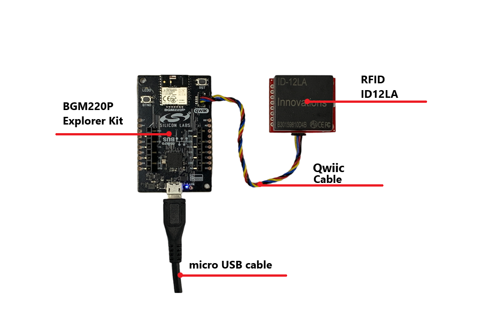
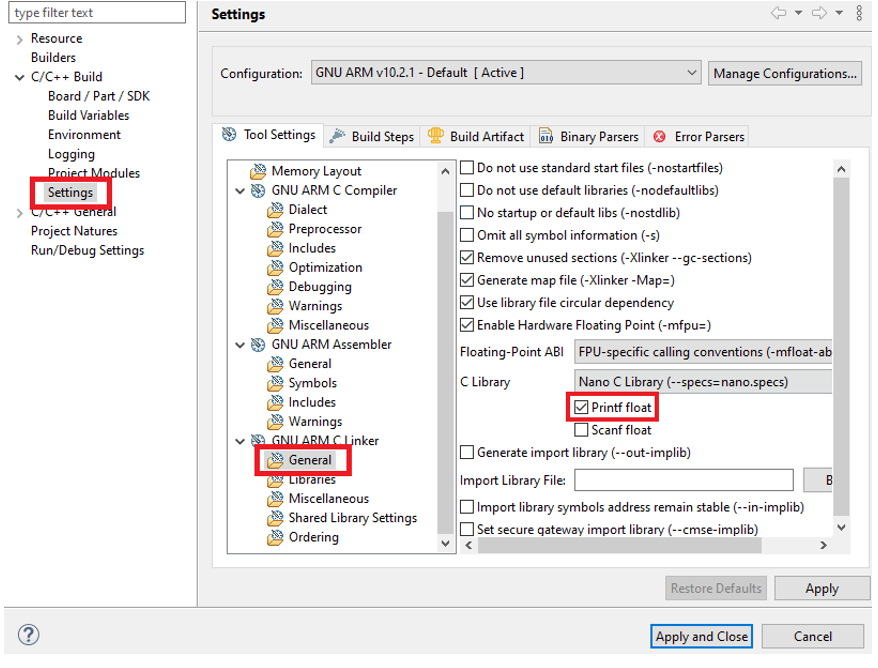
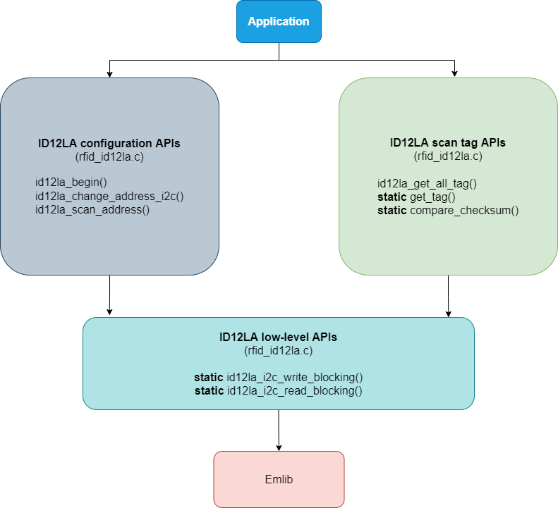
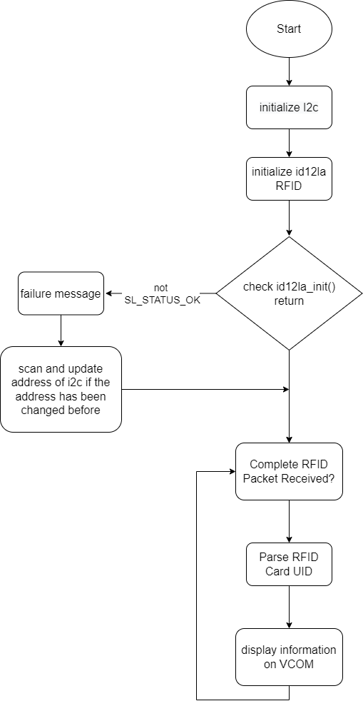
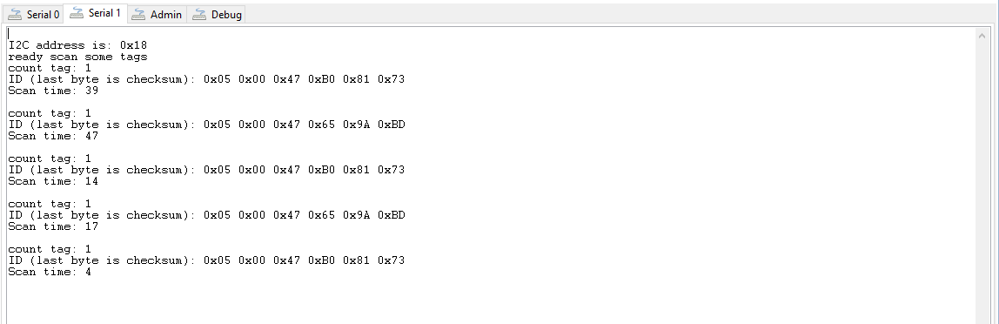

# ID12LA RFID Reader Driver #

## Overview ##
This project shows the implementation of a RFID module that outputs the 10 character unique ID ( 5 bytes ID + 1 byte checksum + 4 bytes timestamp) of a 125kHz RFID card with **BGM220 Explorer Kit** based on Qwiic communication.

## Gecko SDK version ##

GSDK v4.1.0

## Hardware Required ##

- [A BGM220 Explorer Kit board](https://www.silabs.com/development-tools/wireless/bluetooth/bgm220-explorer-kit)

- [SparkFun RFID Qwiic Reader](https://www.sparkfun.com/products/15191)

- [RFID Reader ID-12LA](https://www.sparkfun.com/products/11827)

- [RFID Tag (125kHz)](https://www.sparkfun.com/products/14325)
  
## Connections Required ##

A ID12L RFID module can be easily connected up with two I2C wires (SDA and SCL) along with 3v3 and GND. For the designated boards, SparkFun Qwiic compatible STEMMA QT connectors can be used.

## Setup ##

To test this application, you should connect the BMG220 Explorer Kit Board to the PC using a micro USB cable. 

You can either import the provided **id12la_rfid.sls** project file or start with an empty example project as basis:

1. Create a "Empty C Project" project for the "BGM220 Explorer Kit Board" using Simplicity Studio 5. Use the default project settings. Be sure to connect and select the BGM220 Explorer Kit Board from the "Debug Adapters" on the left before creating a project.

2. Copy all attached files in *inc* and *src* folders into the project root folder (overwriting existing app.c).

3. Install the software components:

   - Open the .slcp file in the project.

   - Select the SOFTWARE COMPONENTS tab.

   - Install the following components
      - **[Services]** →  **[IO Stream]** → **[IO Stream: USART]** → instance name: **vcom** 
      - **[Services]** →  **[Sleep Timer]**
      - **[Platform]** →  **[Driver]** → **[I2C]** →  **[I2CSPM]** → instance name: **qwiic** and choose fastmode (400kbit/s) 
      - **[Application]** →  **[Utility]** → **[Log]**

4. Active floating point print() with GCC: 

   - You can check that printf float is enabled for your build configuration by right clicking on your project in the [Project Explorer] window, selecting  Properties > [C/C++ Build]>[Settings], then under [GNU ARM C Linker]>[General], check the [Printf float] checkbox beneath the [C Library] selection box:

   

5. Build and flash the project to your device.

## How It Works ##

### API Overview ###
A higher level kit driver I2CSPM (I2C simple poll-based master mode driver) is used for initializing the I2C peripheral as master mode and performing the I2C transfer.

[rfid_id12la.c](src/rfid_id12la.c): Communicate with the microcontroller through the Silabs I2CSPM platform service as well as implements public APIs to interface with the ID12LA RFID.

### Testing ###

This example demonstrates some of the available features of the ID12LA module. After initialization, the ID-12LA module outputs a packet through I2C ( 5 bytes ID + 1 byte checksum + 4 bytes timestamp) when it scans an RFID card. The "scan" time is not the time of day the RFID card was scanned but rather the time between when the card was scanned and when the user requested the RFID tag from the Qwiic RFID Reader (the time that data is stored in the buffer of ID12LA module). The following diagram shows the program flow as implemented in the app.c file:

Use J-Link Silicon Labs or other program to read the serial output. The BGM220P uses by default a baudrate of 115200. You should expect a similar output to the one below.

## .sls Projects Used ##

- [**id12la_rfid.sls**](SimplicityStudio/id12la_rfid.sls)