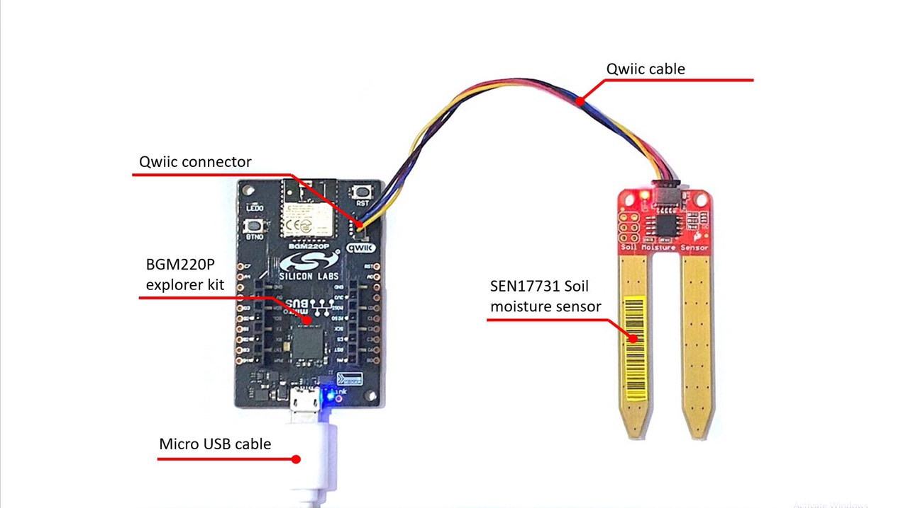
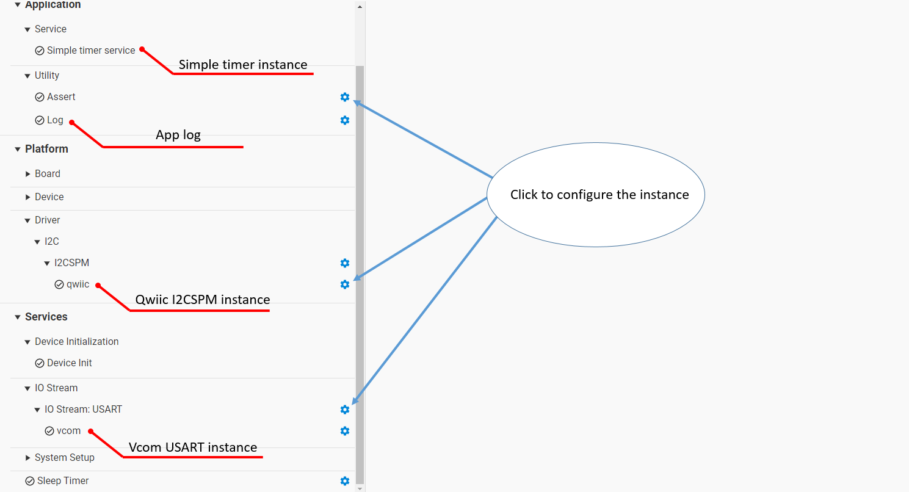
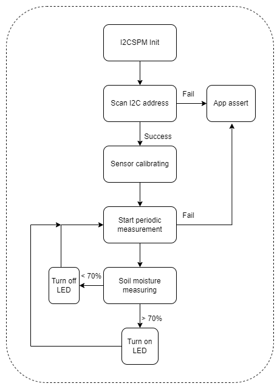
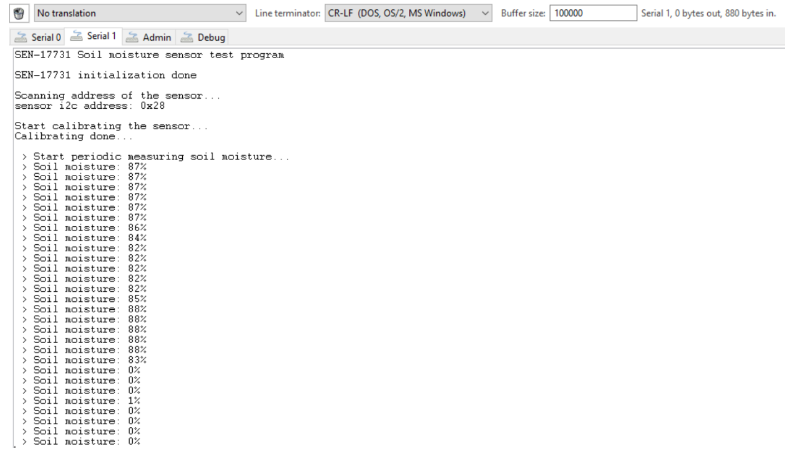

# SEN17731 Soil Moisture Sensor Driver #

## Overview ##

This project aims to implement a hardware driver interacting with the [SEN17731 soil moisture sensor](https://www.sparkfun.com/products/17731) via APIs of GSDK.

SEN17731 is a simple breakout for measuring the moisture in soil and similar materials.The soil moisture sensor is pretty straightforward to use. The two large, exposed pads function as probes for the sensor, together acting as a variable resistor. The more water that is in the soil means the better the conductivity between the pads will be, resulting in a lower resistance and a higher SIG out. This version of the Soil Moisture Sensor includes a Qwiic connector, making it even easier to use this sensor.

## Gecko SDK version ##

GSDK v4.1.1

## Hardware Required ##

- [BGM220 Explorer Kit board](https://www.silabs.com/development-tools/wireless/bluetooth/bgm220-explorer-kit)
- [SparkFun Qwiic Soil Moisture Sensor](https://www.sparkfun.com/products/17731)

## Connections Required ##

A SEN17731 sensor board can connect with the BGM220 Explorer Kit easily via SparkFun Qwiic compatible STEMMA QT. The Sparkfun Qwiic is a special connector that includes two I2C wires (SDA and SCL), 3v3 and GND. All of these wires are combined into 1 connection port so that it makes the connection between 2 devices become easier and more convinient.

## Setup ##

To test this application, you should connect the BMG220 Explorer Kit Board to the PC using a microUSB cable.

You can either import the provided **sen17731_soil_moisture_simple.sls** project file or start with an empty example project as basis:

1. Create a "Empty C Project" project for the "BGM220 Explorer Kit Board" using Simplicity Studio 5. Use the default project settings. Be sure to connect and select the BGM220 Explorer Kit Board from the "Debug Adapters" on the left before creating a project.

2. Copy all attached files in *inc* and *src* folders into the project root folder, overwriting existing app.c by the app.c file in *test* folder.

3. Install the software components:

   - Open the .slcp file in the project.

   - Select the SOFTWARE COMPONENTS tab.

   - Install the following components
      - [Services] → [IO Stream] → [IO Stream: USART] → instance name: **vcom**
      - [Platform] → [Driver]→ [I2C] → [I2CSPM] → instance name: **qwiic**
      - [Application] → [Utility] → [Log]
      - [Application] → [Utility] → [Assert]
      - [Application] → [Services] → [Simple Timer]

   

4. Build and flash the project to your device.

## Sensor Calibration ##
SEN17731 sensor outputs the soil moisture value via 10-bit resolution ADC value so it needs to be calibrated before users can understand what these number means. The calibration procedure is quite simple.
   - Firstly, you need to place the sensor in the driest condition, read the ADC value, and remember it.
   - Do the same as the first step, but now try it the wettest condition.
   - Finally, you can create your own map() function based on the two above limited values to convert other values to the corresponding moisture percentage (0% - 100%).

## How It Works ##

### API Overview ###
The driver includes 2 files: [sen17731.c](src/sen17731.c) and [sen17731.h](inc/sen17731.h):

[sen17731.c](src/sen17731.c) : The source file of the driver, it contains the implementation of all the public functions that will be used by users and the local functions that handle the I2C communication between the sensor and the microcontroller.

[sen17731.h](inc/sen17731.h) : Containing public funtion protoypes of the driver.

### Testing ###
The below chart represents the workflow of a simple testing program. The left chart shows the initialization steps that needed before reading data and the right chart shows the periodic measuring process.

Use Console Launcher on Simplicity Studo to monitor the serial output. The BGM220P uses by default a baudrate of 115200. You should expect a similar output to the one below.

