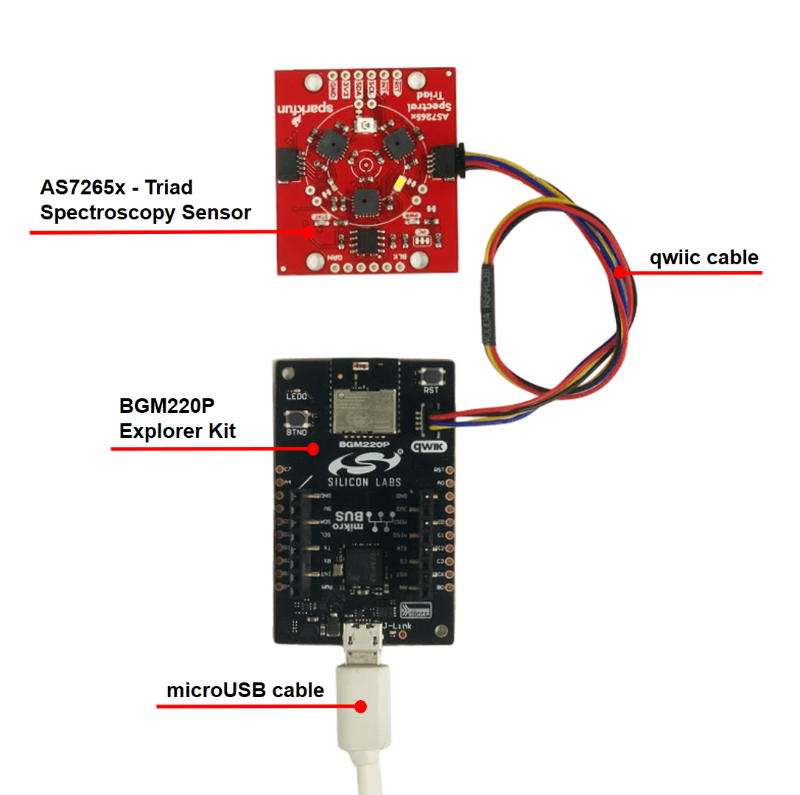
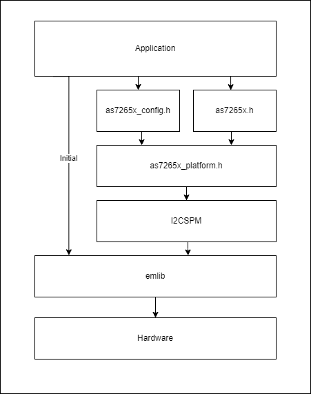
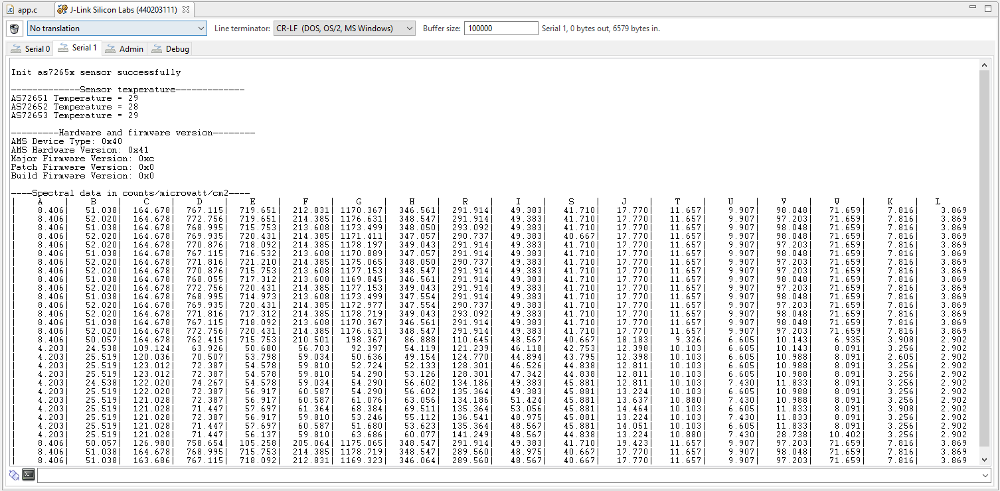
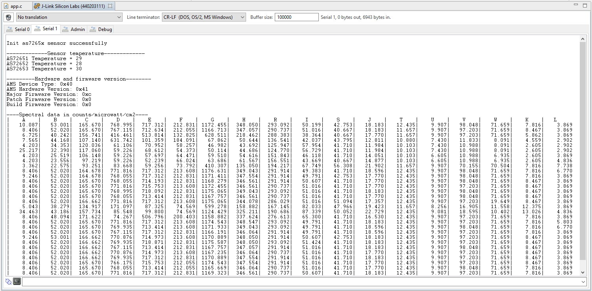
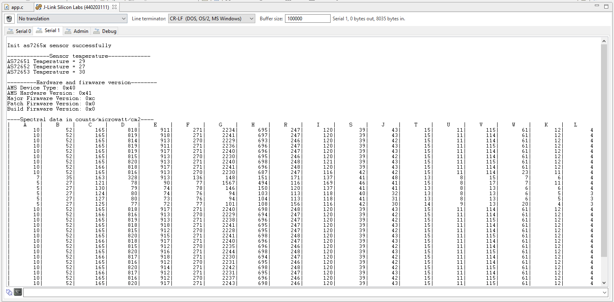
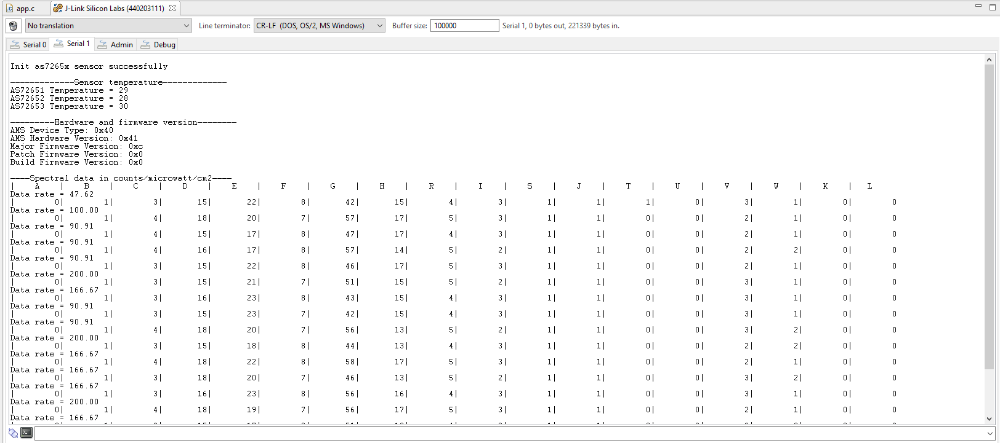
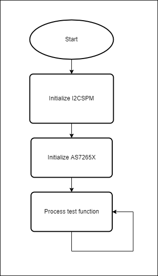
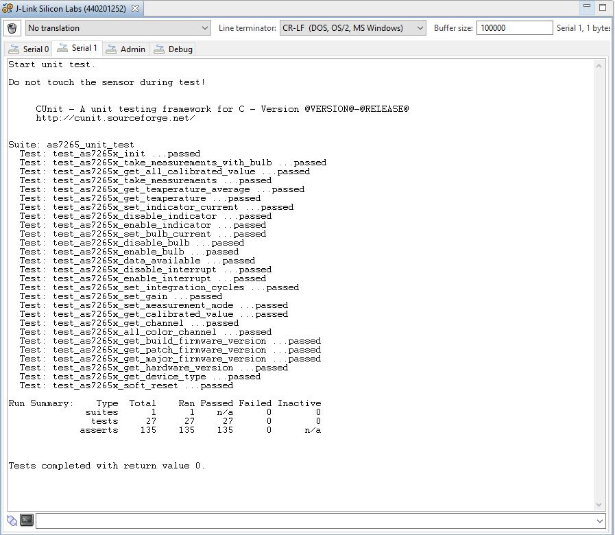

# Triad Spectroscopy Sensor - AS7265x Driver #

## Description ##

This project shows the implementation of the Triad Spectroscopy Sensor using a **Triad Spectroscopy Sensor-AS7265x** with **BGM220 Explorer Kit** based on Qwiic communication.

The SparkFun Triad Spectroscopy Sensor is a powerful optical inspection sensor also known as a spectrophotometer. Three AS7265x spectral sensors are combined alongside visible, UV, and IR LEDs to illuminate and test various surfaces for light spectroscopy. The Triad is made up of three sensors; the AS72651, the AS72652, and the AS72653 and can detect light from 410nm (UV) to 940nm (IR).

For more information about the Triad Spectroscopy Sensor-AS7265x, see the [specification page](https://cdn.sparkfun.com/assets/c/2/9/0/a/AS7265x_Datasheet.pdf).

## Gecko SDK version ##

GSDK v4.1.0

## Hardware Required ##

- [A BGM220 Explorer Kit board](https://www.silabs.com/development-tools/wireless/bluetooth/bgm220-explorer-kit).

- [A Triad Spectroscopy Sensor - AS7265x Board](https://www.sparkfun.com/products/15050).

## Connections Required ##

A Triad Spectroscopy Sensor - AS7265x can be easily connected up with two I2C wires (SDA and SCL) along with 3v3 and GND. For the designated boards, SparkFun qwiic compatible STEMMA QT connectors can be used.



## Setup ##

To test this application, you should connect the BMG220 Explorer Kit Board to the PC using a micro USB cable.

You can either import the provided [**specstroscopy_as7265x.sls**](SimplicityStudio/spectroscopy_as7265x.sls) project file or start with an empty example project as a basis:

1. Create an "Empty C Project" project for the "BGM220 Explorer Kit Board" using Simplicity Studio v5. Use the default project settings. Be sure to connect and select the BGM220 Explorer Kit Board from the "Debug Adapters" on the left before creating a project.

2. Copy all attached files in [inc](inc), [src](src) folders and [test/as7265x_simple_test/app.c](test/as7265x_simple_test/app.c) into the project root folder (overwriting existing app.c).

3. Choose the test mode you want by uncommenting the #define

   ```c
   #define TEST_BASIC_READING
   // #define TEST_BASIC_READING_WITH_LED
   // #define TEST_READ_RAW_VALUE
   // #define TEST_MAX_READ_RATE
   ```

4. Install the software components::
   - **[Software Components] > [Services] > [Sleeptimer]**
   - **[Software Components] > [Platform] > [Driver] > [I2CSPM]** (in case of using the BGM220 Explorer kit board, the instance name should be qwiic)
   - **[Software Components] > [Services] > [IO Stream] > [IOStream]**: USART with the default instance name: vcom.
   - **[Software Components] > [Application] > [Utility] > [Log]**

5. If you want to print float sensor values like in this example, follow the instructions of the [Floating point print() with GCC](https://www.silabs.com/community/mcu/32-bit/knowledge-base.entry.html/2014/11/19/floating_point_print-7R9j) article.

### Unit Test Setup ###

This driver has been unit tested by using the CUnit testing framework. CUnit is a lightweight framework for writing, administering, and running unit tests in C. More documents about CUnit can be found at [CUnit homepage](http://cunit.sourceforge.net/).

Follow the steps below to set up the unit test for this driver.

You can either import the provided [**specstroscopy_as7265x_unit_test.sls**](SimplicityStudio/specstroscopy_as7265x_unit_test.sls) project file or start with an Empty C project as basis:

1. Create an "Empty C Project" for the "BGM220 Explorer Kit Board" using Simplicity Studio v5. Use the default project settings.

2. Copy the files [test/as7265x_unit_test/app.c](test/as7265x_unit_test/app.c) (overwriting existing app.c), [as7625x.c](src/as7265x.c), [as7625x.h](inc/as7265x.h), [as7625x_platform.c](src/as7265x_platform.c), [as7265x_platform.h](inc/as7265x_platform.h), [as7265x_config.h](inc/as7265x_config.h), [test/as7265x_unit_test/inc/ut_as7265x.c](test/as7265x_unit_test/src/ut_as7265x.c), [test/as7265x_unit_test/inc/ut_as7265x.h](test/as7265x_unit_test/inc/ut_as7265x.h) and all of the [Cunit framework](test/as7265x_unit_test/cunit_framework) include files and source files into the project root folder.

3. Install the software components:

   - Open the .slcp file in the project.

   - Select the `SOFTWARE COMPONENTS` tab.

      - Install **[Platform] > [Driver] > [I2CSPM] > [Qwiic]** component with the default instance name: **Qwiic**.

      - Install the **[Services] > [Sleep Timer]** component.

      - Install the **[Services] > [IO Stream] > [IO Stream: USART]** component with the default instance name: **vcom**.

      - Install the **[Services] > [IO Stream] > [IO Stream: USART] > [IO Stream: Retarget STDIO]** component.

      - Install the **[Application] > [Utility] > [Log]** component.

## How It Works ##

### API Overview ###



[as7265x.h](inc/as7265x.h): API for the application

[as7265x_config.h](inc/as7265x_config.h): API for the sensor configuration

[as7265x_platform.h](inc/as7265x_platform.h): API for the platform interfacing

### Testing ###

This simple test application demonstrates some of the available features of the A Triad Spectroscopy Sensor - AS7265x, after initialization, the Triad Spectroscopy Sensor - AS7265x measure the value and return on the serial communication interface.

You can choose which type of test you want by uncommenting the #define, follow the below steps to test the example:

1. Open a terminal program on your PC, such as the Console that is integrated into Simplicity Studio or a third-party tool terminal like TeraTerm to receive the logs from the virtual COM port.

2. Depending on the test mode defined in the app.c file, the code application can operate in the different modes.

- If you use **TEST_BASIC_READING** for testing, this example takes all 18 readings, 372nm to 966nm, over I2C and outputs them to the serial port.



- If you use **TEST_BASIC_READING_WITH_LED** for testing, this example takes all 18 readings and blinks the illumination LEDs as it goes, resets the device, and observes the log messages.



- If you use **TEST_READ_RAW_VALUE** for testing, this example shows how to output the raw sensor values.



- If you use **TEST_MAX_READ_RATE** for testing, this example shows how to set up the sensor for max, calibrated read rate.



Our unit test for the application run with the flow chart below.



The unit test for all the APIs also was provided with the result below.



### .sls Project Used ###

- [**specstroscopy_as7265x.sls**](SimplicityStudio/specstroscopy_as7265x.sls)
- [**specstroscopy_as7265x_unit_test.sls**](SimplicityStudio/specstroscopy_as7265x_unit_test.sls)
