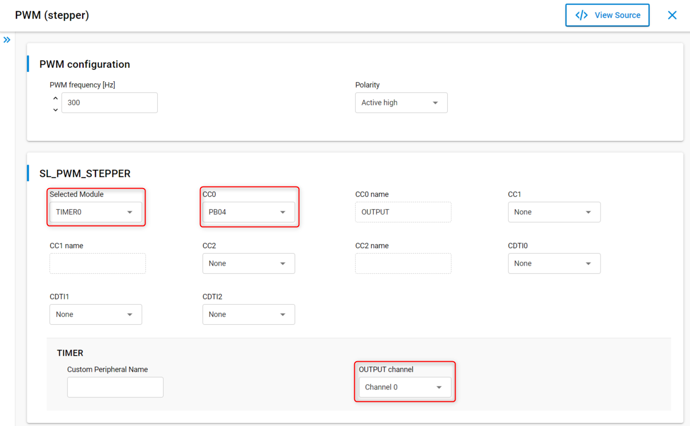

# Stepper Motor Driver


[](https://www.mikroe.com/stepper-2-click)

## Summary

This project shows the implementation of a stepper motor driver. The BGM220 Explorer Kit is used to control a popular stepper motor driver IC, the A4988 from Allegro Microsystems. This is a highly integrated IC, which offers a very simple bipolar stepper motor control interface, thanks to the integrated translator section.

The Stepper 2 click Mikroe board carries an A4988 IC along with screw terminals for connecting an external motor, as well as for bringing in an external power supply.

## Gecko SDK version

v4.0.0 and later

## Hardware Required

- BGM220 Explorer Kit ([BRD4314A](https://www.silabs.com/development-tools/wireless/bluetooth/bgm220-explorer-kit))
- A4988 stepper motor driver board ([Stepper 2 click board from Mikroe](https://www.mikroe.com/stepper-2-click))
- 4-wire bipolar stepper motor (NEMA-17)
- External power supply that is enough to power the chosen stepper motor

The driver should work with minimal porting on other devices.

## Setup

The BGM220 Explorer Kit supports the mikroBUS connector so the Stepper 2 click board can be just "clicked" into its place. Be sure that the board's 45-degree corner matches the Explorer Kit's 45-degree white line.

> More information on the connectors and pinout of the BGM220P can be found in the [user guide](https://www.silabs.com/documents/public/user-guides/ug465-brd4314a.pdf).

The driver board contains three pairs of screw terminals. 2B, 2A, 1A and 1B are for connecting the stepper motor, VIN and GND are for bringing an external power supply.

Import the [a4988_stepper_simple.sls](SimplicityStudio/a4988_stepper_simple.sls) project into Simplicity Studio 5 and flash the BGM220P or follow the steps in the following section to add the driver into a custom project.

### Creating a new project

Any starter project can be used but the provided [a4988_stepper_simple.sls](SimplicityStudio/a4988_stepper_simple.sls) project uses the `Empty C Project` as its base.


Once you have your new starter project, copy the driver files into the project and add the inc folder's path to the project's include paths (GNU C, workspace path).

In the `.slcp` file go to the `Software Components` tab and add the following components:

- `[Platform] > [Driver] > [PWM]`
- `[Platform] > [Driver] > [Button] > [Simple Button]`
- `[Services] > [Sleep Timer]`


In order to be able to run the motor with low speed (low PWM frequency), it is worth to use a 32 bit timer. For the Explorer kit and series 2 devices, this is TIMER0.



## How It Works

The A4988 IC has two inputs for controlling the motor: STEP and DIR. A low-to-high transition on the STEP input advances the motor one increment. The stepper motor can be driven in both directions. The DIR input determines the direction of rotation of the motor. The IC's ENABLE and RESET inputs are also utilized. The ENABLE input turns on or off all of the FET outputs of the driver and the RESET input sets the translator to a predefined Home state and turns off all of the FET outputs.

### API Documentation

The stepper motor driver provides a set of functions to operate a stepper motor.

| Function | Description | 
| ------- | ------- | 
| a4988_stepper_init | Initializes GPIOs needed to interface with the driver IC |
| a4988_stepper_reset | Activates the RESET input on the driver IC |
| a4988_stepper_enable | Enables or disable the motor driver | 
| a4988_stepper_set_dir | Sets the direction of rotation | 
| a4988_stepper_set_speed | Sets the speed of the motor in rpm | 
| a4988_stepper_start | Starts the motor with the configured speed and direction |
| a4988_stepper_stop | Stops the motor |
| a4988_stepper_step | Move the motor by a given number of steps |
| a4988_stepper_get_state | Returns with the inner state of the driver |

Basically, there are two modes of operation:

1. Run the stepper motor continuously with a constant speed by using the a4988_stepper_start function. In this mode, the driver needs a PWM instance to operate.
2. Move the motor by a given number of steps using the a4988_stepper_step function. In this mode, the driver needs a PWM instance and a sleeptimer handle to operate.


After installing the PWM software component, you need to pass the created PWM instance to the driver in its init function:

```c
#include "sl_pwm_instances.h"

static a4988_stepper_inst_t app_stepper_instance = A4988_STEPPER_INST_DEFAULT;
```

```c
  app_stepper_instance.pwm = &sl_pwm_stepper;
  a4988_stepper_init(&app_stepper_instance);
```

## Configuration

There are macro definitions in [stepper_config_A4988.h](inc/stepper_config_A4988.h) that can be modified to get the desired pin connections. There are also other symbols for configuration:

- `A4988_STEPPER_MAX_RPM`: determine the maximum speed of the motor in rpm. 
- `A4988_STEPPER_MOTOR_STEPS_PER_REV`: used to determine the step revolution of the motor. You can get this parameter from the stepper motor's datasheet.


The default PWM frequency is set by the installed PWM software component. Make sure to use a PWM frequency that the stepper motor is capable to handle or set the `A4988_STEPPER_MAX_RPM` limit properly.

## Example Application with CLI

In the [a4988_stepper_cli.sls](SimplicityStudio/a4988_stepper_cli.sls) example, the **CLI: Command Line Interface** software component is used so the user can control the motor with commands via UART. Connect the Explorer kit to your PC, open a UART terminal and use the following commands to control the motor:

| Command | Description | Parameter (type) |
| ------- | ------- | ------- |
| set_rpm | Set speed in RPM | Speed in rpm (uint32) |
| set_dir | Set direction of rotation | 0: CW, 1: CCW (uint8) |
| step | Move the motor by a given number of steps | Step count (uint32) |
| start | Start the motor with the configured speed and direction | - |
| stop | Stop the motor | - |
| enable | Enable the motor driver | - |
| disable | Disable the motor driver | - |

There is also an emergency button feature in this test application. If the motor is enabled then pressing BTN0 on the board disables it. The next button press will enable the driver again.

## Peripherals Usage

- TIMERx (PWM)
- GPIO (Simple Button)
- RTCC (Sleeptimer)

## .sls Projects Used

- [a4988_stepper_simple.sls](SimplicityStudio/a4988_stepper_simple.sls)
- [a4988_stepper_cli.sls](SimplicityStudio/a4988_stepper_cli.sls)
