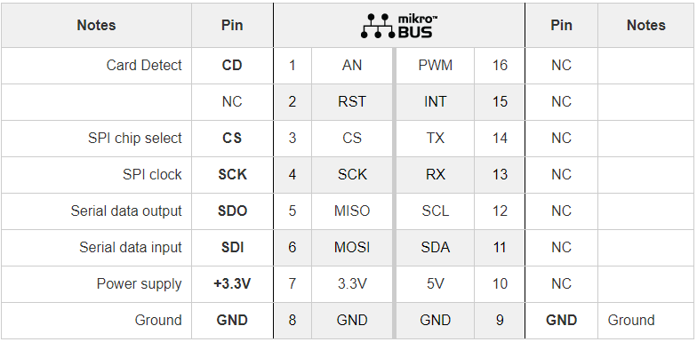
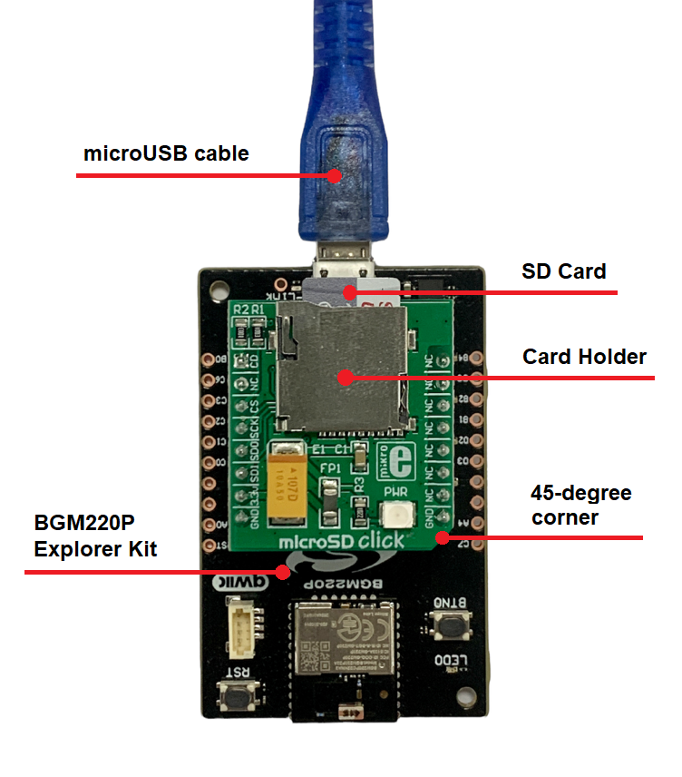
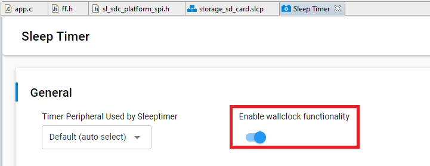
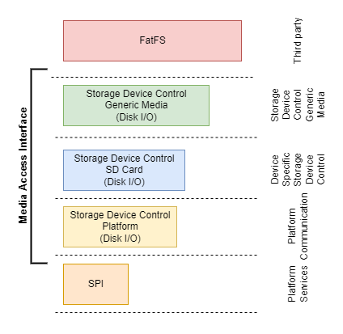
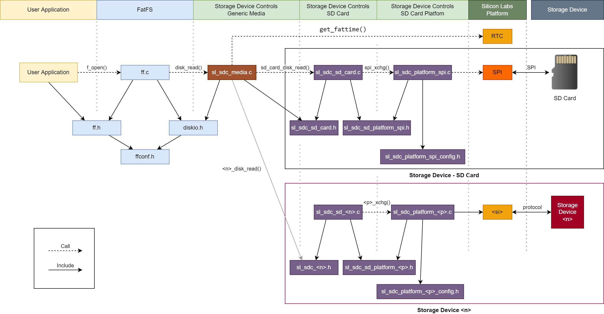
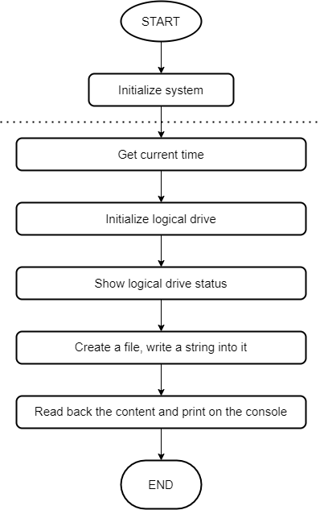
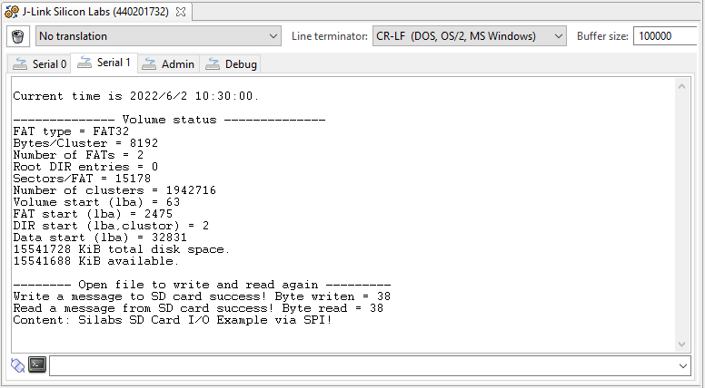
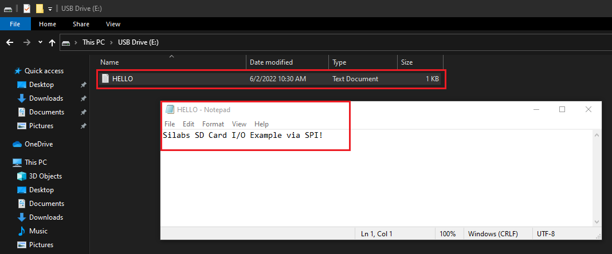

# External Storage - SD card driver #

## Description ##

This project aims to implement a hardware driver interacting with an SD Card using the microSD Click board. SD Cards support SDIO or SPI interfaces to communicate with them, this driver focuses to communicate with them via the SPI interface. SPI is widely available in embedded devices/microcontrollers.

This project integrates FatFS which is one of the most popular file system libraries. File system related abstraction is handled by FatFS, and lower-level functions like the media IO layer are provided by this project's source code. For more information about FatFS, see the following [source](http://elm-chan.org/fsw/ff/doc/appnote.html).

The microSD Click communicates with the target microcontroller over SPI interface that corresponds to the pinout on the mikroBUS™ socket as shown below.

## Gecko SDK version ##

GSDK v4.1.0

## Hardware Required ##

- [A BGM220P Explorer Kit board.](https://www.silabs.com/development-tools/wireless/bluetooth/bgm220-explorer-kit)

- [A microSD Click board.](https://www.mikroe.com/microsd-click)

- A microSD card, e.g. [microSD card 32 GB with adapter](https://www.mikroe.com/microsd-32gb).

## Connections Required ##

The microSD click board can just be "clicked" into its place. Be sure that the board's 45-degree corner matches the Explorer Kit's 45-degree white line.

## Setup ##

To test this application, you should connect the BMG220 Explorer Kit Board to the PC using a micro USB cable.

You can either import the provided **storage_sd_card_simple.sls** project file or start with an empty example project as a basis:

1. Create a "Platform - Empty C Project" project for the "BGM220 Explorer Kit Board" using Simplicity Studio v5. Use the default project settings. Be sure to connect and select the BGM220 Explorer Kit Board from the "Debug Adapters" on the left before creating a project.

2. Copy all attached files in inc and src folders into the project root folder (overwriting existing app.c).

3. Install the software components:

   - Open the .slcp file in the project.

   - Select the *SOFTWARE COMPONENTS* tab.

   - Install the following components:

     - **[Platform] > [Driver] > [SPIDRV]** with the default instance name: **mikroe**.
     - **[Services] > [IO Stream] > [IO Stream: USART]** with the default instance name: **vcom**.
     - **[Services] > [Sleep Timer]**. Then set the **Enable wallclock functionality**.

        

     - **[Application] > [Utility] > [Log]**.
     - **[Application] > [Utility] > [Assert]**.

4. Build and flash the project to your device.

## How It Works ##

### API Overview ###

The driver is divided into a FatFs, a Media access interface, and an SPI platform. The FatFs layer is the Filesystem Layer independent of platforms and storage media, it is completely separated from the physical device, such as memory card, hard disk, or any type of storage device. The media access interface is not part of the FatFs module and it needs to be provided by the implementer. FatFs controls the storage devices via a media access interface. The SPI platform layer provides integration to the host microcontroller hardware-dependent code.

The dependency diagram is shown below.

**FatFS**: provides various filesystem functions for the applications.

- File Access
- Directory Access
- File and Directory Management
- Volume Management and System Configuration

For more information about the APIs of the FatFS module, see the following [source](http://elm-chan.org/fsw/ff/00index_e.html).

**Storage Device Controls Generic Media**: implements the generic media access interface by consuming device-specific storage device control implementations.
**Storage Device Controls SD Card**: implements the storage device control interfaces specific to SD Card.

**Storage Device Controls SD Card Platform**: implements basic interfaces required by the upper Storage Device Control layer. It implements SPI **byte, multibyte, exchange**, and other required functions by consuming platform SPI interfaces. The SPI instance is configurable via a public interface. Default instance should be provided via a configuration macro defined in a separate [sl_sdc_platform_spi_config.h](inc/sl_sdc_platform_spi_config.h) named header file.

**Silicon Labs Platform**: implements the peripheral driver core.

### Testing ###

This example demonstrates the basic features of the driver as shown below:

Use a terminal program, such as the Console that is integrated into Simplicity Studio or a third-party tool terminal like Tera Term to receive the logs from the virtual COM port. You should expect a similar output to the one below.

Unmount the SD Card. Use a micro Card Reader to read files from the SD Card on your computer. You should expect a similar output to the one below.

## .sls Projects Used ##

[storage_sd_card_simple.sls](/SimplicityStudio/storage_sd_card_simple.sls)
