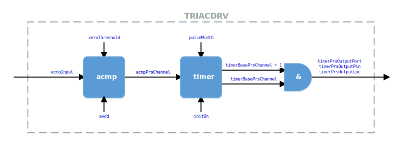

# TRIACDRV #

## Overview ##

TRIACDRV is a hardware device driver for Series 1 EFM32 and EFR32
devices that uses an appropriate voltage level representation of the
AC line voltage in order to fire a timed pulse to drive the gate on a
triac.

By using the PRS to connect one of the device's analog comparators
(ACMP) with one of its timers (TIMERs), the triac gate enable pulse can
be fired automatically and with zero CPU intervention. In addition to
initializing the necessary hardware, the driver includes functions to
get and set the duty cycle (between 0 and 100% in 1% increments) and
to monitor the half-wave duty cycle periods as a kind of calibration to
account for some level of potential variation in the incoming DC
waveform due to poor line conditions.

## Gecko SDK Support ##

The driver is written for Gecko SDK v2.7.x. While it has not been
tested, nothing in the driver or the example demonstration project
should preclude it from being built against Gecko SDK 3.x.

## Demonstration Hardware ##

The demonstrator provided with the driver runs on the EFM32TG11
Starter Kit (SLSTK3301A). It generates a 60 Hz output that is routed
to the ACMP input. A jumper wire is required to connect these two
pins. An oscilloscope can be used to observe both this stimulus and
the gate enable pulse output generated by the driver.

## Setup ##

Clone the repository with the driver source and demonstrator project
from GitHub onto your local machine.

From within the Simplicity Studio IDE, select Import -> MCU Project...
from the Project menu. Click the Browse button and navigate to the local
repository folder, then to the SimplicityStudio folder, select the .sls
file, click the Next button twice, and then click Finish.

Using a jumper wire, connect expansion header pins 3 (PC0, the ACMP
input) and 12 (PC14, the 60 Hz stimulus). Attach oscilloscope probes to
expansion header pins 10 (PC8) and 12 to observe the gate enable pulse
output relative to the 60 Hz input.

Build the project, download it to the Starter Kit, and press F8 (or
click the Resume icon) to run the program. Pressing button 0 or button
1, respectively, decrements or increments the output duty cycle (and
thus the position of the output pulse relative to the zero-crossing)
by 5% over the full range of 0% to 100%.

## Device Resource Requirements ##

As mentioned above, TRIACDRV uses the PRS to link one ACMP with one
TIMER to generate the gate enable pulse. The specific requirements are
as follows:

**1. ACMP**

The input voltage, which is some user-conditioned representation of the
AC line voltage (what this specifically means is discussed later), must
be between 0 volts and the lesser of AVDD or IOVDD because the ACMP is
supplied by AVDD, and the input signal is routed using the APORT.

This permits the widest possible input range because Series 1 devices
require that AVDD &ge; IOVDD and that VREGVDD = AVDD on devices with the
DCDC. It does, however, mean that the representation of the AC line must
be between 0 volts and IOVDD in systems where IOVDD < AVDD (e.g. when
IOVDD = 1.8V to interface with digital peripherals and GPIO  on
high-performance processors that do not support some kind of 3 volts
nominal I/O rail).

Selection of the APORT channel routed to the ACMP positive input and the
zero-crossing threshold voltage are up to the user and handled as part
of initializing the driver.

**2. TIMER**

TRIACDRV requires a single 16-bit TIMER of which it uses capture/compare
(CC) channels 0, 1, and 2. For all practical purposes CC channel 3 should
be considered unavailable to end user code as TRIACDRV must retain control
of the TIMER counter and its initialization.

Use of the WTIMER is currently unsupported.

**3. PRS**

TRIACDRV requires three PRS channels. The zero-crossing detection output
from the ACMP is routed to the selected TIMER using one PRS channel. TIMER
channels CC1 and CC2 are ANDed together using two adjacent PRS channels to
create the triac gate enable pulse. When the AND option is used with a pair
of PRS channels, channel N and is ANDed together with channel N + 1 such
that channel N is the resulting output.

Consequently, specifying PRS channel N for the TIMER means that channel
N + 1 is also used and that the port, pin, and location specified for the
output must be one of the available locations for PRS channel N (PRS_CHn).

**4. Pins**

As noted above, the user-conditioned representation of the AC line voltage
is input on one ACMP pin via the APORT. Refer to Analog Port (APORT) Client
Maps in section 5 of the datasheet to see the APORT inputs available for a
given ACMP.

One pin is required for the gate enable pulse output. It must be a GPIO
pin for which the PRS_CH alternate function corresponds to the selected
PRS channel chosen for the TIMER. For example, if PRS channel 8 is chosen
for the TIMER, then the pin chosen as an output must have PRS_CH8 as an
alternate function.

**5. Energy Modes**

Because the TIMER counter must run in order to output gate enable pulses
in response to zero-crossing events, TRIACDRV is restricted to running in
EM0 or EM1. To enter EM2 (or lower), application software should first set
the output duty cycle to 0% by calling triacdrv_set_duty_cycle(). Upon
returning to EM0, there is no need to re-initialize the driver; the output
can be re-enabled simply by setting the duty cycle to a non-zero value.

## API ##

### Overview ###

TRIACDRV works on the premise that&hellip;

* the AC line voltage appears to be a symmetrical waveform consisting of
two half waves demarcated by zero-crossings and that
* the TIMER which measures this waveform is operating many times faster
(e.g. somewhere in the single-digit MHz range)

&hellip;such that any asymmetry in the duration of the two half waves is
effectively invisible to the human eye for dimming purposes when the net
effective difference is relatively small.

By using the PRS to connect the ACMP output with the TIMER start-reload
input, TRIACDRV is able to continually start and reload the counter in
response to zero-crossing events. Capture/compare channel 0 (CC0) of the
selected timer captures the time of this reload event, which is the
duration of the half-wave.

During initialization and in response to calling the TRIACDRV_Calibrate()
function, the driver captures this half-wave duration and saves both the
largest and smallest values observed. TRIACDRV_SetDutyCycle() uses this
information to determine the positioning of the gate enable output pulse.

For example, if the duty cycle is set to 30%, the rising edge is of the
output pulse is positioned at 30% of the smallest count value observed;
the falling edge is positioned at this count plus the user-specified
pulse duration later. When 0% duty cycle is specified, the output pulse
is positioned to start after the maximum half wave count such that the
counter reload-start occurs before the pulse can ever be generated.

As mentioned above, the rising and falling edges of the output pulse
are positioned with respect to the half-wave duration and the specified
duty cycle. TIMER channel CC1 is used for the pulse rising edge and, if
it were output to a pin, would initially be low. Conversely, TIMER
channel CC2 is used for the falling edge and would be initially high if
output to a pin.

To combine these two signals into the desired output pulse, CC1 and CC2
are assigned to user-specified PRS channel N and N + 1, respectively.
This sequential assignment is mandatory because the PRS has the ability
to perform some limited logic operations on two adjacent channels.
Specifically, the PRS has the ability to AND a given channel with the
next higher-numbered channel (ANDNEXT), and this is used here to AND
CC1 (rising edge), which goes from low to high, with CC2 (falling edge),
which goes from high to low. The resulting pulse is driven on the
user-selected PRS_CH pin associated with channel N.

### Directory Structure ###

In the provided example, TRIACDRV resides in the project's **Drivers**
folder as follows:

When adding TRIACDRV to a project, in addition to the folders and source
files shown above, the Drivers/triac/inc directory must be added to the
include directory search path. In Simplicity Studio, this is easily done
by adding "${workspace_loc:/${ProjName}/Drivers/triac/inc}" to
Properties -> C/C++ Build -> Setting -> GNU ARM C Compiler -> Includes.

### Using the TRIACDRV ###

Use of TRIACDRV is modeled after emlib components. An initialization
function takes a pointer to an initialization structure that specifies
the fixed configuration parameters for the driver. Other functions
adjust the behavior of the driver once it is running.

A project using TRIACDRV must #include triacdrv.h in source files that
call the driver's functions.

#### Data Structures ####

    typedef struct
    {
      // ACMP used for zero crossing detection
      ACMP_TypeDef                *acmp;

      // APORT ACMP input channel
      ACMP_Channel_TypeDef        acmpInput;

      // PRS channel used to link ACMP and TIMER
      uint32_t                    acmpPrsChannel;

      // TIMER used for half-wave measurement and output generation
      TIMER_TypeDef               *timer;

      /*
       * Base PRS channel used for gate enable output pulse.  Two
       * adjacent channels (N and N + 1) are ANDed together to form
       * the output pulse.
       */
      uint32_t                    timerPrsBaseChannel;

      /*
       * Output port, pin, and location for timerPrsBaseChannel.  This
       * must be one of the PRS_CH pin options for the PRS channel
       * selected, e.g. if PRS channel 4 is selected as the
       * timerPrsBaseChannel on EFM32TG11, then the pin options are PC8
       * and PF1.
       */
      GPIO_Port_TypeDef           timerPrsOutputPort;
      uint32_t                    timerPrsOutputPin;
      uint32_t                    timerPrsOutputLoc;

      // Input waveform type
      TRIACDRV_InputWave_Typedef  inputWave;

      // Threshold voltage for zero-crossing in mV
      uint32_t                    zeroThreshold;

      // AVDD supply voltage in mV
      uint32_t                    avdd;

      // Gate enable pulse width in microseconds
      uint32_t                    pulseWidth;

      // Triac initially on?
      bool                        initOn;
    } TRIACDRV_Init_TypeDef;

TRIACDRV_Init_TypeDef is the initialization structure passed to the
TRIACDRV_Init() function. The members have self-explanatory names
and, unless explicitly disabled, are bounds-checked during
initialization.

#### Enumerations ####

    typedef enum
    {
      triacInputRectifiedSine,   // Rectified sine wave (no negative half wave) input
      triacInputOffsetSine,      // Offset sine wave with zero-crossing at 50%
    } TRIACDRV_InputWave_Typedef;

Allowable input waveforms are a rectified sine wave or an offset sine
wave that oscillates between ground and AVDD (or IOVDD) and has a
midpoint at half the specified analog input voltage.

#### Macros ####

    #define TRIACDRV_MAX_CAL_COUNT   		  60

    #define TRIACDRV_MAX_ENABLE_PULSE_WIDTH   200

    #define TRIACDRV_MIN_ZERO_THRESHOLD       5
    #define TRIACDRV_MAX_ZERO_THRESHOLD       500

	#define TRIACDRV_MIN_AVDD                 1800
	#define TRIACDRV_MAX_AVDD                 3800

    #define TRIACDRV_MIN_TIMER_FREQUENCY      1000000

These macros specify the bounds-checked ranges for parameters that are
specified or otherwise controlled (the TIMER clock frequency) by the
user.

#### Functions ####

    sl_status_t triacdrv_init(const TRIACDRV_Init_TypeDef *init)

triacdrv_init() takes a pointer to the initialization structure
described above. Unless explicitly disabled at compile time, it
bounds-checks the hardware resources assigned to the driver, as well as
the user-specified parameters that govern the input and output signals.
It can return the following possible status codes:

**1. SL_STATUS_OK**

Denotes successful driver initialization.

**2. SL_STATUS_INVALID_RANGE**

One or more of the zeroThreshold, avdd, or pulseWidth initialization
structure members is out of range. It can also mean that the selected
TIMER clock is less than 1 MHz (TRIACDRV_MIN_TIMER_FREQUENCY in
triacdrv.h), which means that the HFPERCLK has been prescaled to less
than 1 MHz on a Series 1 device.

**3. SL_STATUS_INVALID_CONFIGURATION**

One of the user-specified hardware parameters is invalid. This can mean
that the selected ACMP or TIMER does not exist on the chip against which
the project is being built (e.g. specifying ACMP2 on EFM32TG11, which has
only ACMP0 and ACMP1).

It can also indicate a similar problem with the selection of PRS channels
(e.g. one of the selected channels does not exist on the device, including
one of the two adjacent channels required to generate the output pulse).

Finally, there can be a problem with output selection. This can be a
non-existent I/O port or pin or a possibly non-existent location for
the PRS_CH alternate function. Note that the bounds-checking for the
latter is not absolute. Alternate functions are not always contiguously
defined (e.g. PRS_CH4 has only locations 0 and 2 on EFM32TG11).

    sl_status_t triacdrv_set_duty_cycle(uint32_t duty)

Sets the duty cycle (positioning) of the gate enable pulse to an integer
value between 0 (off) and 100% (always on). The following status codes
can be returned:

**1. SL_STATUS_NOT_INITIALIZED**

Returned if TRIACDRV_Init() has not been called and returned
SL_STATUS_OK.

**2. SL_STATUS_INVALID_RANGE**

Returned if a duty cycle greater than 100% is specified.

    uint32_t triacdrv_get_duty_cycle(void)

Returns the previously set duty cycle or 0 if TRIACDRV has not been
successfully initialized.

    sl_status_t triacdrv_calibrate(uint32_t count)

triacdrv_calibrate() takes up to TRIACDRV_MAX_CAL_COUNT measurments of
the measures the half-wave count and saves the largest and smallest
values found. This allows the driver to attempt to more accurately
place the gate enable pulse in the event that there is some asymmetry
in the AC waveform due to poor line conditions. The following status
codes can be returned:

**1. SL_STATUS_NOT_INITIALIZED**

Returned if TRIACDRV_Init() has not been called and returned
SL_STATUS_OK.

**2. SL_STATUS_INVALID_RANGE**

Returned if called with a half-wave count greater than
TRIACDRV_MAX_CAL_COUNT.

## Demonstration Project ##

The demonstration project in src/main.c shows how to initialize and
invoke TRIACDRV. Code flow is as follows:

1. Both the LFXO and HFXO are initialized, and the HFXO is selected as
the source of the HFCLOCK. This permits the TIMER used by TRIACDRV to
run with a fast and accurate reference clock.

2. GPIO pins connected to push buttons 0 and 1 are configured as inputs
with active pull-ups, and their associated interrupts are enabled.
Additionally, the pin used to output the 60 Hz LETIMER square
wave stimulus is set to use the lowest available slew rate setting.

3. The LETIMER is configured to output a 60 Hz square wave with 50%
duty cycle to be used as stimulus for the rectified sine wave input
configuration.

4. The default TRIACDRV initialization structure is modified to use the
specific hardware resources available on the EFM32TG11 Starter Kit and
to use the maximum supported output enable pulse width so that it is
visible on an oscilloscope when displayed along with the input
stimulus waveform.

5. triacdrv_init() is called and halts if SL_STATUS_OK is not returned.

6. The output duty cycle is set to 25% and the driver is allowed to
calibrate over 60 half-waves.

7. At this point, the device enters EM1 and waits for an interrupt in
response to button 0 or 1 being pressed. No CPU cycles are utilized to
generate the output pulse as the PRS allows TIMER0 to do this
automatically in response to zero-crossings detected by ACMP0.

8. When a button press is detected, the GPIO interrupt handler
decrements (button 0) or increments (button 1) the duty cycle and calls
triacdrv_set_duty_cycle() to have the driver update the output.

## Input Waveform Considerations ##

No microcontroller of any sort, regardless of the vendor, has input pad
structures that permit it to be interfaced directly with the AC mains.
Some kind of external hardware is required to translate the positive and
negative high voltages swings into something between ground and the
microcontroller's I/O voltage supply.

TRIACDRV has no awareness of the external hardware that might be used to
do this. However, it does provide a means to select one of two supported
ways in which the AC waveform can be presented.

One is as a rectified sine wave in which the voltage swings are scaled
between GND and AVDD (or IOVDD, as noted above). The expected waveform
for this option is shown below:

When using this option, the inputWave member of the initialization
structure must be set to triacInputRectifiedSine. Use this option for
other AC mains representations that present the zero-crossings as
comparator threshold transitions near GND. The 60 Hz square wave output
provided by the letimer60Hz() function in the demonstration project is
an example of this.

The other input option is an offset sine wave, which is simply a
scaled representation of the AC mains voltage that swings between GND
and AVDD (or IOVDD). The expected waveform for this option is shown
below:

Ideally, the waveform midpoint should be one half AVDD (or IOVDD), but
the avdd member of the initialization structure effectively specifies
the peak input voltage seen at the pin.

## Gate Enable Output

The gate enable output pulse is driven on a digital I/O pin that
toggles between GND and IOVDD.

## Disabling Hardware Resource Checking ##

TRIACDRV can be compiled with hardware resource checking disabled at
build time. Add TRIACDRV_DISABLE_HW_RESOURCE_CHECKING to
Properties -> C/C++ Build -> Setting -> GNU ARM C Compiler -> Symbols
in Simplicity Studio or define this symbol as part of the compiler
invocation command line (e.g. -DTRIACDRV_DISABLE_HW_RESOURCE_CHECKING
in GCC or the equivalent in IAR).

Depending on the optimization level, doing so can save up to 324 bytes
of flash space on the EFM32TG11. The savings on other devices vary
depending on the number of ACMPs and TIMERs with EFM32xG1/EFR32xG1
devices seeing a reduction of up to 304 bytes and other devices being
in the range of 360 to 388 bytes.

Once a TRIACDRV configuration is known to be working on its intended
target, disabling hardware resource checking is advisable in order to
recover some flash space for use elsewhere in the application.

## Porting to Other EFM32 and EFR32 Series 1 Devices ##

Apart from any issues of pin or alternate function availability on a
given device or board, the TRIACDRV code itself should not require
modifications. The user-provided initialization structure of type
TRIACDRV_Init_TypeDef, will, of course, need to be customized for the
target device or board.

Note that the minimum supported AVDD on EFM32xG1 and EFR32xG1 devices is
1.85V, which is 50 mV higher than the 1.8V minimum on all other Series 1
devices. TRIACDRV_MIN_AVDD in triacdrv.h is set to the latter value.

TRIACDRV provides a debugging facility that might be helpful if problems
are experienced when attempting to build the driver on another target.
This mechanism consists of various internal signals that can be output to
pins specified in the src/triacdrv_debug.h file.

These outputs are globally enabled at build time by the TRIACDRV_DEBUG
symbol and are, in fact, enabled in the demonstration project. No actual
debug code is generated because the symbols that specify the port, pin,
and routing location for each of these signals are only defined when
their top-level enable symbol is uncommented.

For example, to see the live ACMP output, uncomment line 21 in
src/triacdrv_debug.h (//#define TRIACDRV_DEBUG_ACMPOUT) and connect an
oscilloscope probe to expansion header pin 16 on the EFM32TG11 Starter
Kit. Other signals associated with the TIMER and the PRS channels can be
observed in a similar fashion. Naturally, this file must be customized
for use on another target.